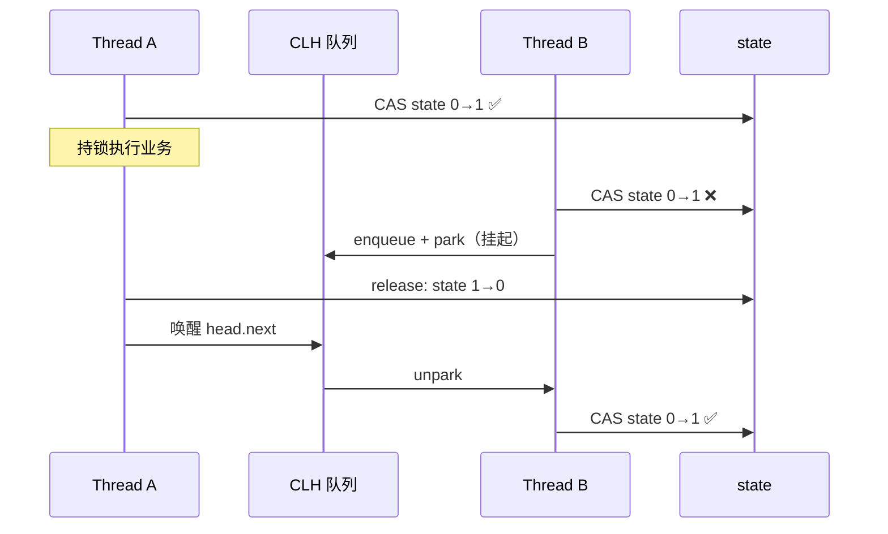

---
---

# AQS 原理（AbstractQueuedSynchronizer）

> Java 并发包（J.U.C）的基石。
> ReentrantLock / Semaphore / CountDownLatch / CyclicBarrier / ReentrantReadWriteLock 都基于它。

---

## AQS 是什么

```
                   AQS 提供两个东西：
                   
                ┌────────────────────────┐
                │ ① state (int)           │  → 同步状态变量
                │   - 1=已锁, 0=空闲       │
                │   - 重入次数             │
                │   - 信号量许可数         │
                └────────────────────────┘
                ┌────────────────────────┐
                │ ② CLH 队列              │  → 等待线程的双向链表
                │   Head ⇄ N1 ⇄ N2 ⇄ Tail │
                └────────────────────────┘
                
       子类只需要重写 tryAcquire/tryRelease，定义 state 怎么变
       AQS 帮你处理"排队、唤醒、竞争"的复杂逻辑
```

---

## CLH 队列

```
       state = 1（线程 A 持锁）
         │
         ▼
       ┌──────────────────────────────────────────┐
       │ Head ⇄ Node(B,WAIT) ⇄ Node(C,WAIT) ⇄ Tail │
       └──────────────────────────────────────────┘
         ↑              线程 B 等线程 A 释放
         空节点          线程 C 等线程 B 唤醒它

       释放过程：
         A 调 release → state=0 → 唤醒 head.next（B）
         B 抢到锁 → state=1，B 变成 head
```



---

## 三大核心模板方法

子类（如 ReentrantLock）只重写这几个：

```java
protected boolean tryAcquire(int arg)   { ... }  // 独占式获取
protected boolean tryRelease(int arg)   { ... }  // 独占式释放
protected int tryAcquireShared(int arg) { ... }  // 共享式获取（Semaphore）
protected boolean tryReleaseShared(int arg) { ... }
```

AQS 负责的脏活：
- 把抢锁失败的线程 enqueue
- park/unpark 线程
- 唤醒后重新抢锁
- 处理中断与超时

---

## 公平锁 vs 非公平锁

```java
ReentrantLock fairLock = new ReentrantLock(true);    // 公平
ReentrantLock unfairLock = new ReentrantLock();      // 非公平（默认）
```

### 公平锁
```java
// 必须检查队列前面有没有人在等
final boolean tryAcquire(int acquires) {
    if (hasQueuedPredecessors()) return false;  // ← 关键
    if (compareAndSetState(0, acquires)) {
        setExclusiveOwnerThread(current);
        return true;
    }
    return false;
}
```

### 非公平锁
```java
// 直接抢，不管队列
final boolean tryAcquire(int acquires) {
    if (compareAndSetState(0, acquires)) {  // ← 直接 CAS
        setExclusiveOwnerThread(current);
        return true;
    }
    return false;
}
```

```
公平：严格 FIFO，避免饥饿，但吞吐低（每次唤醒+抢锁有开销）
非公平：可能插队，但吞吐高（不用切换上下文）

经验：默认非公平就行，公平锁性能 30% 起步降。
```

---

## 基于 AQS 的同步器

| 同步器 | state 含义 |
| :--- | :--- |
| **ReentrantLock** | 0=空闲，>0=重入次数 |
| **Semaphore** | 当前剩余许可数 |
| **CountDownLatch** | 倒数初值 → 0 唤醒 |
| **CyclicBarrier** | 内部用 ReentrantLock + Condition |
| **ReentrantReadWriteLock** | 高 16 位读锁数，低 16 位写锁数 |

### CountDownLatch 用法

```java
CountDownLatch latch = new CountDownLatch(3);

// 工作线程
new Thread(() -> { doWork(); latch.countDown(); }).start();
new Thread(() -> { doWork(); latch.countDown(); }).start();
new Thread(() -> { doWork(); latch.countDown(); }).start();

latch.await();  // 主线程等 3 个都完成
```

```
state 初始=3
  worker1 countDown → state=2
  worker2 countDown → state=1
  worker3 countDown → state=0 → 唤醒 await 的线程
```

### Semaphore（限流）

```java
Semaphore sem = new Semaphore(10);  // 同时最多 10 个

sem.acquire();
try {
    callExternalApi();  // 限流到 10 并发
} finally {
    sem.release();
}
```

---

## CAS（AQS 的物理基础）

```
state = 0
线程 A 想从 0 改成 1：
  CAS(addr, expected=0, new=1)
  
  CPU 指令 cmpxchg：原子地
    if (*addr == 0) {
       *addr = 1;
       return true;  ← A 成功
    } else {
       return false; ← 别人改过了
    }
```

**ABA 问题**：
```
线程 1 读到 A，准备 CAS
线程 2 改 A→B→A
线程 1 CAS 看到还是 A，认为没人动过 → 但其实变过两次

解决：AtomicStampedReference / AtomicMarkableReference 加版本号
```

---

## ReentrantLock 完整示例

```java
ReentrantLock lock = new ReentrantLock();

lock.lock();
try {
    // 临界区
} finally {
    lock.unlock();  // 必须 finally
}

// 可中断
lock.lockInterruptibly();

// 限时
if (lock.tryLock(3, TimeUnit.SECONDS)) {
    try { ... } finally { lock.unlock(); }
}
```

```
synchronized vs ReentrantLock：
  
  synchronized                  ReentrantLock
  ────────────────────────      ────────────────────────
  JVM 内置                       Java 类
  自动加解锁                     必须手动 lock/unlock
  不可中断                       可中断 lockInterruptibly
  无限等待                       可限时 tryLock
  非公平                         可选公平
  一个 condition                 多个 Condition
  monitorenter / monitorexit    CAS + park
```

---

## 一句话总结

- **AQS = state + CLH 队列**
- 子类重写 tryAcquire/tryRelease，状态怎么变自己定
- CAS 是底层物理，park/unpark 是挂起恢复
- **ReentrantLock / Semaphore / CountDownLatch** 全是 AQS 的不同 state 玩法
