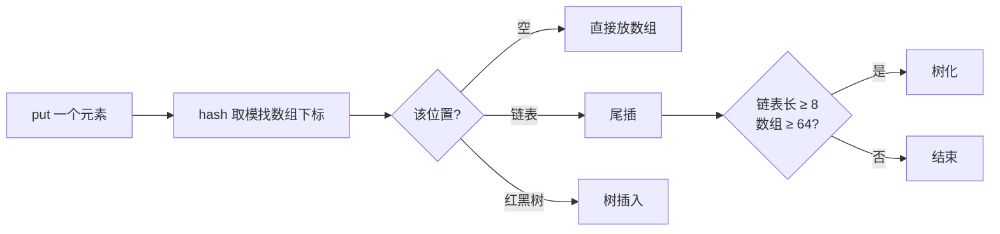
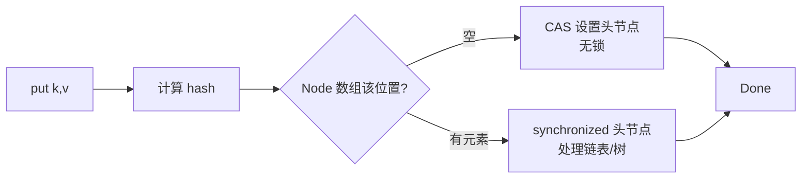
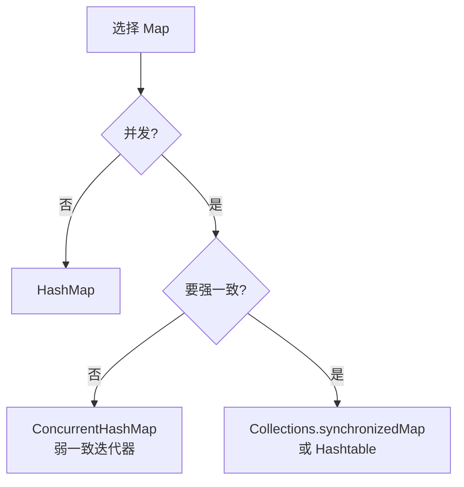

# HashMap 与 ConcurrentHashMap

> Java 集合面试**永远**的考点。关键变化在 JDK 1.7 → 1.8。

---

## HashMap 1.7 vs 1.8

| 维度 | JDK 1.7 | JDK 1.8 |
| :--- | :--- | :--- |
| 数据结构 | 数组 + 链表 | 数组 + 链表 + **红黑树** |
| 链表插入 | 头插法 | **尾插法** |
| 扩容触发 | 长度 >= 阈值且发生哈希冲突 | 长度 >= 阈值 |
| 扩容方式 | rehash 重新计算 | **位运算判断高位**（更快） |
| 并发死循环 | ✅ 头插法会成环 | ❌ 尾插法不会，但仍线程不安全 |

---

## 1.8 数据结构

```
                      数组 (Node[])
   ┌─────┬─────┬─────┬─────┬─────┬─────┬─────┬─────┐
   │  0  │  1  │  2  │ ... │  6  │  7  │ ... │ N-1 │
   └──┬──┴─────┴──┬──┴─────┴──┬──┴─────┴─────┴─────┘
      │           │           │
      ▼           ▼           ▼
   [Node]      [Node]      [TreeNode]
      │           │           │
      ▼           ▼           ▼
   [Node]      [Node]      [TreeNode]
      │           │           │
      ▼           ▼           ▼
   [Node]    [链表 < 8]    [红黑树 ≥ 8]
   
   链表长度 ≥ 8 且数组长度 ≥ 64 → 转红黑树
   红黑树元素 ≤ 6 → 转回链表
```



---

## 为什么 1.7 头插法会成环

```
并发扩容场景：
  原表 A → B → null
  线程 1 扩容到一半被挂起，看到 A 待迁移
  线程 2 完成扩容：新表 B → A → null  ←头插法颠倒了顺序
  线程 1 恢复，继续按它的"已迁移 A、下一个是 B"流程
  → 新表上 A → B → A → B → ... 环形链表！
  
  下次 get 触发死循环 → CPU 100%
```

1.8 改成尾插法 + 在 transfer 内部直接复用节点，**彻底解决死循环**，但仍然**非线程安全**（put 可能丢数据）。

---

## 为什么扩容是 2 倍

```
n = 16 (二进制 10000)
n-1 = 15 (二进制 01111)
hash & (n-1) → 取 hash 的低 4 位作为下标

扩容到 32 (二进制 100000)
n-1 = 31 (二进制 11111)
现在取 hash 的低 5 位

新位置 = 旧位置 (低 4 位不变)，或 旧位置 + 旧容量 (取决于第 5 位)
        ↓
只需判断 hash 多出的那一位是 0 还是 1，避免重新 hash
```

---

## ConcurrentHashMap 1.7 vs 1.8

| 维度 | JDK 1.7 | JDK 1.8 |
| :--- | :--- | :--- |
| 锁粒度 | Segment 分段锁（默认 16 段） | **Node 节点锁**（synchronized + CAS） |
| 数据结构 | Segment[] + HashEntry[] + 链表 | Node[] + 链表 + 红黑树 |
| 并发度 | 固定 16 | 数组长度（动态扩） |
| 实现 | ReentrantLock | synchronized + CAS |

### 1.7 Segment 分段锁

```
ConcurrentHashMap
  ├─ Segment[0]  (ReentrantLock)
  │    └─ HashEntry[] → 链表
  ├─ Segment[1]  (ReentrantLock)
  │    └─ HashEntry[] → 链表
  ├─ ...
  └─ Segment[15] (ReentrantLock)
       └─ HashEntry[] → 链表

  put 时：先定位 Segment，再锁这个 Segment
  并发度 = Segment 数 = 16
```

### 1.8 Node 锁

```
直接 Node[]，没有 Segment 这层：

  Node[0] ──┐
            ├── 链表/红黑树
  Node[1] ──┘
  
  put 时：
    if (Node 为空) CAS 设置（无锁成功）
    else synchronized(头节点) 处理冲突
  
  并发度 = Node 数（可达数千万）
```



---

## 高频陷阱

### 1. HashMap 允许 null 键，ConcurrentHashMap 不允许

```java
HashMap<String, Object> m = new HashMap<>();
m.put(null, "ok");  // ✅

ConcurrentHashMap<String, Object> cm = new ConcurrentHashMap<>();
cm.put(null, "ok"); // ❌ NullPointerException
```

> 多线程下 `get(null)` 无法区分"键不存在"和"值为 null"，源码硬性禁止。

### 2. 容量与负载因子

```java
new HashMap<>(initialCapacity, loadFactor);
```

- 默认容量 16，负载因子 0.75
- 大小 = 16 × 0.75 = 12 时扩容到 32
- 提前知道数据量 → 设初始容量避免反复扩容
- 0.75 是空间/时间折中（太小浪费空间，太大冲突多）

### 3. 为什么数组长度必须是 2 的幂

```
hash & (length - 1) == hash % length  仅当 length 是 2 的幂

位运算比取模快得多 → 强制 2 的幂
```

---

## 一致性 vs 并发性



> ConcurrentHashMap 的迭代器是**弱一致**：迭代时可能反映或不反映并发修改，但不会抛 ConcurrentModificationException。

---

## 一句话总结

- 1.7→1.8：**链表+红黑树**、**尾插法**、**Node 锁代替分段锁**
- HashMap 不是线程安全，并发用 ConcurrentHashMap
- 容量永远是 **2 的幂**，方便位运算
- ConcurrentHashMap **不允许 null 键值**
