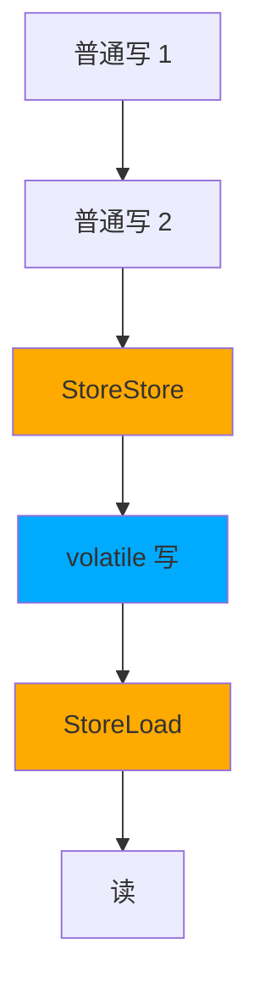

# JMM 与 volatile

> JMM = Java Memory Model，**Java 多线程内存可见性的规范**。
> 不是物理内存，是抽象模型。

---

## 为什么需要 JMM

```
现代 CPU 架构：

  Thread 1 (CPU 1)             Thread 2 (CPU 2)
   ┌───────────┐                ┌───────────┐
   │  寄存器    │                │  寄存器    │
   ├───────────┤                ├───────────┤
   │ L1 Cache  │                │ L1 Cache  │
   │ L2 Cache  │                │ L2 Cache  │
   └─────┬─────┘                └─────┬─────┘
         │                            │
         └────── L3 Cache ────────────┘
                   │
                ┌──┴──┐
                │ RAM │  ← 真正的"主内存"
                └─────┘

  线程 1 修改变量 x：
    → 改的是 L1 Cache 副本，没立刻写回 RAM
  线程 2 读 x：
    → 读自己的 L1 Cache，看到的是旧值 ❌
```

**JMM 解决三件事**：
1. **可见性**：一个线程的修改能让其他线程看见
2. **有序性**：禁止指令重排
3. **原子性**：long/double 等读写原子化

---

## JMM 抽象图

```
       Java 线程                 Java 线程
         │                         │
    ┌────▼────┐               ┌────▼────┐
    │ 本地内存 │               │ 本地内存 │   ← 抽象（对应缓存/寄存器）
    └────┬────┘               └────┬────┘
         │                         │
         └────────── 主内存 ─────────┘
                  ┌─────────┐
                  │ x = 100 │   ← 共享变量
                  └─────────┘

  操作：
    read    ← 从主内存读
    load    → 加载到本地内存
    use     → 使用
    assign  → 赋值
    store   → 写回准备
    write   ← 写到主内存
    lock / unlock
```

---

## 三大问题

### 1. 可见性问题

```java
class Flag {
    boolean stop = false;
    
    // 线程 1
    void worker() {
        while (!stop) {
            // 干活
        }
    }
    
    // 线程 2
    void stop() {
        stop = true;
    }
}
```

```
线程 1 在自己的 CPU 上：
  把 stop 加载到寄存器 → 一直读寄存器值 false
  → 永远不退出循环 ❌
```

**解法**：`volatile boolean stop`

### 2. 有序性问题（指令重排）

```java
class Reorder {
    int a = 0;
    boolean flag = false;
    
    // 线程 1
    void writer() {
        a = 1;          // ①
        flag = true;    // ②  CPU 可能把 ② 重排到 ① 前面！
    }
    
    // 线程 2
    void reader() {
        if (flag) {
            System.out.println(a);  // 可能输出 0 ❌
        }
    }
}
```

为什么会重排：
- 编译器优化：调整指令顺序提高 CPU 利用
- CPU 乱序执行：流水线优化
- 缓存系统：写缓冲、失效队列

### 3. 原子性问题

```java
volatile int count = 0;
count++;  // ❌ 不是原子！
//  = read count → +1 → write count （3 步）
```

多线程并发 count++ 仍会丢更新。

---

## volatile 的两个保证

| 保证 | 实现 |
| :--- | :--- |
| **可见性** | 写后强制刷主内存 + 读前强制失效本地缓存 |
| **有序性** | 插入内存屏障，禁止特定重排 |

**不保证原子性**！count++ 仍然要用 AtomicInteger / synchronized。

### 内存屏障

```
volatile 写：
  普通写 ────
  StoreStore 屏障 ──→ 之前的普通写必须先完成
  volatile 写
  StoreLoad 屏障  ──→ 之后的读不能重排到 volatile 写之前

volatile 读：
  volatile 读
  LoadLoad 屏障   ──→ 之后的读不能重排到 volatile 读之前
  LoadStore 屏障  ──→ 之后的写不能重排到 volatile 读之前
  普通读 ────
```



---

## happens-before 规则

JMM 定义的"无需 volatile/synchronized 也保证可见"的规则：

| 规则 | 含义 |
| :--- | :--- |
| **程序顺序** | 单线程内，前面的操作 hb 后面的 |
| **锁** | unlock hb 后续 lock 同一锁 |
| **volatile** | volatile 写 hb 后续 volatile 读 |
| **线程启动** | start() hb 子线程内的所有操作 |
| **线程终止** | 子线程所有操作 hb join() 返回 |
| **传递性** | A hb B, B hb C → A hb C |

> 满足 happens-before = 一定可见 + 一定有序。

---

## DCL 单例（volatile 的经典案例）

```java
class Singleton {
    // 必须 volatile！
    private static volatile Singleton instance;
    
    public static Singleton getInstance() {
        if (instance == null) {              // ① 第一次检查（无锁）
            synchronized (Singleton.class) {
                if (instance == null) {      // ② 第二次检查（锁内）
                    instance = new Singleton();  // ③
                }
            }
        }
        return instance;
    }
}
```

### 为什么 instance 必须 volatile？

```
new Singleton() 其实是 3 步：
  ① 分配内存
  ② 调用构造函数初始化对象
  ③ 把 instance 指向该内存

如果不 volatile，可能重排成 ①③② ：
  → 线程 A 走到 ③ 还没 ② 时，instance != null
  → 线程 B 走到 ① 看到 instance != null，直接返回
  → 拿到一个还没初始化完的对象 → NPE 或脏数据
```

---

## volatile vs synchronized

| 维度 | volatile | synchronized |
| :--- | :--- | :--- |
| 原子性 | ❌ 只对单次读/写 | ✅ |
| 可见性 | ✅ | ✅ |
| 有序性 | ✅ | ✅ |
| 阻塞 | ❌ 不阻塞 | ✅ 阻塞 |
| 适用 | 状态标志、DCL | 临界区互斥 |

```java
// ✅ volatile 适合：单个状态标志
volatile boolean ready;

// ❌ volatile 不适合：复合操作
volatile int count;
count++;  // 仍然有并发问题

// ✅ AtomicInteger 替代
AtomicInteger count = new AtomicInteger();
count.incrementAndGet();
```

---

## 一句话总结

- JMM 解决 **可见性 / 有序性 / 原子性**
- volatile：**只保证可见性 + 有序性**，不保证原子性
- 内存屏障是 volatile 的底层实现
- happens-before 是无需关键字也保证有序的规则
- DCL 单例的 instance 必须 volatile（防重排）
