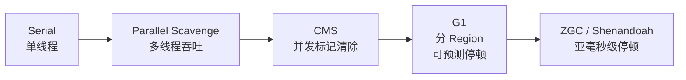

# JVM 内存与 GC

## JVM 运行时数据区

```
┌─────────────────────────────────────────────────────────────┐
│                      JVM 运行时数据区                         │
├──────────────────────────────┬──────────────────────────────┤
│        线程私有                │        线程共享                │
├──────────────────────────────┼──────────────────────────────┤
│  程序计数器 PC                 │  ┌──────────────────────┐    │
│  - 当前线程字节码行号           │  │   堆 Heap            │    │
│                              │  │   - 对象实例           │    │
│  虚拟机栈                      │  │   - GC 主战场         │    │
│  - 一个方法一个栈帧             │  └──────────────────────┘    │
│  - 局部变量表/操作数栈          │  ┌──────────────────────┐    │
│                              │  │  方法区 Metaspace     │    │
│  本地方法栈                    │  │  - 类元信息           │    │
│  - native 方法                │  │  - 常量池             │    │
│                              │  │  - 静态变量           │    │
│                              │  └──────────────────────┘    │
└──────────────────────────────┴──────────────────────────────┘
```

| 区域 | 存什么 | OOM 原因 |
| :--- | :--- | :--- |
| 程序计数器 | 字节码行号 | 不会 OOM |
| 虚拟机栈 | 栈帧（方法调用） | 递归太深 → StackOverflowError |
| 本地方法栈 | native 方法 | 同上 |
| 堆 | 对象实例 | 对象泄漏 → OOM Heap |
| 方法区 / Metaspace | 类元信息、常量池 | 类加载过多 → OOM Metaspace |
| 直接内存（堆外） | NIO ByteBuffer | 用满物理内存 → OOM Direct |

---

## 堆的分代结构

```
                 ┌─────────────────── Heap ───────────────────┐
                 │                                            │
   新生代 ────→  │ ┌──── Young Gen (1/3) ────┐ ┌──────────────┐│
                 │ │  Eden (8)  │ S0 (1) │ S1 (1) │  Old Gen   ││
                 │ └─────────────────────────┘ │   (2/3)      ││
                 │                             └──────────────┘│
                 └────────────────────────────────────────────┘
                                                ↑
                                          老年代

  Eden : S0 : S1 = 8 : 1 : 1
  新生代 : 老年代 = 1 : 2
```

### 对象一生


> **大对象直接进老年代**（>`PretenureSizeThreshold`），避免 Survivor 区来回拷贝。

---

## GC 算法

| 算法 | 思路 | 适合 |
| :--- | :--- | :--- |
| 标记-清除 | 标记垃圾→清除 | 老年代（缺点：碎片） |
| 标记-复制 | 一分为二，存活的拷到另一边 | 新生代（缺点：浪费一半空间） |
| 标记-整理 | 标记→把存活的往一端挪 | 老年代（无碎片） |
| 分代收集 | 不同区域不同算法 | 现代 JVM 默认 |

```
标记-清除：           标记-复制：             标记-整理：
[●○●●○●○○●○]         [●○●●○]→[●●●○○]      [●○●●○]→[●●●○○]
↓ 清除                ↓ 复制存活到右边       ↓ 整理到一端
[●_●●_●__●_]          [_____|●●●○○]        [●●●_____○○]
   碎片多               左半边整个清空        无碎片但慢
```

---

## GC 收集器演进



| 收集器 | 区域 | 停顿目标 | 适用 |
| :--- | :--- | :--- | :--- |
| Parallel Scavenge | 新生代 | 吞吐优先 | 后台计算 |
| CMS | 老年代 | 低停顿 | 老旧服务（已废弃） |
| **G1** ⭐ | 全区 | 200ms 内 | JDK8 后默认推荐 |
| ZGC | 全区 | <10ms | 大堆 / 低延迟 |

### G1 核心：Region 分区

```
不再固定 Young/Old 边界，整堆划分为 N 个等大 Region：

  ┌──┬──┬──┬──┬──┬──┬──┬──┐
  │E │E │S │O │O │H │  │  │   E=Eden  S=Survivor
  ├──┼──┼──┼──┼──┼──┼──┼──┤   O=Old   H=Humongous(大对象)
  │  │O │E │  │O │S │E │  │
  └──┴──┴──┴──┴──┴──┴──┴──┘
  
  优先回收"垃圾最多的 Region"（Garbage First）→ 名字由来
  停顿可控：用户设定 -XX:MaxGCPauseMillis=200
```

---

## STW（Stop-The-World）

**所有 GC 都会 STW**，只是时间长短。

```
JVM 时间线：
  ──cmd──cmd──[STW: GC 200ms]──cmd──cmd──[STW: Full GC 2s]──
                   ↑↑↑↑↑↑↑↑↑↑              ↑↑↑↑↑↑↑↑↑↑↑
              用户感知卡顿                业务接口直接超时
```

为什么必须 STW？
- 标记阶段需要"一致快照"
- 移动对象时，业务线程不能引用旧地址
- 现代收集器（G1/ZGC）通过**并发标记 + 增量更新**让 STW 越来越短

---

## 调优实战

### 启动参数（生产标配）

```bash
# 堆
-Xms4g -Xmx4g                           # 初始 = 最大，避免动态扩容抖动
-XX:MetaspaceSize=256m                  # 元空间初始
-XX:MaxMetaspaceSize=512m               # 元空间上限

# G1
-XX:+UseG1GC
-XX:MaxGCPauseMillis=200                # 停顿目标
-XX:G1HeapRegionSize=16m                # Region 大小

# GC 日志
-Xlog:gc*,safepoint:file=/var/log/gc.log:time,uptime,level,tags

# OOM 自动 dump
-XX:+HeapDumpOnOutOfMemoryError
-XX:HeapDumpPath=/var/log/heapdump.hprof

# CodeCache
-XX:ReservedCodeCacheSize=512m
```

### 常见症状 → 处理

| 症状 | 工具 | 处理 |
| :--- | :--- | :--- |
| Full GC 频繁 | jstat -gcutil | 找老年代泄漏 / 加堆 |
| 单次 GC 时间长 | gc.log | 换 G1 / 减小新生代 |
| 进程 OOM | jmap + MAT | 分析 hprof 找泄漏 |
| Metaspace OOM | -XX:+TraceClassLoading | 类加载器泄漏（热部署） |
| 直接内存 OOM | NMT | NIO ByteBuffer 没释放 |

### jstat 速看

```bash
jstat -gcutil <pid> 1000
# S0   S1   E    O    M    CCS  YGC YGCT FGC FGCT GCT
# 0.00 99.0 80.0 70.0 96.0 92.0 100 1.2  5   3.0  4.2
#  ↑                  ↑                 ↑   ↑↑↑
# Survivor 用量    Old 用量         Full GC 次数和耗时
```

---

## 高频面试题答案

**Q: 怎么判断对象可以被 GC？**
- 引用计数法（Java 不用，循环引用问题）
- **可达性分析**：从 GC Roots（栈引用、静态字段、常量、JNI 引用）出发，不可达的对象可回收

**Q: 哪些是 GC Roots？**
1. 虚拟机栈中的局部变量
2. 方法区中类的静态变量
3. 方法区中的常量引用
4. 本地方法栈 JNI 引用
5. 锁持有对象、活跃线程

**Q: 4 种引用？**
| 类型 | 何时回收 | 场景 |
| :--- | :--- | :--- |
| 强引用 | 永不（除非不可达） | `Object o = new Object()` |
| 软引用 | 内存不足才回收 | 内存敏感缓存 |
| 弱引用 | **下次 GC 就回收** | ThreadLocalMap 的 key |
| 虚引用 | 任何时候 | 仅用于跟踪回收（PhantomReference） |

---

## 一句话总结

- **堆分代** + **G1 Region**：现代 JVM 的两个核心思想
- **STW 不可避免**，只能缩短
- **G1** 是 JDK 8+ 默认推荐；超低延迟用 **ZGC**
- 生产参数：固定堆大小 + GC 日志 + OOM dump
