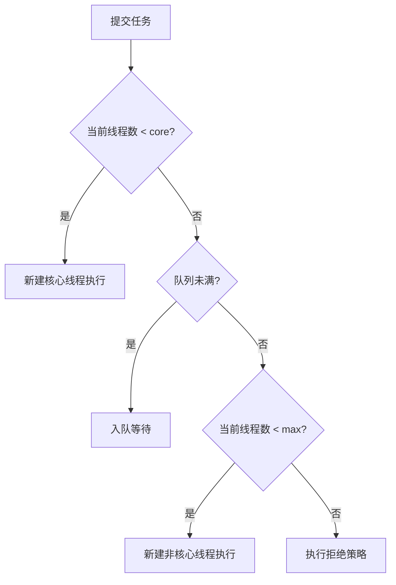
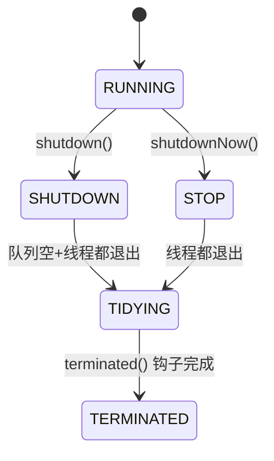

---
---

# 线程池原理（ThreadPoolExecutor）

## 七大参数

```java
new ThreadPoolExecutor(
    corePoolSize,      // ① 核心线程数（常驻）
    maximumPoolSize,   // ② 最大线程数
    keepAliveTime,     // ③ 非核心空闲存活时间
    unit,              // ④ 时间单位
    workQueue,         // ⑤ 任务队列
    threadFactory,     // ⑥ 线程工厂（命名等）
    handler            // ⑦ 拒绝策略
);
```

---

## 任务流转图（必须背）



```
形象图：

      新任务来了
          │
          ▼
   ┌──────────────────┐
   │ 核心线程未满?     │  ─是→ 新建核心线程跑
   └──────┬───────────┘
          │否
          ▼
   ┌──────────────────┐
   │ 队列未满?        │  ─是→ 进队列
   └──────┬───────────┘
          │否
          ▼
   ┌──────────────────┐
   │ 最大线程未满?     │  ─是→ 新建非核心线程跑
   └──────┬───────────┘
          │否
          ▼
       拒绝策略
```

> 关键反直觉：**先填队列，队列满了才扩容到 max**。
> 不是"先扩到 max，再入队"。

---

## 4 种工作队列

| 队列 | 容量 | 特点 |
| :--- | :--- | :--- |
| ArrayBlockingQueue | 有界 | FIFO，需指定容量 |
| LinkedBlockingQueue | 默认无界（Integer.MAX） | 危险，max 失效 |
| SynchronousQueue | 0 容量 | 直接交付，必须扩容到 max |
| PriorityBlockingQueue | 有界 | 按优先级出队 |

```
LinkedBlockingQueue 不指定容量 ≈ 内存炸弹：
  生产快、消费慢 → 队列无限堆积 → OOM
  
而且队列永远不满 → 永远不扩容到 max
  → max 参数毫无意义
```

---

## 4 种拒绝策略

| 策略 | 行为 | 适合 |
| :--- | :--- | :--- |
| **AbortPolicy**（默认） | 抛 RejectedExecutionException | 能感知拒绝 |
| **CallerRunsPolicy** | 让提交线程自己跑 | 反向限流 |
| DiscardPolicy | 静默丢弃 | 几乎不用 |
| DiscardOldestPolicy | 丢队列里最老的，加入新任务 | 几乎不用 |
| 自定义 | 落 MQ / 落库重试 | 不能丢的关键业务 |

```java
// 自定义示例：落库重试
new RejectedExecutionHandler() {
    public void rejectedExecution(Runnable r, ThreadPoolExecutor e) {
        retryTaskMapper.insert(toTask(r));
        log.warn("线程池满，任务转 DB 重试队列");
    }
};
```

---

## Executors 的 4 个坑（生产禁用）

`Executors.xxx()` 是阿里规约明令禁用的便捷工厂方法：

| 工厂 | 问题 |
| :--- | :--- |
| `newFixedThreadPool(n)` | 队列默认无界 → OOM |
| `newSingleThreadExecutor()` | 队列默认无界 → OOM |
| `newCachedThreadPool()` | maxPoolSize 是 Integer.MAX → 线程数爆炸 |
| `newScheduledThreadPool()` | DelayedWorkQueue 无界 → OOM |

**生产必须手写 ThreadPoolExecutor**，显式给出每个参数。

---

## 线程数怎么设

| 场景 | 经验值 |
| :--- | :--- |
| CPU 密集（加密、压缩、报表） | **核数 + 1** |
| IO 密集（DB、HTTP） | **核数 × 2** 或 `核数 × (1 + 等待时间/计算时间)` |
| 混合 | 拆开多个线程池，**按业务隔离** |

```
理论公式（Brian Goetz）：
  N_threads = N_CPU × U × (1 + W/C)
  
  N_CPU = 核数
  U     = 目标 CPU 利用率（0~1）
  W/C   = 等待时间 / 计算时间
  
  纯计算：W/C ≈ 0  → N = N_CPU
  纯 IO ：W/C ≈ 10 → N = N_CPU × 11
```

---

## 线程池状态



- `shutdown()`：拒绝新任务，但**已提交任务继续执行完**
- `shutdownNow()`：拒绝新任务，**中断所有正在执行的**，返回未执行任务

---

## 监控（不监控就是定时炸弹）

```java
pool.getActiveCount();         // 活跃线程数
pool.getPoolSize();            // 当前池大小
pool.getQueue().size();        // 队列长度
pool.getCompletedTaskCount();  // 累计完成
pool.getLargestPoolSize();     // 历史最大
```

接 Prometheus → Grafana → 告警：
- 活跃数 > 核心数 80% 持续 5 分钟
- 队列长度 > 容量 50%
- 拒绝次数 > 0

---

## 实战配置模板

```java
@Bean("orderPool")
public ThreadPoolExecutor orderPool() {
    return new ThreadPoolExecutor(
        16,                                    // core
        32,                                    // max
        60L, TimeUnit.SECONDS,                 // keepAlive
        new ArrayBlockingQueue<>(1000),        // 有界队列
        new ThreadFactoryBuilder()
            .setNameFormat("order-pool-%d")    // 命名！排查必备
            .setUncaughtExceptionHandler(...)  // 未捕获异常
            .build(),
        new ThreadPoolExecutor.CallerRunsPolicy()  // 反向限流
    );
}
```

---

## 一句话总结

- **七参数**：core / max / keepAlive / unit / queue / factory / handler
- **流转**：core → queue → max → reject
- **禁用 Executors**，自己 new ThreadPoolExecutor
- **按业务隔离线程池**，一个池死了不能拖死全部
- **必须监控**，并配拒绝策略告警
