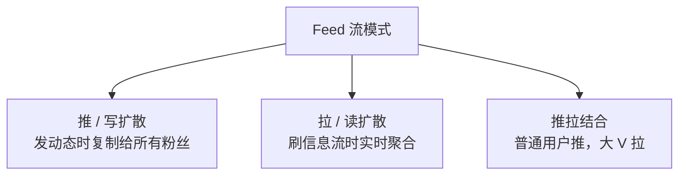
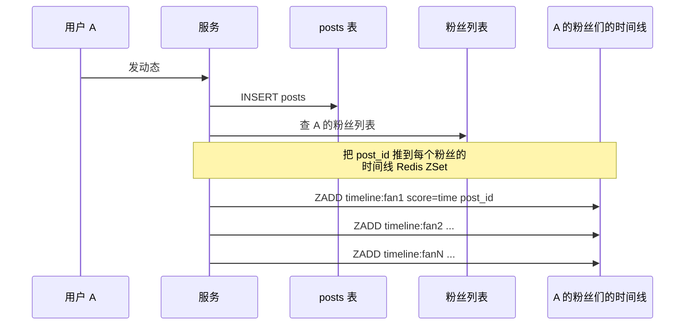
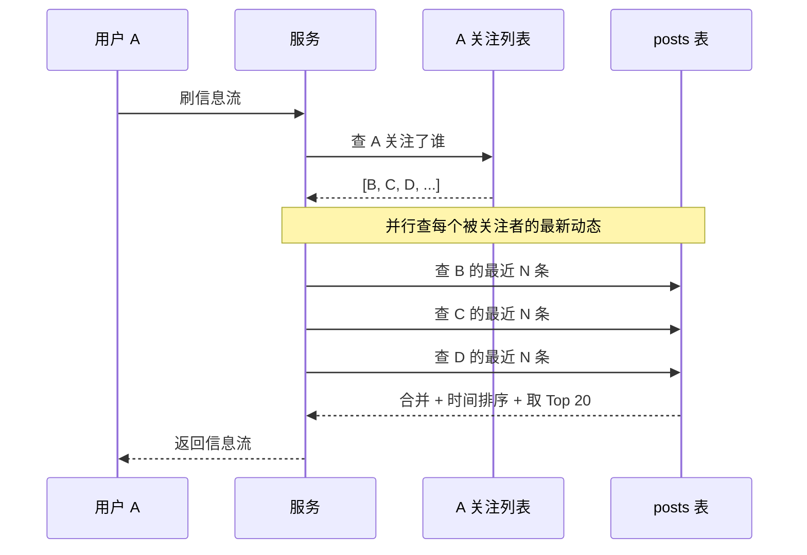
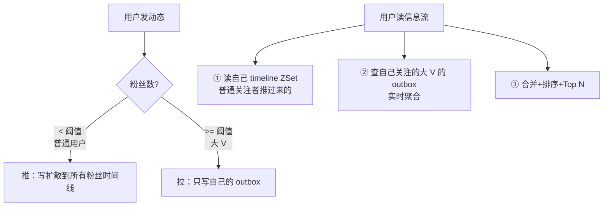
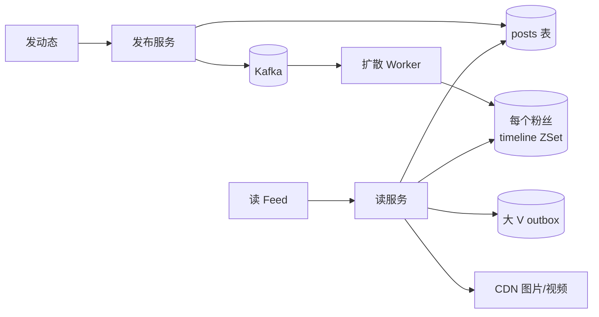

---
---

# Feed 流设计（朋友圈 / 微博 / 抖音）

> Feed = 关注的人的动态按时间排序展示。
> 难点：**关注关系复杂 + 时间线实时性 + 大 V 粉丝过亿**。
> 三种模式：**推（写扩散）/ 拉（读扩散）/ 推拉结合**。

---

## 业务建模

```
两张核心表：
  user_follow (粉丝关注谁)：fan_id, idol_id
  posts (动态)：post_id, user_id, content, create_time

主流场景：
  ① 用户发动态  → 写入 posts
  ② 用户刷信息流 → 读出"所有关注的人最近发的动态"按时间排序
```

---

## 三种模式总览



| 模式 | 优点 | 缺点 | 适合 |
| :--- | :--- | :--- | :--- |
| **推** | 读极快（直接读自己时间线） | 大 V 发一条要写几亿份 | 普通用户 |
| **拉** | 写极快（只写一份） | 读慢、要聚合所有关注的人 | 大 V |
| **推拉结合** | 综合性能最好 | 实现复杂 | **生产推荐** ⭐ |

---

## 模式一：推（写扩散）



```
每个用户一个收件箱 ZSet：
  Key: timeline:{uid}
  Score: 发布时间戳
  Value: post_id

读：直接 ZREVRANGE timeline:{uid} 0 19  → 极快 O(log N)
```

**痛点**：大 V 发一条动态要写几亿份
```
某顶流博主 1 亿粉丝，发一条微博：
  → 推 1 亿次 ZADD
  → 即使 Redis 单机 10w QPS，也需要 1000 秒
  → 部分粉丝几分钟后才能看到 → 体验差
```

**结论**：推模式只适合"普通用户"（粉丝数有限的）。

---

## 模式二：拉（读扩散）



```
读时实时聚合：
  ① 查关注列表（假设 200 个）
  ② 并发查每个人的最新 20 条
  ③ 内存归并排序 → Top 20

写：只写一份到 posts → 快
读：聚合 200 个人的数据 → 慢
```

**痛点**：
- 用户关注几千人就崩了
- 实时聚合性能差
- 翻页/缓存难做

---

## 模式三：推拉结合 ⭐（生产方案）

**核心思想**：按"发布者粉丝数"决定推还是拉。



```
阈值（粉丝数）：100~1万 视业务而定

例子：
  小明（500 粉丝）发微博：
    → 推：500 次 ZADD（毫秒完成）
  
  大 V（5000 万粉丝）发微博：
    → 只写自己 outbox
    → 粉丝拉取时实时聚合
```

### 数据结构

```
个人 outbox（每个用户都有）：
  Key:   outbox:{uid}
  Score: time
  Value: post_id
  
普通用户 timeline（收件箱，存推过来的）：
  Key:   timeline:{uid}
  Score: time
  Value: post_id

大 V 标记：
  大 V 不写别人 timeline，只写自己 outbox
  用户读流时单独查关注的大 V outbox
```

### 读流程

```java
public List<Post> getFeed(long uid, int pageSize) {
    // 1. 拿自己时间线（已被推过来的）
    Set<Long> ids1 = redis.zrevrange("timeline:" + uid, 0, pageSize);
    
    // 2. 关注的大 V 列表
    List<Long> vips = followService.getVipFollowing(uid);
    
    // 3. 并发查每个大 V 的最新 N 条
    List<Future<Set<Long>>> futures = vips.stream()
        .map(v -> executor.submit(() -> redis.zrevrange("outbox:" + v, 0, pageSize)))
        .toList();
    
    // 4. 合并 + 时间排序 + Top N
    Set<Long> all = new HashSet<>(ids1);
    futures.forEach(f -> all.addAll(f.get()));
    return loadPosts(all).stream()
        .sorted(Comparator.comparing(Post::getTime).reversed())
        .limit(pageSize)
        .toList();
}
```

---

## 整体架构



---

## Feed 排序（实战）

```
不是简单按时间排序，而是综合多维度：
  
  score = w1 * 时间衰减
         + w2 * 互动率（点赞/评论/转发）
         + w3 * 个性化匹配（兴趣标签）
         + w4 * 用户亲密度
         - w5 * 已读惩罚

  抖音/小红书是"推荐 Feed"，不只是关注 Feed
```

---

## 翻页问题

```sql
-- ❌ 传统 OFFSET 分页 → 深分页性能差
SELECT * FROM posts ORDER BY time DESC LIMIT 1000, 20;

-- ✅ 游标分页（last_id 法）
SELECT * FROM posts WHERE id < ${last_id} ORDER BY id DESC LIMIT 20;
```

```
Redis ZSet 用 score 作游标：
  ZREVRANGEBYSCORE timeline:uid (last_score -inf LIMIT 0 20
```

详见 [深分页.md](深分页.md)。

---

## 取关 / 删动态

```
取关：
  推模式 → 收件箱里旧动态怎么办？
    选择 A：保留（懒处理）
    选择 B：扫一遍删掉（成本高）
  → 通常选 A，下次刷新自动消失

删动态：
  作者删了一条动态
  → 推模式：要去所有粉丝 timeline 删除（成本极高）
  → 通常做法：保留 post_id，读取时检查 post 是否被删，删了就过滤掉
```

---

## 大 V 阈值动态调整

```
冷热分级：
  - 普通用户：纯推
  - 中等粉丝（1万~100万）：推 + 拉（在线粉丝推，离线粉丝拉）
  - 大 V：纯拉
  
进一步优化：
  - 把"在线粉丝"推（活跃用户优先）
  - "离线粉丝"等他登录时再聚合
  → 写扩散量减少 10 倍
```

---

## 容量估算

```
日活 1 亿，平均每人关注 200，每天人均发 1 条：
  发动态 QPS：1 亿 / 86400 ≈ 1200
  读 Feed QPS：1 亿人 × 每人刷 100 次 / 86400 ≈ 12 万
  
  推模式扩散量：
    1 亿条 × 200 平均粉丝 = 200 亿条扩散写/天
    
  存储：
    posts 表：1 亿/天，3 年 ≈ 1000 亿 → 分库分表
    timeline ZSet：每人最近 1000 条 = 1000 × 1 亿 = 1000 亿 → Redis Cluster
```

---

## 一句话总结

| 模式 | 写 | 读 | 适合 |
| :--- | :--- | :--- | :--- |
| 推 | 慢（粉丝越多越慢） | 快 | 普通用户 |
| 拉 | 快 | 慢（关注多就慢） | 大 V |
| **推拉结合** | 平衡 | 平衡 | **生产** |

> Feed 流没有银弹，**根据用户分布选模式 + 多级缓存 + 异步扩散**。
> 排序不只是时间，**互动率 + 个性化推荐**是大厂真正用的。
