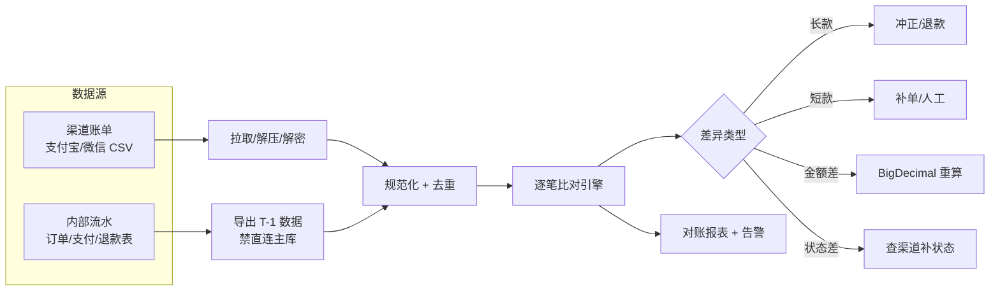
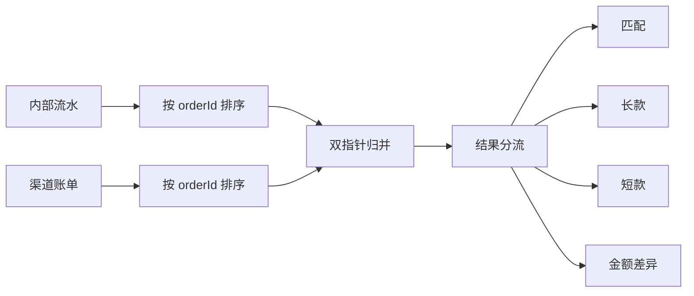
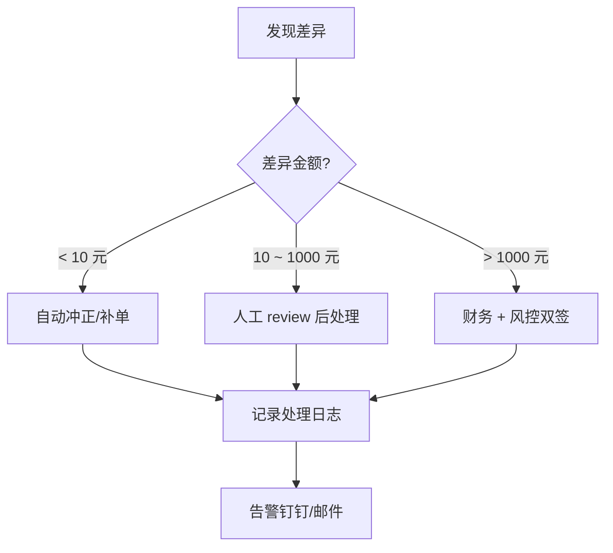

---
---

# 千万级对账

> 对账 = **每天定时把"自己系统记录"和"第三方账单"逐笔比对**，找差异、补差异。
> 是支付/电商/金融系统的最后一道防线。

---

## 四种差异（必背）

```
                     系统(我方)
                  ┌─有─────┬──无──┐
        渠道有 ──→│ 一致?  │ 短款 │ ← 渠道有但我方没记录
                  │ ─────  │      │   "钱收到了但订单没创建"
                  ├────────┼──────┤
        渠道无 ──→│ 长款   │ N/A  │ ← 我方记了但渠道没收到钱
                  │        │      │   "用户取消了但我们没同步"
                  └────────┴──────┘
            
            另外两种"形态差异"：
        ⓐ 金额不一致：差 0.01 元（精度问题）
        ⓑ 状态不一致：系统已完成 / 渠道还在处理中
```

| 差异类型 | 含义 | 后果 | 处理 |
| :--- | :--- | :--- | :--- |
| **长款** | 系统有，渠道无 | 我方多记，钱其实没收到 | 冲正、退款给用户 |
| **短款** | 渠道有，系统无 | 我方少记，钱已收到没给货 | 补单、人工介入 |
| **金额差** | 通常精度问题 | 财务报表错乱 | 用 BigDecimal 重算 |
| **状态差** | 中间状态滞后 | 业务卡住 | 主动查询渠道补平 |

---

## 整体流程



---

## 一、数据获取

### 外部账单（CSV / 加密文件）

```java
// ❌ 一次性读到内存
String content = Files.readString(Paths.get("/data/alipay_bill.csv"));  // OOM!

// ✅ 流式读取
try (BufferedReader reader = Files.newBufferedReader(path);
     Stream<String> lines = reader.lines()) {
    lines.skip(1)  // 跳过表头
         .map(this::parseLine)
         .forEach(this::process);
}
```

千万行 CSV 全读内存能直接 OOM。流式 + 分批 batch insert 是标配。

### 内部流水

```
不能 :
  SELECT * FROM payment WHERE create_time BETWEEN ? AND ?
  ↑ 跑在主库会拖死线上

可以 :
  - 从只读从库 / 离线库读
  - 走数仓 Hive / Doris 取
  - 走 binlog 实时同步到对账系统
```

---

## 二、金额精度（最容易翻车）

```java
// ❌ double / float 二进制无法精确表示十进制小数
double a = 0.1 + 0.2;  // = 0.30000000000000004
// 千万行累加 → 误差到元级别

// ✅ BigDecimal 全程
BigDecimal a = new BigDecimal("0.1");
BigDecimal b = new BigDecimal("0.2");
BigDecimal sum = a.add(b);  // 精确 0.3

// 落库统一存 "分"（long）也行
long amountInCents = 30;  // 0.30 元
```

**铁律**：金额从数据库到代码到接口全程 BigDecimal 或 long（分），**任何一处用 double 都是 bug 源头**。

---

## 三、比对引擎设计

### 小数据（< 100 万）：内存 HashMap

```java
Map<String, BillItem> channelMap = loadChannelBill();
Map<String, OrderItem> internalMap = loadInternal();

// 内部为基准扫一遍
for (var entry : internalMap.entrySet()) {
    var c = channelMap.remove(entry.getKey());
    if (c == null)         report.longRecord(entry);    // 长款
    else if (amountDiff(c, entry))  report.amountDiff(...);
    else                            report.matched(...);
}
// channelMap 里剩下的 = 短款
channelMap.values().forEach(report::shortRecord);
```

### 大数据（千万+）：归并排序

```
1. 内部流水按 orderId 排序 → file_a
2. 渠道账单按 orderId 排序 → file_b
3. 双指针归并：
   ──a1─a2─a3─a4─...
       │  │  │  │
       ↓  ↓  ↓  ↓
   ──b1─b2─b3─b5─...

   a3 == b3 → 匹配
   a4 < b5  → a4 是长款
   b5 > a4  → b5 是短款
```



更大规模（亿级）用 Spark/Hive 跑离线对账。

---

## 四、T+1 节奏（行业标准）

```
   今天 (T)              明天凌晨 (T+1)
   交易发生              对账作业
   ──────────────────────────────────
                              │
                              ├─ 凌晨 2 点：拉昨天的渠道账单
                              ├─ 凌晨 3 点：导出昨天的内部流水
                              ├─ 凌晨 4 点：跑比对
                              ├─ 凌晨 5 点：生成报表
                              └─ 早 8 点前：人工 review 差异
```

**为什么 T+1 而不是实时？**
- 渠道账单是 T+1 才出（一夜批生成）
- 业务有"中间状态"，实时对差异多但其实只是延迟
- 离线作业能用大资源跑、不影响线上

---

## 五、差异处理流程



---

## 六、坑点清单

| 坑 | 表现 | 解决 |
| :--- | :--- | :--- |
| 时区不一致 | 凌晨边界订单"丢" | 全部用 UTC，对账按时区切日 |
| 重试导致重复 | 同一笔被算两次 | 用渠道流水号去重 |
| 退款是负数 | 金额对不上 | 退款单独一张表，对账区分方向 |
| 渠道账单延迟到 | 跑了对账才到 | 加补跑机制 |
| 直连主库 | 把线上拖慢 | 走从库 / 数仓 |

---

## 一句话总结

- **四种差异**：长款、短款、金额差、状态差
- **精度**：全程 BigDecimal / 分（long）
- **大数据**：归并排序，不要全量内存
- **节奏**：T+1 离线批跑，差异分级处理
