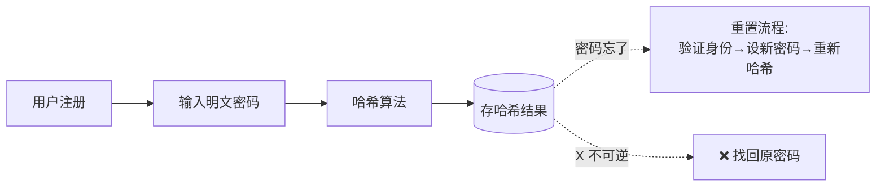
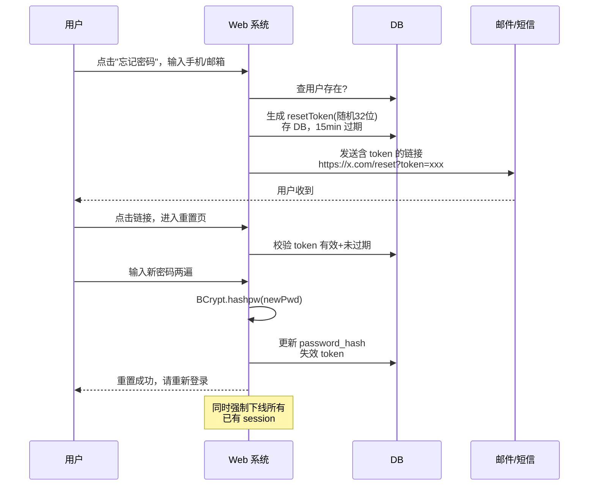

# 密码重置 vs 找回密码

> "找回密码"在技术上**是个伪概念**。
> 安全系统**根本不应该能找回**原密码——只能让用户**重新设置**一个。

---

## 为什么不能"找回"

密码在数据库里**从来不应该明文存储**，存的是单向哈希值：

```
   用户输入                  数据库存储
   "abc123"     ──hash──→    $2a$10$N9qo8uLO...

   能正向算 → 不能反向解
```

哈希是**单向函数**：知道结果反推不出原文。如果你的系统能"找回原密码"，**说明它存的是明文或可逆加密**——这本身就是巨大安全漏洞。



---

## 密码哈希算法对比

| 特性 | MD5 | SHA-256 | BCrypt | scrypt / Argon2 |
| :--- | :--- | :--- | :--- | :--- |
| 算法类型 | 通用哈希 | 通用哈希 | **密码专用** | **密码专用** |
| 密文长度 | 32 | 64 | 60 | 可变 |
| 自带盐 | ❌ | ❌ | ✅ | ✅ |
| 计算速度 | 极快 | 极快 | **故意慢** | **故意慢 + 抗 GPU/ASIC** |
| 抗暴力破解 | ❌ | ❌（GPU 一秒数十亿次） | ✅ | ✅✅ |
| 推荐度 | 禁用 | 仅文件校验 | **生产推荐** | **更现代** |

---

## 一、MD5（永远不要用于密码）

```java
String md5 = DigestUtils.md5Hex("abc123");
// → e99a18c428cb38d5f260853678922e03
```

两个致命问题：
1. **碰撞**：不同输入能算出相同哈希
2. **彩虹表**：黑客提前算好几十亿常见密码的 MD5 → 一查即破

```
彩虹表攻击：
  ┌──────────────┬─────────────────────────────────┐
  │ 原文         │ MD5                              │
  ├──────────────┼─────────────────────────────────┤
  │ 123456       │ e10adc3949ba59abbe56e057f20f883e│  ← 数据库泄漏后
  │ password     │ 5f4dcc3b5aa765d61d8327deb882cf99│     一秒还原原文
  │ qwerty       │ d8578edf8458ce06fbc5bb76a58c5ca4│
  │ ...          │ ...                              │
  └──────────────┴─────────────────────────────────┘
```

加私钥/加盐能缓解，但仍然挡不住"算得快"的根本问题。

---

## 二、SHA-256（仍然不够慢）

```java
String sha = DigestUtils.sha256Hex("abc123" + salt);
```

比 MD5 更抗碰撞，但**计算速度依然是毫秒级**：
- 单显卡 RTX 4090：每秒 ~100 亿次 SHA-256
- 8 位密码全暴破：几个小时

→ **不适合密码存储**，适合接口签名/文件校验。

---

## 三、BCrypt（生产推荐）⭐

```java
// 加密
String hash = BCrypt.hashpw("abc123", BCrypt.gensalt(10));
// → $2a$10$N9qo8uLOickgx2ZMRZoMyeIjZAgcfl7p92ldGxad68LJZdL17lhWy

// 验证
boolean ok = BCrypt.checkpw("abc123", hash);
```

**结构解析**：
```
  $2a$10$N9qo8uLOickgx2ZMRZoMye  IjZAgcfl7p92ldGxad68LJZdL17lhWy
   │   │  ──────────────────────  ──────────────────────────────
   │   │            盐(22 字符)              密码哈希(31 字符)
   │   └─ cost factor: 2^10 = 1024 轮
   └─ 版本号
```

**关键设计**：
- **故意变慢**：通过 cost factor 控制，cost=10 一次 ~100ms
- **盐自动生成、自动嵌入**：业务代码不用管
- **未来摩尔定律来了**：只需调大 cost，老哈希依然能验证

```
慢有什么好处？
  普通用户登录：100ms 等待，无感
  黑客暴破：    每秒只能试 10 次
              暴破 8 位密码需要 ~10^5 年
```

---

## 四、scrypt / Argon2（最现代）

- 不仅 CPU 慢，**内存也吃**
- 抗 GPU/ASIC（攻击者无法用专用硬件加速）
- Argon2 是 2015 年密码哈希竞赛冠军

新项目可考虑，但 BCrypt 在工程上已经足够稳。

---

## 五、密码重置完整流程



**安全要点**：
- token 必须随机不可猜（用 SecureRandom 32 字节）
- 短时效（15 分钟）
- 一次性（用过即失效）
- 链接走 HTTPS，防止中间人嗅探
- 重置后立刻让旧 session 失效（防"密码已改但旧 cookie 还能登"）

---

## 加密总览（不只是密码）

| 场景 | 推荐 | 原因 |
| :--- | :--- | :--- |
| 用户密码存库 | **BCrypt / Argon2** | 慢哈希 + 自带盐 |
| 接口加签验签 | HMAC-SHA256 | 快 + 防篡改 |
| 文件完整性校验 | SHA-256 | 快 + 抗碰撞 |
| 需要解密的敏感数据（手机号、身份证） | AES-256-GCM | 对称加密 + 认证 |
| SSH 免密登录 | Ed25519 / RSA / ECDSA | 非对称密钥对 |
| Linux 登录密码 | yescrypt / sha512crypt | 系统自带的慢哈希 |
| HTTPS | TLS 1.3 | 综合 |

---

## 一句话总结

- 不存原文，**只存哈希**
- 用 **BCrypt / Argon2**（慢哈希）不要用 MD5/SHA
- 密码"找回"不存在，只能**重置**
- 重置走"邮件/短信 + 一次性 token + 强制失效旧 session"
