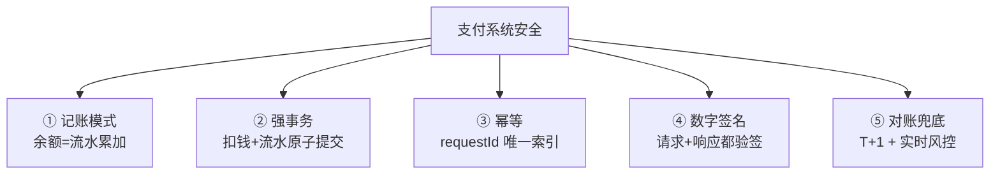
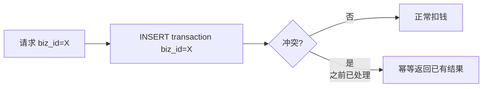
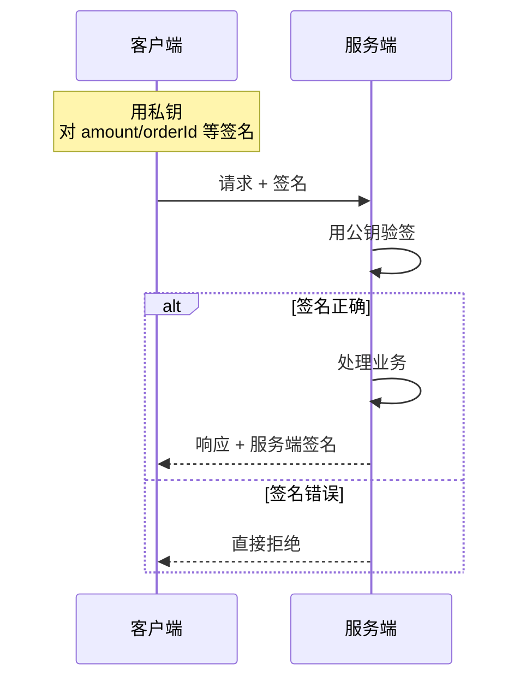
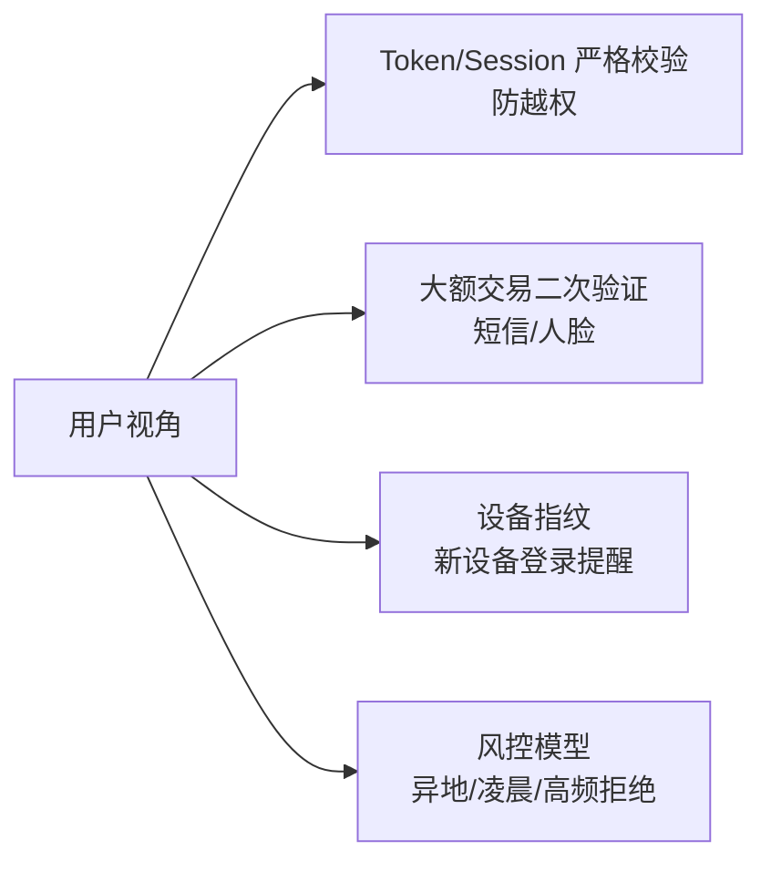

# 支付系统怎么防止余额被篡改

> 余额安全的核心**不是加密**，是**记账模式 + 不可篡改流水 + 签名校验**。

---

## 总览：五道防线



---

## 一、记账模式（核心）

正规支付/钱包系统**几乎都用会计复式记账 + 流水不可篡改**。绝不只是存一个 `balance=100` 字段。

```
错误做法：
  user_account
  ┌──────┬─────────┐
  │ uid  │ balance │
  ├──────┼─────────┤
  │ 1001 │ 100.00  │  ← UPDATE 一行就改了，无审计、易篡改
  └──────┴─────────┘

正确做法：
  user_account                     transaction (流水表 append-only)
  ┌──────┬─────────┐               ┌────┬──────┬────────┬─────────┬──────┐
  │ uid  │ balance │ ◀── 物化视图  │ id │ uid  │ amount │ type    │ time │
  │ 1001 │ 100.00  │               ├────┼──────┼────────┼─────────┼──────┤
  └──────┴─────────┘               │ 1  │ 1001 │ +200   │ RECHARGE│ ...  │
                                   │ 2  │ 1001 │ -50    │ CONSUME │ ...  │
                                   │ 3  │ 1001 │ -50    │ CONSUME │ ...  │
                                   └────┴──────┴────────┴─────────┴──────┘

  余额公式：balance = SUM(amount where uid=1001)
                    = 200 - 50 - 50 = 100
```

**好处**：
- 想改余额必须同时改全部历史流水 → 难度爆炸
- 任何变更都有审计追溯
- 财务对账永远有依据

---

## 二、强事务（扣钱必须原子）

```sql
-- 扣减余额 + 写流水必须在同一事务里
START TRANSACTION;

-- 校验 + 扣减（乐观锁）
UPDATE user_account
SET balance = balance - 50, version = version + 1
WHERE uid = 1001 AND balance >= 50 AND version = ?;

-- 必须影响 1 行，否则余额不足
SELECT ROW_COUNT();  -- = 1

-- 写流水
INSERT INTO transaction(uid, amount, type, biz_id) VALUES (1001, -50, 'CONSUME', ?);

COMMIT;
```

```
失败场景：
  扣钱成功 → 写流水失败 → 回滚 ❌ 用户白扣钱
  扣钱失败 → 不写流水 ✅ 安全
  
  事务保证：要么都成，要么都不成
```

---

## 三、幂等 + 唯一订单号

每笔交易都有**全局唯一 biz_id**，DB 上加唯一索引：

```sql
CREATE UNIQUE INDEX uk_transaction_biz ON transaction(biz_id);
```



**防止**：
- 网络重试导致重复扣款
- 黑客重放请求

---

## 四、数据是否需要加密

**会加密，但不是你想象的那种"余额变乱码"**。

### 传输加密
```
   Client ──────HTTPS (TLS 1.3)──────→ Server
              ↑ 防抓包、防篡改、防中间人
              拦截者看到的全是密文
```
否则黑客抓包改"金额=1元 → 0.01元"就能 0 元购。

### 存储加密
```
什么字段加密？
  ✅ 身份证、银行卡号、手机号（敏感 PII）→ AES
  ✅ 用户密码 → BCrypt（哈希，不可逆）
  ❌ 余额：不加密（高频读写计算，加密太慢）
```

### 脱敏 + 权限隔离
```
  普通研发  → 看不到生产 DB
  DBA       → 余额脱敏成 ***
  财务/审计 → 可查但只能查不能改
  核心改动  → 双人审批 + 操作日志
```

---

## 五、数字签名（杀手锏）

每笔交易请求附带签名，服务端验签：

```
请求包：
  {
    "from": "1001",
    "to": "1002",
    "amount": "100.00",
    "orderId": "ORD20260513001",
    "timestamp": 1715000000,
    "sign": "a3b8c2..."   ← 用商户私钥对前面字段签名
  }
```



**任何篡改**（比如把 100 改成 999）→ 签名校验失败 → 拒绝。
即使黑客拿到请求包重发，也改不了金额。

**配合**：
- nonce + timestamp 防重放（同 nonce 拒绝、超时拒绝）
- 端到端加密敏感字段

---

## 六、对账兜底

```
每日 T+1：
  ┌──────────────────────────────────┐
  │ ① 内部流水 SUM vs 余额表          │
  │   不一致 → 告警，财务人工介入      │
  ├──────────────────────────────────┤
  │ ② 内部账 vs 渠道账（支付宝/微信）  │
  │   不一致 → 长款/短款处理           │
  ├──────────────────────────────────┤
  │ ③ 实时风控扫描                    │
  │   异常修改（凌晨改余额、异地大额） │
  │   → 临时冻结 + 告警               │
  └──────────────────────────────────┘
```

---

## 七、防内部篡改

```
DBA / 运维如果心怀不轨怎么办?

  ✅ 核心财务表禁止 UPDATE balance
     只能通过"加流水"间接变更
  ✅ 所有写操作走"工单审批 + 审计"
  ✅ 高敏感操作要双人 KMS 解密
  ✅ DB binlog 单独落到只读审计库
```

---

## 八、其他进阶安全



---

## 一句话总结

| 防什么 | 靠什么 |
| :--- | :--- |
| 外部篡改请求 | HTTPS + 签名验签 |
| 重复扣款 | 幂等 + 唯一 biz_id |
| 数据中间断了 | DB 事务 + 流水 |
| 余额被乱改 | 记账模式（不能直接 UPDATE） |
| 内部作恶 | 权限隔离 + 审计 + 双人审批 |
| 兜底 | 实时风控 + T+1 对账 |
