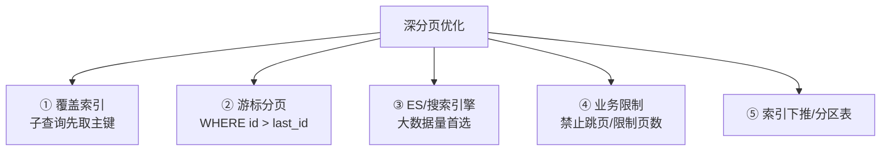
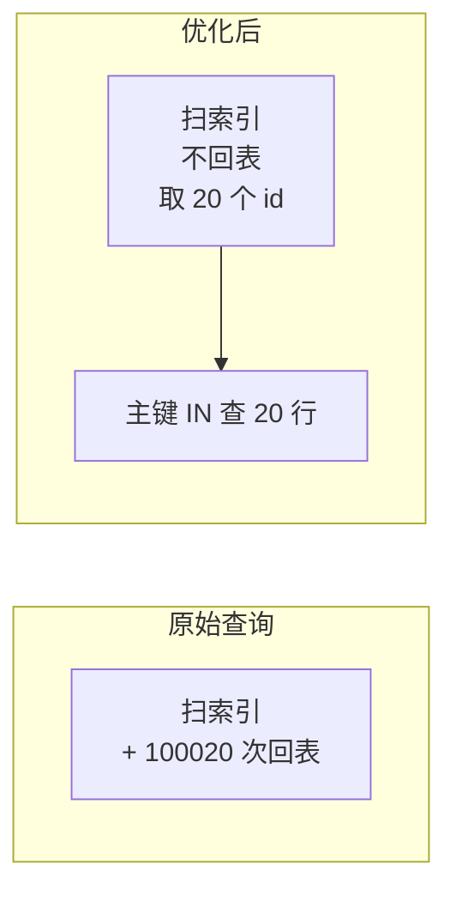
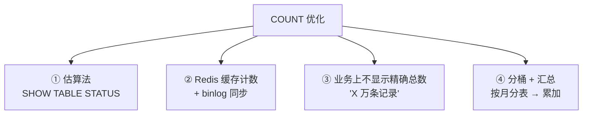
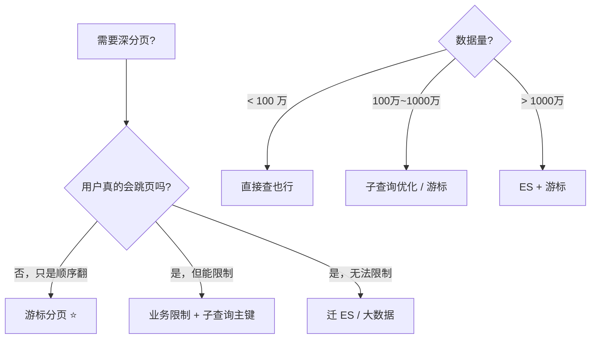

---
---

# 深分页优化（OFFSET 100000 LIMIT 20）

> 单表 1000 万行，`LIMIT 100000, 20` 慢得发指。
> 大厂面试经典题：**为什么慢？怎么优化？**

---

## 为什么深分页慢

```sql
SELECT * FROM order ORDER BY create_time DESC LIMIT 100000, 20;
```

```
MySQL 实际干的事：
  ① 扫描索引（create_time DESC）
  ② 找到前 100020 行
  ③ 每一行回表（聚簇索引取完整数据）
  ④ 丢掉前 100000 行
  ⑤ 返回最后 20 行

  → 100020 次回表！
  → 99.98% 的工作量被丢弃！
```


---

## 优化方案



---

## 方案 1：覆盖索引 + 延迟关联

```sql
-- ❌ 原始
SELECT * FROM order ORDER BY create_time DESC LIMIT 100000, 20;

-- ✅ 子查询先在索引里找主键
SELECT * FROM order
WHERE id IN (
    SELECT id FROM order
    ORDER BY create_time DESC
    LIMIT 100000, 20            -- 这一步走覆盖索引，不回表
)
ORDER BY create_time DESC;
```

```
原理：
  子查询只用索引 (id, create_time)，不回表
  → 扫 100020 个索引项（比扫完整行快几倍）
  → 拿到 20 个 id
  → 主查询用主键 IN，只回表 20 次

  提速 10~50 倍
```



---

## 方案 2：游标分页（last_id 法）⭐ 最推荐

```sql
-- 第一页
SELECT * FROM order WHERE id < 9999999 ORDER BY id DESC LIMIT 20;

-- 拿到这页最后一条 id = 9999800
-- 下一页：
SELECT * FROM order WHERE id < 9999800 ORDER BY id DESC LIMIT 20;
```

```
原理：
  WHERE id < ? 直接用索引定位
  → 跳过前面 100000 行不需要扫
  → 永远只扫 20 行
  
  无论翻到多深都一样快
```


**前端配合**：
```json
// 第一页响应
{
  "list": [...],
  "next_cursor": "9999800"
}

// 下一页请求
GET /api/orders?cursor=9999800&size=20
```

**优点**：
- 性能稳定，任意深度都快
- 无锁友好

**痛点**：
- 不支持"跳页"（无法直接跳到第 100 页）
- 数据中间被删可能导致漏
- 必须有**单调递增**字段（主键 / 自增时间）

---

## 方案 3：ES（大数据量首选）

```
MySQL 大表 + 分页 + 搜索 → 性能极差

ES：
  - 全文搜索快
  - search_after（游标）天然解决深分页
  - 海量数据
```

```json
GET /orders/_search
{
  "size": 20,
  "sort": [{"create_time": "desc"}, {"id": "desc"}],
  "search_after": [1715000000000, 9999800]
}
```

ES `search_after` 类似 MySQL 游标，但更通用。

---

## 方案 4：业务限制（最简单也最有效）

```
真实业务里，用户根本不会翻到第 100 页：

  Google 限 1000 条结果
  淘宝搜索只显示 100 页
  微博只能往下翻 N 天
  
  → 99% 用户只看前 5 页
  → 业务直接限制 page <= 100
  → 真要看后面：让他改筛选条件（按时间、按类目）
```

```java
if (page * pageSize > 10000) {
    throw new BizException("请缩小查询范围");
}
```

---

## 方案 5：分区表

```sql
ALTER TABLE order PARTITION BY RANGE (create_time) (
    PARTITION p2024 VALUES LESS THAN ('2025-01-01'),
    PARTITION p2025 VALUES LESS THAN ('2026-01-01'),
    PARTITION p2026 VALUES LESS THAN ('2027-01-01'),
    PARTITION pmax  VALUES LESS THAN MAXVALUE
);
```

```
按时间分区：
  查询时只扫相关分区，扫描量小
  
  WHERE create_time >= '2026-01-01' → 只扫 p2026
```

但分区表运维复杂，**优先选游标分页**。

---

## COUNT 优化（深分页的孪生兄弟）

```sql
-- 同样很慢
SELECT COUNT(*) FROM order WHERE status = 1;
-- 1000 万行 → 全表扫
```



**Google 风格**：
```
"约 1,234,000 条结果"  ← 估算
```

而不是精确的 1234567 条。

---

## 完整决策树



---

## 实战代码模板

### 游标分页（Spring + MyBatis）

```java
public class CursorPageDTO<T> {
    private List<T> list;
    private String nextCursor;   // 下一页游标
    private boolean hasMore;
}

@GetMapping("/orders")
public CursorPageDTO<Order> list(
    @RequestParam(required = false) String cursor,
    @RequestParam(defaultValue = "20") int size) {
    
    long lastId = cursor == null ? Long.MAX_VALUE : Long.parseLong(cursor);
    
    List<Order> list = orderMapper.selectByCursor(lastId, size + 1);
    
    boolean hasMore = list.size() > size;
    if (hasMore) list.remove(size);
    
    String nextCursor = hasMore ? String.valueOf(list.get(list.size() - 1).getId()) : null;
    return new CursorPageDTO<>(list, nextCursor, hasMore);
}
```

```xml
<select id="selectByCursor">
    SELECT * FROM order
    WHERE id < #{lastId}
    ORDER BY id DESC
    LIMIT #{size}
</select>
```

---

## 各方案性能对比（1000 万行表）

| 方案 | 第 1 页 | 第 1000 页 | 第 10000 页 |
| :--- | :--- | :--- | :--- |
| 原始 LIMIT | 5ms | 500ms | 5000ms |
| 子查询覆盖索引 | 5ms | 100ms | 800ms |
| 游标分页 | 5ms | 5ms | 5ms |
| ES search_after | 10ms | 10ms | 10ms |

---

## 高频面试追问

**Q: 为什么 LIMIT 100000, 20 比 LIMIT 20 慢这么多？**
- 必须扫描前 100020 行才能丢弃前 100000 行
- 每一行都要回表

**Q: 为什么不用 OFFSET 直接跳过？**
- MySQL 没办法"跳过"索引项，必须一项项扫
- 除非有特殊索引结构

**Q: 游标分页能跳页吗？**
- 不能，只能下一页。这是它的取舍。

**Q: 为什么不缓存所有结果？**
- 数据可能变（新增、删除）
- 缓存全量 1000 万行成本太高

---

## 一句话总结

| 场景 | 方案 |
| :--- | :--- |
| 顺序翻页（默认） | **游标分页**（id > last_id）⭐ |
| 必须跳页 + 数据量中等 | 子查询 + 覆盖索引 |
| 大数据量 + 复杂搜索 | ES |
| 业务允许 | **限制页数 + 不精确 COUNT** |

> 最佳实践：**前端 UI 设计成无限滚动**，天然只支持游标分页，绕开问题。
