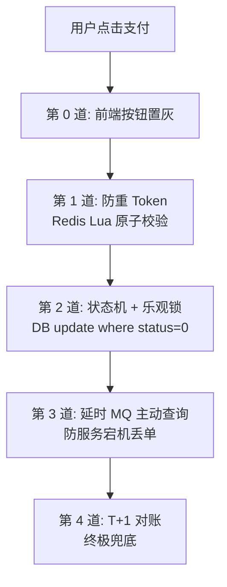
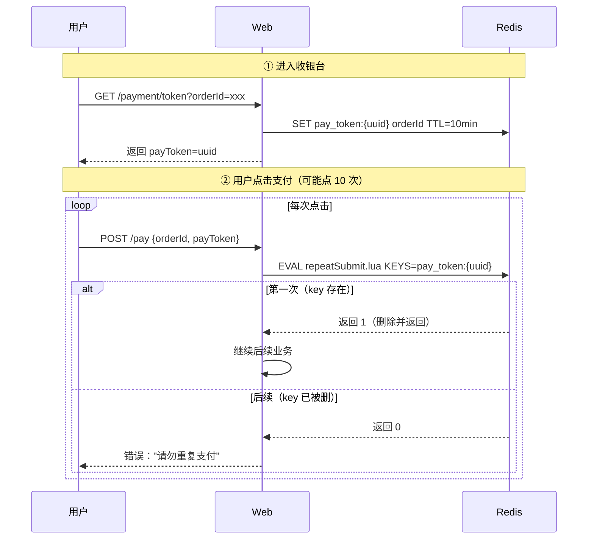
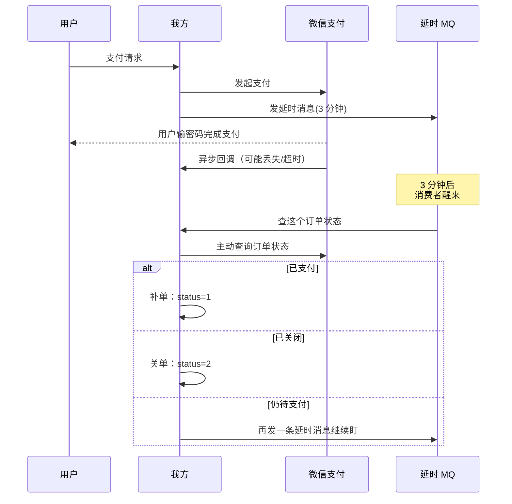

# 疯狂点击 10 次支付怎么办

> 用户网络卡顿，疯狂点击"立即支付"10 次。
> 防止重复扣款必须**多层防御**：前端置灰 → 后端 Token → DB 状态机 → MQ 兜底 → T+1 对账。

---

## 总览：四道防线



每一道都能挡住一类风险，**叠加才安全**：

| 风险 | 第 0 道 | 第 1 道 | 第 2 道 | 第 3 道 | 第 4 道 |
| :--- | :--- | :--- | :--- | :--- | :--- |
| 重复点击 | ✅ | ✅ | ✅ | | |
| 前端绕过/脚本 | ❌ | ✅ | ✅ | | |
| Token 网络抖动失效 | | ❌ | ✅ | ✅ | |
| 第三方回调丢失 | | | ❌ | ✅ | ✅ |
| Redis 宕机 | | ❌ | ✅ | ✅ | ✅ |
| 所有中间件全挂 | | | | | ✅ |

---

## 第 0 道：前端按钮置灰

```javascript
async function pay() {
  btn.disabled = true;     // 立刻置灰
  try {
    await api.pay(orderId, payToken);
  } finally {
    btn.disabled = false;  // 失败后才允许重试
  }
}
```

> 挡 80% 的"手抖用户"，但挡不住脚本攻击和真重试。

---

## 第 1 道：防重 Token（Redis Lua）

### 流程



### Lua 脚本（关键）

```lua
-- repeatSubmit.lua
-- KEYS[1]: pay_token:xxxx
-- 返回 1=合法并消费，0=已被使用/过期
if redis.call('EXISTS', KEYS[1]) == 1 then
    redis.call('DEL', KEYS[1])
    return 1
else
    return 0
end
```

> 必须用 Lua 保证"判断+删除"原子。两条命令分开做，并发下能让两个请求都拿到 1。

### Java 实现

```java
// 1. 进入收银台：颁发 Token
public PayTokenVO getPayToken(Long userId, Long orderId) {
    Order order = orderMapper.getById(orderId);
    if (order.getUserId() != userId || order.getStatus() != WAIT_PAY) {
        throw new BizException("订单状态异常");
    }
    String token = UUID.randomUUID().toString().replace("-", "");
    redisTemplate.opsForValue().set("pay_token:" + token, orderId, 10, TimeUnit.MINUTES);
    return new PayTokenVO(token, orderId);
}

// 2. 支付：原子消费 Token
public PayResultVO submitPay(Long userId, Long orderId, String payToken) {
    Long ok = stringRedisTemplate.execute(
        RedisScript.of(loadLua("repeatSubmit.lua"), Long.class),
        Arrays.asList("pay_token:" + payToken)
    );
    if (!Long.valueOf(1).equals(ok)) {
        throw new BizException("请勿重复支付，或支付链接已过期");
    }
    // 继续走第 2 道防线...
}
```

### 问题：Redis 宕机怎么办？
→ Lua 失败抛异常或退化到"未拿到 Token"，**第 2 道 DB 状态机能兜住**。

---

## 第 2 道：DB 状态机 + 乐观锁

```sql
-- 唯一一行能成功的 UPDATE
UPDATE `order`
SET status = 1, pay_time = NOW()
WHERE id = #{orderId} AND status = 0;
```

```
status 状态机：
  0 待支付 ──支付成功──→ 1 已支付 ──发货──→ 2 已发货 ──→ 3 已完成
                                                ↑
                                        每一步状态迁移
                                        都用 WHERE 旧状态约束
```

```mermaid
flowchart LR
  A[10 个并发请求都过了 Token] --> B[UPDATE WHERE status=0]
  B --> C1[请求 1: 1 行受影响 ✅]
  B --> C2[请求 2: 0 行受影响 ❌]
  B --> C3[请求 3: 0 行受影响 ❌]
  B --> C10[请求 10: 0 行受影响 ❌]
  C2 --> R[抛"订单已支付"]
  C3 --> R
  C10 --> R
```

> InnoDB 行锁串行化这条 UPDATE，**全世界只有一次能 status=0→1**。

### Mybatis 模板

```xml
<update id="updatePaySuccess">
    UPDATE `order`
    SET status = 1, pay_time = NOW()
    WHERE id = #{orderId} AND status = #{waitPayStatus}
</update>
```

```java
int rows = orderMapper.updatePaySuccess(orderId, WAIT_PAY);
if (rows <= 0) {
    throw new BizException("订单已支付");  // 并发下别人先支付了
}
// 然后调用第三方支付
ThirdPayResult result = thirdPayService.createPay(order);
```

---

## 第 3 道：延时 MQ 主动查询

**痛点**：钱在微信扣了，但回调时你的服务器宕机了 → 本地状态没改 → 用户以为没支付。

### 流程



### 代码

```java
// 支付时发延时消息
mqTemplate.sendDelayMessage(PayCheckTopic, orderId, 3 * 60);

// 消费者
@RabbitListener(queues = PayCheckTopic)
public void checkPayStatus(Long orderId) {
    Order order = orderMapper.getById(orderId);
    if (order.getStatus() != WAIT_PAY) return;  // 已经处理过

    ThirdPayQueryResult r = thirdPayService.query(orderId);
    if (r.isPaySuccess()) {
        orderMapper.updatePaySuccess(orderId, WAIT_PAY);
    } else if (r.isClosed() || r.isPayTimeout()) {
        orderMapper.updateToClosed(orderId);
    } else {
        // 还在 PAYING，再延时 2 分钟
        mqTemplate.sendDelayMessage(PayCheckTopic, orderId, 2 * 60);
    }
}
```


---

## 第 4 道：T+1 对账（终极兜底）

每天凌晨：拉全量支付账单 → 逐笔对比本地订单 → 不一致告警人工处理。

详见 [千万级对账.md](千万级对账.md)。

---

## requestId 怎么生成？

幂等键不能只信前端，**前端生成 + 后端校验** 或 **后端预下发**。

### 方案 A（最常见）：前端生成 UUID

```js
// 进入页面时生成一次
const requestId = crypto.randomUUID();
// 重试时带同一个
await api.pay({ orderId, requestId });
```

后端用 `userId + activityId + requestId` 作幂等键，DB 加唯一索引。

### 方案 B（更安全）：后端预下发 Token

进入收银台时由服务端生成 → 客户端必须携带 → 防伪造、防刷。

### 注意
- 后端要做格式校验、过期校验、绑定用户
- `orderId` ≠ `requestId`
  - requestId：**单次请求身份**（同一请求重试用同一个）
  - orderId：**业务订单号**（下单成功后才有）

---

## 总结口诀

| 层 | 目的 | 技术 |
| :--- | :--- | :--- |
| 前端置灰 | 挡手抖 | JS disabled |
| 防重 Token | 挡并发请求 | Redis Lua 原子 |
| 状态机 + 乐观锁 | 挡所有重复支付 | DB UPDATE WHERE status |
| 延时 MQ | 挡服务宕机丢单 | 主动查第三方 |
| T+1 对账 | 终极兜底 | 离线批量比对 |

> 这套是支付领域的"标准答案"——少一道都可能出钱。
