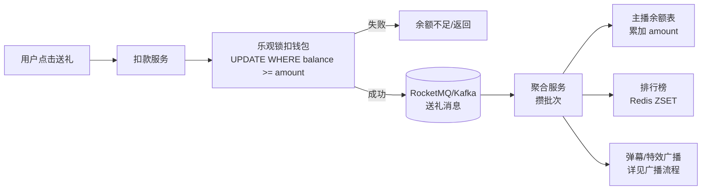
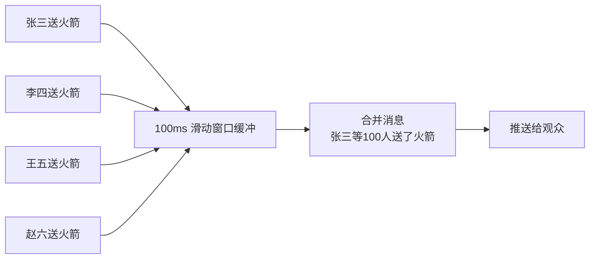
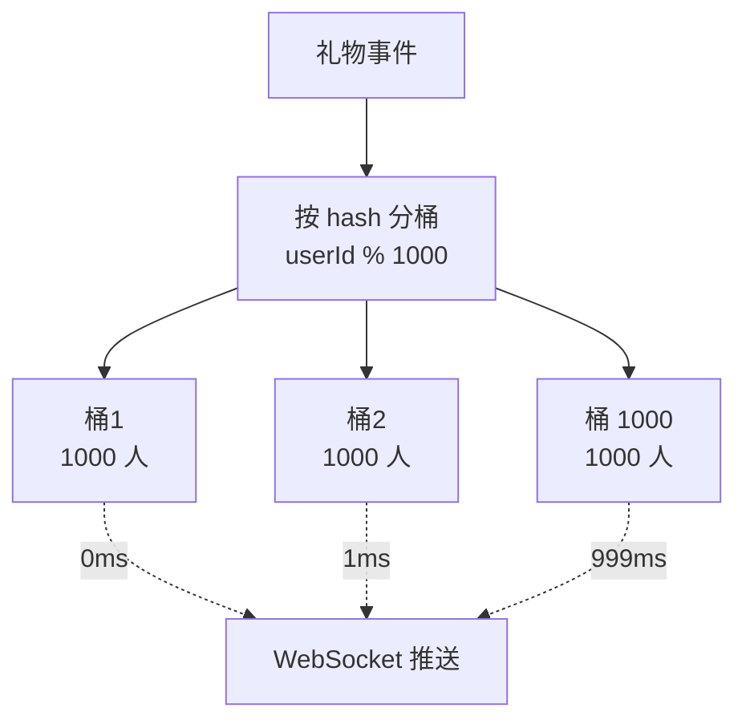
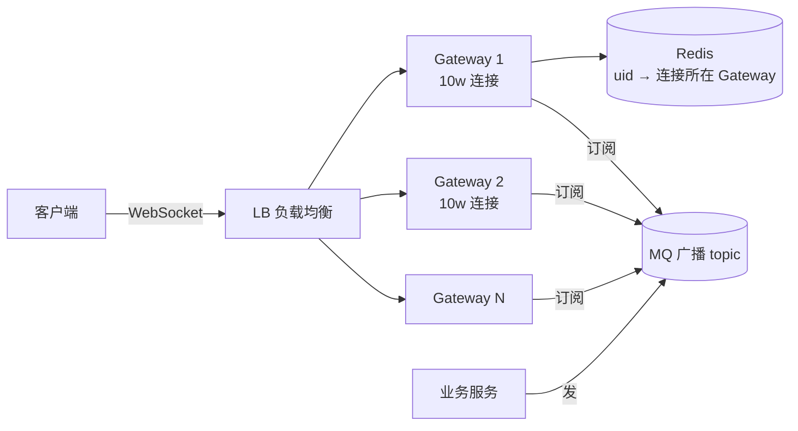
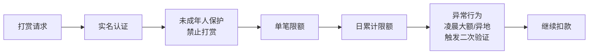

# 直播打赏系统设计

> 两个核心挑战：
> ① **打赏金额扣减**：高并发不能透支、不能丢账
> ② **广播风暴**：100 万观众，主播一个礼物特效要推给所有人

---

## 一、打赏链路（资金流）



### 关键点

**1. 用户扣款用乐观锁**（防透支）
```sql
UPDATE wallet SET balance = balance - 100, version = version + 1
WHERE uid = ? AND balance >= 100 AND version = ?;
-- 影响 0 行 → 余额不足 / 并发冲突
```

**2. 异步聚合给主播加余额**
```
为什么不同步加？
  ❌ 用户扣 1 笔 → 主播加 1 笔 → DB UPDATE 1 行
     1 万 QPS 打赏 → 主播账户 1 万 QPS UPDATE → 锁等待爆炸

  ✅ 用户扣款 → 发 MQ → 聚合服务每 100ms 攒一批
     → 一次 UPDATE 把 1000 笔合并加到主播
     QPS 从 1 万降到 10，DB 压力 1/1000
```

**3. 消息可靠性**
- 扣款成功后才发 MQ（事务消息或 Outbox 模式）
- 聚合服务幂等：用流水 ID 去重
- 失败重试 + 死信队列兜底

---

## 二、广播风暴（消息流）

### 痛点

```
100 万观众长连接，每秒产生 1000 个礼物特效

❌ 朴素做法：
  每个礼物 → 推 100 万次
  1000 个/秒 × 100 万 = 10 亿次推送/秒
  ━━━━━━━━━━━━━━━━━━━━━━━━━━━━━━━━━━━━
  网卡爆炸、CPU 爆炸、客户端也卡死
```

### 解法 1：消息合并

```
原始事件流：
  [张三送火箭] [李四送火箭] [王五送火箭] ... [赵六送火箭]
   ↓
  合并 100ms 内的同类型礼物：
  [张三等 100 人送了火箭]
   ↓
  只推 1 条 → 网络流量 / 100
```



### 解法 2：分桶广播（最关键）

把百万长连接**分到 N 个桶**，**轮询分批次推送**，把瞬间脉冲变成平滑流量。

```
不分桶：
    礼物来了
       │
       ▼
   ┌──────────────────┐
   │ 一次性推 100 万人 │ ──→ 瞬间网络脉冲，网卡爆
   └──────────────────┘

分 1000 个桶：
   100 万连接 = 1000 桶 × 1000 人/桶

    礼物来了
       │
       ▼
   ┌──────────────────────────────────────┐
   │ 第 0ms : 推桶 1 的 1000 人              │
   │ 第 1ms : 推桶 2 的 1000 人              │
   │ 第 2ms : 推桶 3 的 1000 人              │
   │ ...                                  │
   │ 第 999ms: 推桶 1000 的 1000 人          │
   └──────────────────────────────────────┘
   总时长 1 秒，流量被压平 1000 倍
```



观众端体验：1 秒内陆续看到特效，**没人会觉得"慢"**。

---

## 三、长连接架构



- Gateway 用 Netty 维持长连接，单机 10w+ 连接
- Redis 维护"用户在哪台 Gateway"路由表
- 广播：业务发 MQ，所有 Gateway 订阅，各自推自己的连接

---

## 四、数据存储分层

| 数据 | 介质 | 原因 |
| :--- | :--- | :--- |
| 用户余额、主播余额 | MySQL | 强一致 + 事务 |
| 实时排行榜（小时/日） | Redis ZSET | TopN 快 |
| 礼物消息（最近 1 小时） | Redis List/Stream | 高频读 |
| 历史礼物（>1 小时） | HBase / ClickHouse | 海量冷数据 |
| 直播间元数据 | MySQL + 本地缓存 | 高频读取 |

---

## 五、风控



---

## 一句话总结

| 挑战 | 解法 |
| :--- | :--- |
| 用户透支 | 乐观锁 + DB 校验 |
| 主播账户成为热点 | MQ 聚合批次更新 |
| 广播风暴 | 消息合并 + 分桶广播 |
| 长连接管理 | Gateway 集群 + Redis 路由表 |
| 异常打赏 | 风控前置 |
