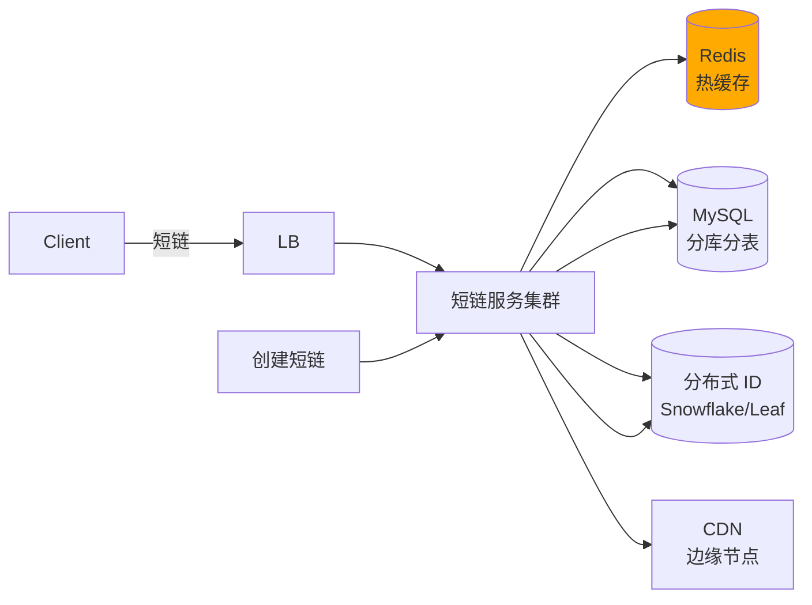
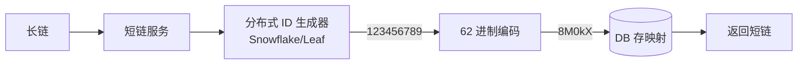
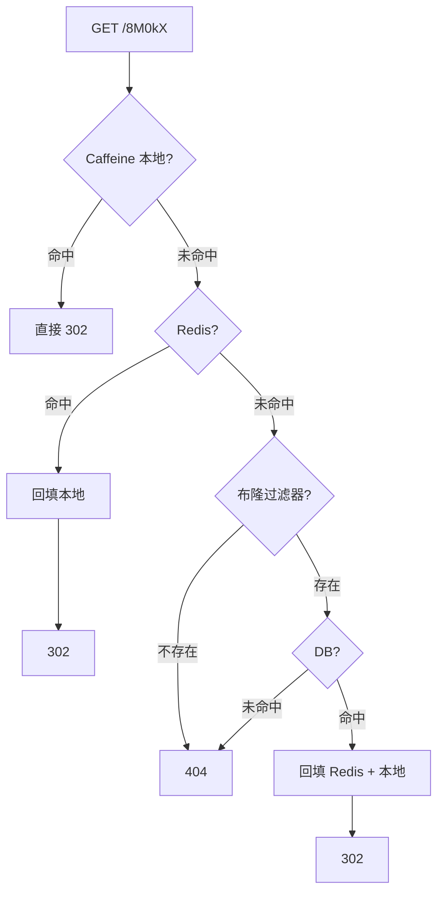
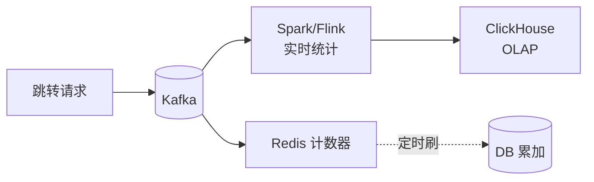
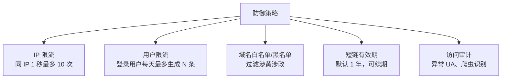
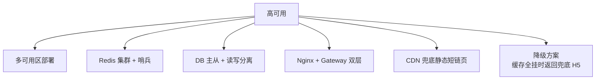
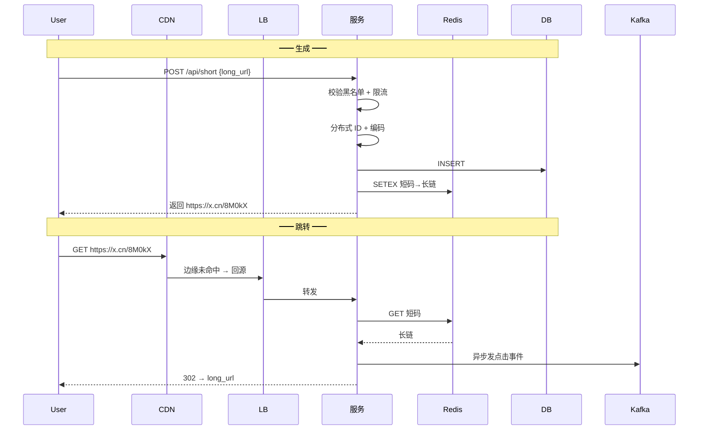

---
---

# 短链系统设计

> 把 `https://www.example.com/share/order/12345?utm_source=...&token=abc...` 变成 `https://x.cn/Ab3Xy9`。
> 大厂面试经典系统设计题，**容量估算 + ID 生成 + 缓存 + 跳转**全考。

---

## 总览架构



---

## 容量估算（先做这步）

```
假设：
  日 PV 1 亿，月新增短链 10 亿条
  每条短链平均存 200 字节
  每月数据 200 GB
  3 年 → 7 TB
  
QPS：
  日 PV 1 亿 / 86400 = 1200 QPS（均值）
  峰值 5~10 倍 = 6000~12000 QPS
  
读写比：
  生成:跳转 = 1:100（短链生成少、点击多）
```

→ 需要：分布式 ID + 分库分表 + Redis 缓存 + CDN

---

## 核心：6 位短码（62 进制）

```
   0-9 + a-z + A-Z = 62 个字符
   
   6 位短码：62^6 ≈ 568 亿种
   7 位短码：62^7 ≈ 3.5 万亿种
   
   → 6 位足够大多数业务用 100 年
```

```
长链 https://example.com/article/789?ref=xyz
  ↓
   生成 ID = 123456789
  ↓
   62 进制转换 = "8M0kX"
  ↓
短链 https://x.cn/8M0kX
```

```java
private static final String CHARS = "0123456789abcdefghijklmnopqrstuvwxyzABCDEFGHIJKLMNOPQRSTUVWXYZ";

public static String encode(long id) {
    StringBuilder sb = new StringBuilder();
    while (id > 0) {
        sb.append(CHARS.charAt((int)(id % 62)));
        id /= 62;
    }
    return sb.reverse().toString();
}

public static long decode(String shortCode) {
    long id = 0;
    for (char c : shortCode.toCharArray()) {
        id = id * 62 + CHARS.indexOf(c);
    }
    return id;
}
```

---

## 方案 1：发号器（推荐）⭐



**优点**：
- ID 趋势递增，DB 索引友好
- 不会冲突
- 实现简单

**缺点**：
- 短码顺序生成 → 容易被遍历（爬虫扫库）
- 需要分布式 ID 组件

详见 [分布式ID.md](../分布式/分布式ID.md)。

---

## 方案 2：Hash + 冲突解决

```
long_url ──MD5──> 32 位 hex
                    │
              取前 6 个字符
                    │
              检查 DB 冲突
                ├ 不冲突 → 用
                └ 冲突 → 加盐重试 / 用第 7 位
```

**优点**：天然散列，难枚举
**缺点**：冲突检测增加 DB 压力

---

## 方案 3：预生成

```
离线生成大量"未使用短码"放 Redis Set：
  ┌────────────────────────────────┐
  │ available_codes: [Ab3Xy, Df8Op, │
  │                   Hk2Mn, ... ]  │
  └────────────────────────────────┘

  请求来时：
    SPOP available_codes → 拿一个用
    
  优点：响应极快，无运行时冲突
  缺点：需要定时补充任务
```

---

## DB 表设计

```sql
CREATE TABLE short_url (
    id            BIGINT PRIMARY KEY,
    short_code    VARCHAR(10) UNIQUE,
    long_url      VARCHAR(2048) NOT NULL,
    creator_id    BIGINT,
    create_time   DATETIME,
    expire_time   DATETIME,
    click_count   BIGINT DEFAULT 0,
    
    INDEX idx_short_code (short_code),
    INDEX idx_creator (creator_id)
);
```

**分库分表**：按 `short_code` hash 分。详见 [分库分表.md](../数据库/分库分表.md)。

---

## 跳转流程（高频读路径）



**三级缓存**：
- L1: Caffeine 本地 5 分钟
- L2: Redis 1 小时
- L3: DB

**布隆过滤器**：防止恶意请求随机短码穿透到 DB。

---

## 重定向用 301 还是 302

| 状态码 | 含义 | 浏览器行为 | 统计点击 |
| :--- | :--- | :--- | :--- |
| **301** | 永久重定向 | **浏览器缓存**，下次直接跳 | ❌ 后续无统计 |
| **302** | 临时重定向 | 每次都问服务器 | ✅ 每次都统计 |

> 短链一般用 **302**，因为要统计点击量。

```nginx
location ~* ^/([a-zA-Z0-9]{6})$ {
    return 302 $upstream_response;
}
```

---

## 点击统计（异步）



```java
// 跳转后异步发消息
@GetMapping("/{code}")
public String redirect(@PathVariable String code) {
    String longUrl = lookup(code);
    
    // 异步统计（不阻塞跳转）
    statsKafkaTemplate.send("short_url_click", new ClickEvent(code, ...));
    
    return "redirect:" + longUrl;
}
```

直接同步写 DB 会拖慢跳转 → 必须异步。

---

## 防刷防恶意



---

## 自定义短码（高级功能）

```
用户输入自定义 alias：mylink
  → 检查 alias 是否已被占用
  → 占用：让用户换一个
  → 未占用：分配给他

实现：
  写入前 SETNX short_alias:mylink uid，原子防并发占用
```

---

## 高可用考虑



---

## 完整链路时序



---

## 一句话总结

| 模块 | 选型 |
| :--- | :--- |
| 短码生成 | 分布式 ID + 62 进制编码 |
| 存储 | MySQL 分库分表 + Redis 多级缓存 |
| 跳转 | 302 + 异步 Kafka 统计 |
| 防穿透 | 布隆过滤器 |
| 防刷 | 多维度限流 + 黑名单 |
| 容量 | 6 位短码够 500 亿条 |
