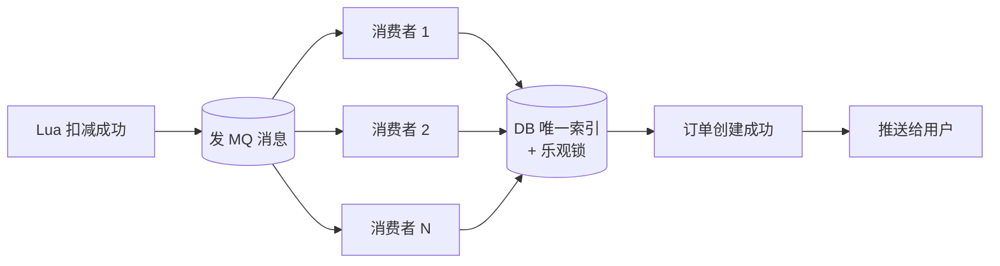
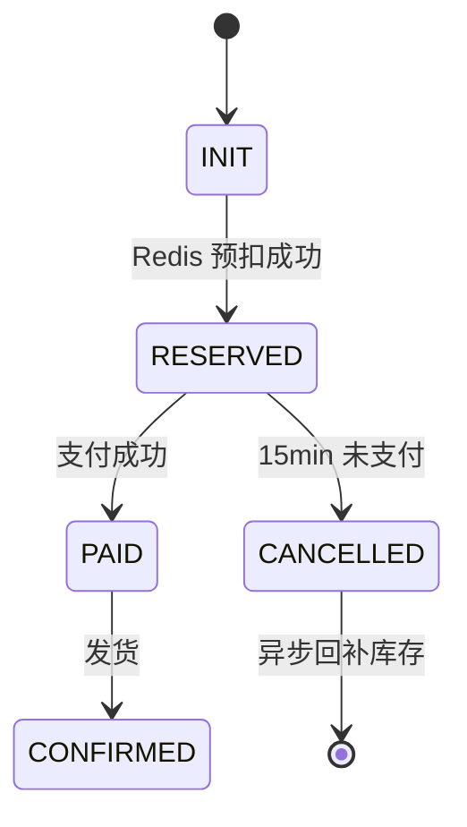

# 秒杀防库存超卖

> 核心思想：**漏斗式过滤**。每一层把 90% 的流量挡掉，到达 DB 时只剩下千分之一。
> 100 万 QPS → 经过 CDN/前端/网关/Redis 层层过滤 → DB 层只剩 1 千 QPS。

---

## 总览：五层漏斗

```
                    流量入口 100万 QPS
                          │
        ┌─────────────────▼─────────────────┐
        │  ① CDN：HTML/JS/CSS/图片          │  -50%
        └─────────────────┬─────────────────┘
                          │ 50万 QPS
        ┌─────────────────▼─────────────────┐
        │  ② 前端置灰 + 滑块/验证码         │  -80%
        └─────────────────┬─────────────────┘
                          │ 10万 QPS
        ┌─────────────────▼─────────────────┐
        │  ③ 网关层：IP 限流/令牌桶/WAF      │  -90%
        └─────────────────┬─────────────────┘
                          │ 1万 QPS
        ┌─────────────────▼─────────────────┐
        │  ④ JVM 本地缓存：活动元数据预判    │  -90%
        └─────────────────┬─────────────────┘
                          │ 1000 QPS
        ┌─────────────────▼─────────────────┐
        │  ⑤ Redis Lua 原子预扣库存（核心） │  -99%
        └─────────────────┬─────────────────┘
                          │ 10 QPS（实际只有 N 个库存）
        ┌─────────────────▼─────────────────┐
        │  ⑥ MQ 异步落 DB + 状态机兜底      │
        └────────────────────────────────────┘
```


## ① CDN（80% 流量）

把 HTML/JS/CSS/图片/活动详情图全部预热到 CDN：
- 用户根本不打你的源站
- 活动入口走 CDN 边缘节点，BGP 多线

---

## ② 前端层

```javascript
btn.disabled = true;     // 置灰防双击
showCaptcha();           // 滑块拖动 / 数字验证码
```

- 滑块/图形验证码：拦截脚本
- 题目验证（如答题秒杀）：把人挡在外面
- 按钮置灰 + 倒计时

> 顶级活动甚至上 POW（工作量证明），强迫客户端算一段哈希，机器人成本暴涨。

---

## ③ 网关层（Nginx + Gateway，10% 流量）

```nginx
# Nginx：IP 限流
limit_req_zone $binary_remote_addr zone=seckill:10m rate=10r/s;
location /seckill {
    limit_req zone=seckill burst=5 nodelay;
}
```

- IP 黑名单：撞库/扫描的 IP 永久封
- 令牌桶限流：每秒只放 N 个进来
- WAF 拦截脚本攻击
- Nginx + Lua 做"秒杀预检"：未到点直接 403

> 接口限流用**令牌桶**（允许偶尔突发），网络限流用**漏桶**（强制匀速）。详见 [限流算法](../分布式/限流算法.md)。

---

## ④ JVM 本地缓存（9% 流量）

```java
// 活动元数据放 Caffeine
Cache<Long, Activity> cache = Caffeine.newBuilder()
    .maximumSize(1000)
    .expireAfterWrite(5, TimeUnit.SECONDS)
    .build();

// 活动还没开始？直接拒
Activity a = cache.get(activityId, this::loadFromRedis);
if (System.currentTimeMillis() < a.getStartAt()) {
    throw new BizException("活动未开始");
}
```

- 活动配置、商品基础信息全部走本地缓存
- 不打 Redis，更不打 DB

---

## ⑤ Redis Lua 原子扣减（核心，0.9% 流量）

### Lua 脚本

```lua
-- KEYS[1]: stock:{itemId}
-- ARGV[1]: 扣减数量
-- ARGV[2]: 用户 ID（防同一用户重复抢）

-- 防重复抢
if redis.call('SISMEMBER', 'user_bought:'..KEYS[1], ARGV[2]) == 1 then
    return -1  -- 已抢过
end

local stock = tonumber(redis.call('GET', KEYS[1]))
if not stock or stock < tonumber(ARGV[1]) then
    return 0   -- 库存不足
end

redis.call('DECRBY', KEYS[1], ARGV[1])
redis.call('SADD', 'user_bought:'..KEYS[1], ARGV[2])
return 1       -- 成功
```

```mermaid
flowchart LR
  A[请求] --> B[EVAL stock_decr.lua]
  B --> C{返回值?}
  C -->|1| D[发 MQ 下单消息]
  C -->|0| E[返回"库存不足"]
  C -->|-1| F[返回"已抢过"]
```

### 为什么必须用 Lua？

```
两条命令分开 GET + DECRBY：
  线程 A: GET stock = 1  ✅
  线程 B: GET stock = 1  ✅
  线程 A: DECRBY → stock = 0  ✅
  线程 B: DECRBY → stock = -1  ❌ 超卖！

Lua 单线程原子执行：
  线程 A 整个脚本跑完 → 线程 B 才能进
  绝不可能超卖
```

### Redis 宕机怎么办？

```
快速失败 → 返回"系统繁忙稍后再试"
绝不降级到 DB（DB 扛不住）
xxl-job 定时任务：补单 / 回滚预扣
```


---

## ⑥ MQ 异步下单（流量整形）

```
Redis 扣减成功 ≠ 订单创建成功
              ↓
        发 MQ 消息（带 orderId）
              ↓
    异步消费者：按订单维度落 DB
              ↓
    用户轮询 / WebSocket 推送结果
```




**消息顺序保证**：同一 orderId 必须落到同一 queue（详见 [MQ消息堆积](../消息队列/MQ消息堆积1亿条数据.md)）：

```java
// RocketMQ：按 orderId 选 queue
producer.send(message, (mqs, msg, arg) -> {
    long id = (Long) arg;
    return mqs.get((int)(id % mqs.size()));
}, orderId);
```

---

## ⑦ DB 兜底（0.1%）

```sql
-- 创建订单：唯一索引防重
INSERT INTO order(...) VALUES(...);
-- 出现重复 (用户ID + 活动ID) → 报唯一键冲突 → 幂等返回

-- 扣库存兜底（防 Redis 失真）：
UPDATE item SET stock = stock - 1
WHERE id = ? AND stock >= 1;
```


---

## 整套链路状态机

```
订单状态：
  INIT ──Redis 扣减成功──→ RESERVED
  RESERVED ──用户支付──→ PAID ──发货──→ CONFIRMED
  RESERVED ──15min 超时──→ CANCELLED ──回补库存──→ Redis stock+1
```



---

## 一些原则（背下来）

- **少用强一致锁**，优先**原子扣减 + 幂等 + 状态机**
- **requestId 幂等键**：Redis/DB 唯一索引
- **Outbox 模式**：本地消息表 → MQ，保证"订单状态变化"和"发消息"一致
- **乐观锁版本号**：每次 update 带 version
- **Redis 锁**：用户维度短锁 TTL 3~5s，业务幂等兜底，**别锁库存**
- **etcd/ZK**：活动发布、批任务单实例执行、Leader 选举——**不放主链路**
- **支付超时取消**走补偿消息回补库存，**补偿同样幂等**

---

## 最小核心流程

1. 接口层限流 + 风控，校验活动资格
2. requestId 幂等判重
3. Redis Lua 预扣库存（原子返回 1/0/-1）
4. 创建订单 INIT/RESERVED（DB 唯一键防重）
5. 写 Outbox，异步发 MQ
6. 支付成功消费消息，订单改 PAID
7. 超时取消或失败，发补偿消息回补库存

---

## 一句话总结

> 秒杀 = **漏斗过滤 + Redis 原子扣减 + MQ 流量整形 + DB 兜底**。
> 每一层只做一件事，DB 永远不该被 100 万 QPS 直接打到。
