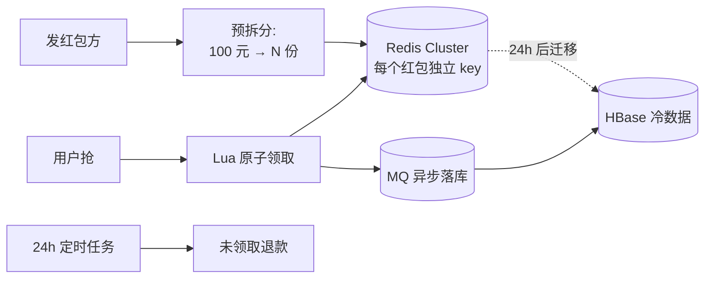
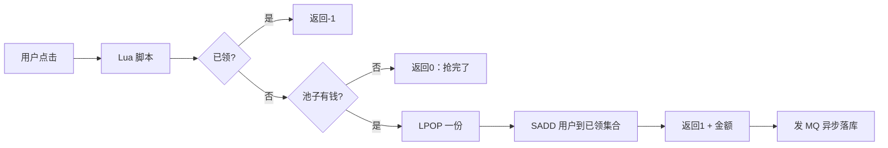
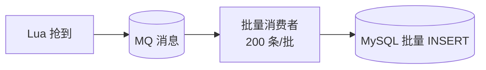
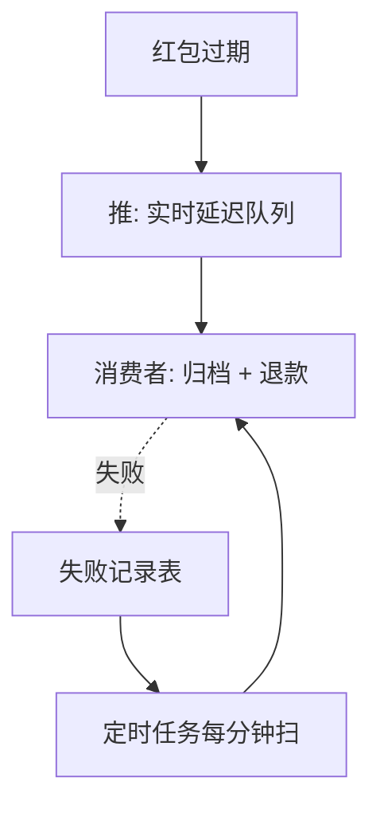
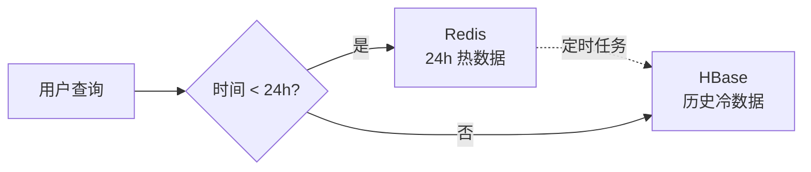

---
---

# 红包雨

> 春晚级别的活动：1 亿人同时抢红包，瞬间几千万 QPS。
> 关键技术：**预拆分到 Redis + Lua 原子领取 + 推拉结合 + 冷热分离**。

---

## 整体架构



---

## 一、发红包：二倍均值法

每抢一次的金额随机，但保证总和 = 红包金额。

```
二倍均值法：
  剩余金额 = R, 剩余人数 = N
  本次随机范围 = [0.01, 2 × R/N)
  
  例：100 元发 10 人
  第 1 次：random(0.01, 20) → 抽到 12.3，剩 87.7 / 9 人
  第 2 次：random(0.01, 19.5) → 抽到 5.6, 剩 82.1 / 8 人
  ...
  最后 1 人：拿全部剩余
```

```java
public List<BigDecimal> split(BigDecimal total, int n) {
    List<BigDecimal> list = new ArrayList<>();
    BigDecimal remain = total;
    for (int i = 0; i < n - 1; i++) {
        BigDecimal max = remain.divide(BigDecimal.valueOf(n - i))
                                .multiply(BigDecimal.valueOf(2));
        BigDecimal amount = randomBetween(BigDecimal.valueOf(0.01), max);
        list.add(amount);
        remain = remain.subtract(amount);
    }
    list.add(remain);  // 最后一份给剩余
    Collections.shuffle(list);
    return list;
}
```

预拆分好之后：**把每一份单独存进 Redis**。

---

## 二、Redis 数据结构

```
红包总池 (List 或 ZSet)：
  Key: redbag:{packetId}
  Value: [12.3, 5.6, 8.9, ..., 余下若干份]

已领用户去重 (Set)：
  Key: redbag_taken:{packetId}
  Value: {uid1, uid2, ...}

红包元数据 (Hash)：
  Key: redbag_meta:{packetId}
  Field: total / count / expire
```

> 关键：**同一红包的 List 和 Set 必须落到同一 Redis 节点**，否则 Lua 不能跨节点。

---

## 三、Cluster 跨槽位问题（用 Hash Tag 解决）

Redis Cluster 的 Lua 脚本**不能跨 slot**。两个 key 默认按完整 key 名 hash，可能落到不同节点。

```
Key 设计：
  ❌ redbag:1001        →  slot 5000
     redbag_taken:1001  →  slot 8000   不同节点，Lua 报错

  ✅ redbag:{1001}        →  按 {1001} hash → slot 5000
     redbag_taken:{1001}  →  按 {1001} hash → slot 5000   同节点 ✅
```

> `{xxx}` 大括号包裹的部分叫 **hash tag**，Redis Cluster 只用这部分算 slot。

---

## 四、抢红包：Lua 原子脚本

```lua
-- KEYS[1] = redbag:{packetId}
-- KEYS[2] = redbag_taken:{packetId}
-- ARGV[1] = userId

-- ① 已领过
if redis.call('SISMEMBER', KEYS[2], ARGV[1]) == 1 then
    return {-1}
end

-- ② 池子里有钱
local amount = redis.call('LPOP', KEYS[1])
if not amount then
    return {0}
end

-- ③ 标记已领
redis.call('SADD', KEYS[2], ARGV[1])
return {1, amount}
```



---

## 五、MQ 异步落库 + 削峰填谷

```
为什么不同步落 DB?
  瞬时 1000 万 QPS 全打 DB → 必崩

异步流程：
  Lua 成功 → 发 MQ → 消费者攒批 INSERT → DB
                  ↓
  DB QPS 平稳在 1 万左右
```



---

## 六、推拉结合（结束时的钱归账）

红包有过期时间，到期后没领的要**退给发送方**。

### 推

```
活动结束/红包过期：
  ① 系统主动推消息给发送方"你还有 50 元未领，已退回"
  ② 进入延迟队列：归档红包数据 + 退款流水
```

### 拉

```
定时任务（兜底）：
  每分钟扫描"过期但未处理"的红包
  → 重新触发归档/退款
  → 记录失败的进死信，人工处理
```



---

## 七、冷热分离

```
红包数据生命周期：
  ━━━━━━━━━━━━━━━━━━━━━━━━━━━━━━━━━━━━━
  抢中后 24h 内：用户频繁查看"我的红包"
    → 热数据，放 Redis
  ━━━━━━━━━━━━━━━━━━━━━━━━━━━━━━━━━━━━━
  24h 之后：偶尔翻历史
    → 冷数据，迁移到 HBase
  ━━━━━━━━━━━━━━━━━━━━━━━━━━━━━━━━━━━━━
```



---

## 八、容量评估

```
春晚红包雨（参考）：
  ──────────────────────────────────────────
  并发用户：10 亿
  活动时长：1 分钟
  预计 QPS：1 亿 / 60 = 167 万 QPS
  ──────────────────────────────────────────
  Redis Cluster：200 个分片 × 8000 QPS = 160 万 QPS ✅
  MQ：RocketMQ 集群 50 broker，单 broker 10w QPS
  DB：异步消费攒批，单库 5000 TPS 足够
  ──────────────────────────────────────────
  网络：高峰出向流量 80Gbps，需 100Gbps 网卡
```

---

## 一句话总结

| 难点 | 解法 |
| :--- | :--- |
| 并发太高 | Redis Lua 原子 + 预拆分 |
| Cluster 跨槽位 | Hash tag `{packetId}` |
| DB 扛不住 | MQ 异步 + 攒批 |
| 红包过期退款 | 推（延迟队列）+ 拉（定时任务）兜底 |
| 数据量大 | 冷热分离，Redis → HBase |
