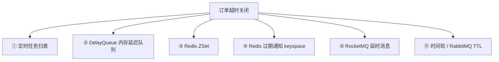
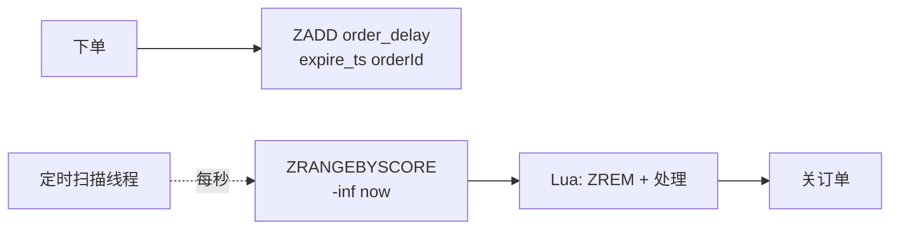
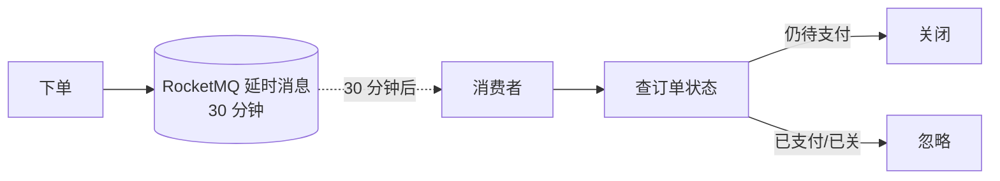
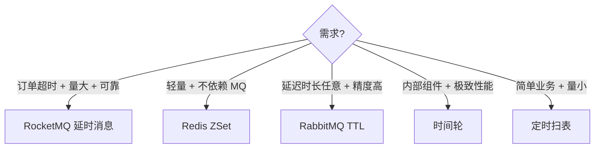
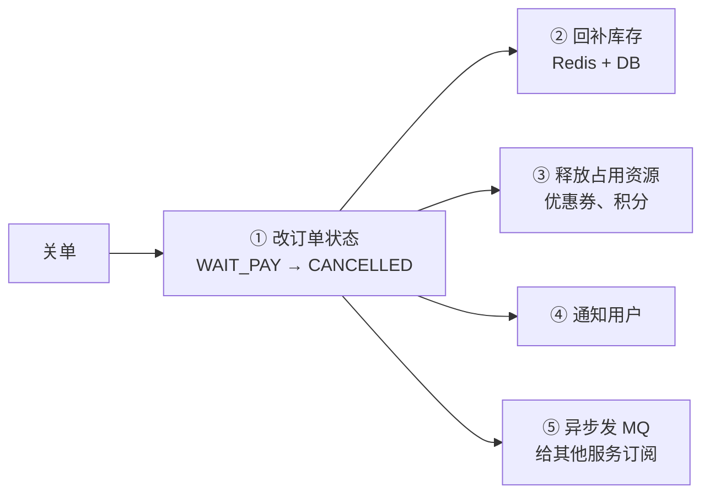

---
---

# 订单超时关闭（延迟任务）

> "下单 30 分钟内不付款自动关闭"——电商必备功能。
> 看似简单，实现起来有 6 种方案，各有性能/可靠性的取舍。

---

## 6 种实现方案



| 方案 | 精度 | 可靠性 | 单机/分布式 | 适合场景 |
| :--- | :--- | :--- | :--- | :--- |
| 定时扫表 | 低（分钟级） | 高 | 分布式 | 量小、对延迟不敏感 |
| DelayQueue | 高（毫秒） | ❌ 重启丢 | 单机 | 玩具项目 |
| Redis ZSet | 中（秒级） | 中 | 分布式 | 中等规模 |
| Redis 过期通知 | 不可靠（有延迟） | ❌ 不保证 | 分布式 | 不推荐 |
| RocketMQ 延时 | 高 | 高 | 分布式 | **生产推荐** ⭐ |
| 时间轮 | 极高 | 中 | 单机 | 内部组件 |

---

## 方案 1：定时任务扫表（最朴素）

```java
@Scheduled(cron = "0 */1 * * * ?")  // 每分钟
public void closeExpiredOrders() {
    List<Order> list = orderMapper.selectExpired(
        new Date(System.currentTimeMillis() - 30 * 60 * 1000)
    );
    for (Order o : list) {
        closeOrder(o);
    }
}
```

```sql
SELECT * FROM order
WHERE status = 'WAIT_PAY'
  AND create_time < ?
  AND id > ?            -- 上次扫到的位置
ORDER BY id
LIMIT 100;
```

**优点**：实现极简、可靠（重启不丢）
**缺点**：
- 精度差（最多 1 分钟延迟）
- 扫表对 DB 不友好（订单多时慢）
- 多实例需要分布式锁防重复


---

## 方案 2：DelayQueue（玩具）

```java
DelayQueue<OrderDelayTask> queue = new DelayQueue<>();
queue.put(new OrderDelayTask(orderId, 30 * 60 * 1000));

// 消费线程
while (true) {
    OrderDelayTask task = queue.take();  // 阻塞到时间到
    closeOrder(task.orderId);
}
```

**致命缺点**：
- 数据在内存，重启全丢
- 单机，不支持集群
- 量大时内存爆炸

> 仅用于学习理解，**生产禁用**。

---

## 方案 3：Redis ZSet（轻量分布式）

```
Score = 过期时间戳，Value = orderId

下单时：ZADD order_delay <expire_ts> <orderId>

定时扫描线程（每秒一次）：
  ZRANGEBYSCORE order_delay -inf <now>
  → 拿到所有已过期的订单
  → 对每个调 ZREM + closeOrder（用 Lua 保证原子）
```



```lua
-- 原子拿 + 移除
local items = redis.call('ZRANGEBYSCORE', KEYS[1], '-inf', ARGV[1], 'LIMIT', 0, 100)
for _, id in ipairs(items) do
    redis.call('ZREM', KEYS[1], id)
end
return items
```

**优点**：
- 分布式，性能好
- 精度秒级
- 实现简单

**缺点**：
- Redis 内存占用
- 单 ZSet 太大要分片
- Redis 宕机短暂不可用

---

## 方案 4：Redis 过期通知 ❌

```
SET order:123 "" EX 1800

config set notify-keyspace-events Ex

订阅 __keyevent@0__:expired 频道
  收到 order:123 过期通知
  → 关闭订单
```

**为什么不推荐**：
- Redis 过期通知**不保证及时**（惰性删除）
- 通知是广播：所有订阅者都收到 → 重复处理
- 消息可能丢（订阅服务重启时 Redis 已发出的通知收不到）

---

## 方案 5：RocketMQ 延时消息（生产推荐）⭐

```java
Message msg = new Message("close_order_topic", orderId.getBytes());
msg.setDelayTimeLevel(16);   // 第 16 档：30 分钟
producer.send(msg);

// 消费者
@RocketMQMessageListener(topic = "close_order_topic")
public void onClose(String orderId) {
    Order order = orderMapper.getById(Long.parseLong(orderId));
    if (order.getStatus() == WAIT_PAY) {
        closeOrder(order);
    }
}
```

**RocketMQ 延时级别**：
```
1s 5s 10s 30s 1m 2m 3m 4m 5m 6m 7m 8m 9m 10m
20m 30m 1h 2h
共 18 档，业务场景基本覆盖
```

**优点**：
- 精度高
- MQ 持久化，宕机不丢
- 分布式自带
- 解耦订单服务和关单服务

**缺点**：只能用固定时间档（任意时长用 RabbitMQ TTL）



### RabbitMQ TTL + 死信队列

RabbitMQ 也可以：消息设 TTL，过期进入死信队列消费。

```
普通队列（带 TTL）→ TTL 到期 → 死信交换器 → 死信队列 → 消费
```

---

## 方案 6：时间轮（Netty / Kafka 内部）

```
环形数组，每格代表一个时间单位（如 1 秒）：

       ┌─[0]─┬─[1]─┬─[2]─┬─[3]─┬─[4]─┬─[5]─┐
       │     │     │     │     │     │     │
       │ task│ task│     │     │ task│     │
       │ ↓   │ ↓   │     │     │ ↓   │     │
       │ A   │ B,C │     │     │ D   │     │
       └─────┴─────┴─────┴─────┴─────┴─────┘
              ↑
           当前指针，每秒+1

  添加任务：根据延迟时间 → 算位置插入
  指针走到该格 → 执行任务
```

**多层时间轮**（应对长延迟）：
```
秒轮 (60 格) → 分轮 (60 格) → 时轮 (24 格)
  类似时钟的秒针/分针/时针
  
  30 分钟后的任务：
    放到分轮 +30 处，时间到了再转入秒轮
```

**Kafka** 用时间轮做客户端请求超时、生产者请求超时。
**Netty** 的 `HashedWheelTimer` 是经典实现。

**优点**：插入/触发都 O(1)，性能极高
**缺点**：单机内存方案，集群要做协调

---

## 实战取舍



---

## 兜底：扫表补偿

任何方案都不是 100% 可靠，**永远要有兜底定时任务**：

```java
@Scheduled(cron = "0 0 */1 * * ?")  // 每小时
public void compensate() {
    // 找超时但状态还是待支付的订单
    List<Order> orphan = orderMapper.selectStaleOrders(2 * 3600);  // 2 小时
    for (Order o : orphan) {
        log.warn("补偿关单: {}", o.getId());
        closeOrder(o);
        alarmService.notify(o);
    }
}
```

**双保险**：
- 主流程：MQ 延时消息（30 分钟后处理）
- 兜底：每小时扫一次，补漏

---

## 关单时要做什么



**关键**：状态机迁移要用乐观锁
```sql
UPDATE order SET status='CANCELLED'
WHERE id=? AND status='WAIT_PAY';
-- 影响 0 行 → 别的线程先关了或已支付了 → 幂等返回
```

---

## 一句话总结

| 业务规模 | 推荐方案 |
| :--- | :--- |
| 个人项目/低流量 | 定时扫表 |
| 中等规模 | Redis ZSet |
| 大规模/生产标准 | **RocketMQ 延时消息** ⭐ |
| 任意时长延迟 | RabbitMQ TTL + 死信 |
| 极致性能（内部组件） | 时间轮 |

> 黄金法则：**主方案 + 扫表兜底**。永远不要相信单一组件 100% 可靠。
