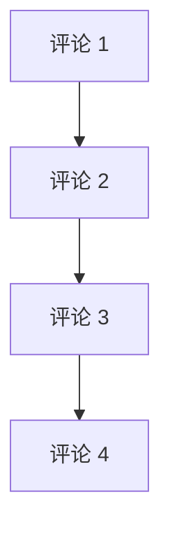
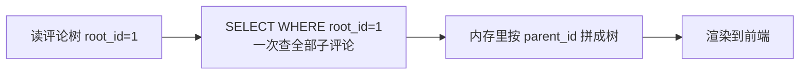
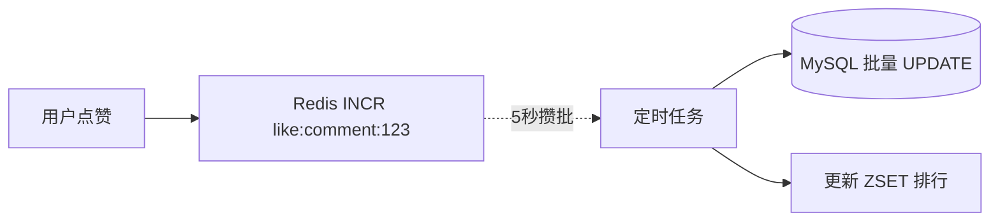
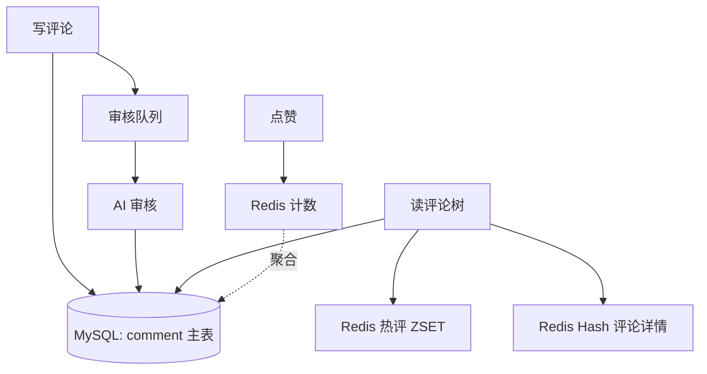

---
---

# 评论盖楼设计

> 场景：B 站/微博/知乎 那种"评论 + 二级回复 + 三级回复"，可能盖到几十层。
> 难点：**层级深 + 高并发 + 删除会塌楼**。

---

## 三种数据结构对比

| 结构 | 实现 | 写性能 | 读性能 | 删除 | 推荐度 |
| :--- | :--- | :--- | :--- | :--- | :--- |
| 树形（parent_id） | 递归查询 | ⭐⭐ | ❌ 深度递归 | ✅ | ⭐ |
| 路径枚举（1/25/100） | 字符串前缀 | ⭐⭐⭐ | ⭐⭐⭐ | ❌ 删父毁子 | ⭐⭐ |
| **扁平 + root_id 冗余** | 二级聚合 | ⭐⭐⭐⭐ | ⭐⭐⭐⭐ | ✅ | ⭐⭐⭐⭐⭐ |

---

## 方案 1：朴素树形（parent_id）

```
comment 表：
  ┌────┬──────────┬────────┐
  │ id │ parent_id│ content│
  ├────┼──────────┼────────┤
  │ 1  │ NULL     │ 一楼   │
  │ 2  │ 1        │ ├ 回复 │
  │ 3  │ 2        │ │ └ ...│
  │ 4  │ 3        │ │   └..│
  └────┴──────────┴────────┘
```



**痛点**：
- 显示 100 层评论 → **递归 100 次查询** → DB 瞬间打爆
- 几百并发同时查 → CPU 飙升
- 高赞评论会被疯狂访问，雪上加霜

---

## 方案 2：路径枚举（Materialized Path）

```
  ┌────┬──────────────┬────────┐
  │ id │ path         │ content│
  ├────┼──────────────┼────────┤
  │ 1  │ 1            │ 一楼   │
  │ 25 │ 1/25         │ 二楼   │
  │ 100│ 1/25/100     │ 三楼   │
  │ 230│ 1/25/100/230 │ 四楼   │
  └────┴──────────────┴────────┘
```

读取：`SELECT * WHERE path LIKE '1/%'` 一次拿全树。

**痛点**：
- 用户删除中间一条评论 → 所有子评论的 path 都要更新
- 删除 100 楼 → UPDATE 几百条 → DB 写爆炸
- 长路径占空间

---

## 方案 3：扁平 + 冗余 root_id（推荐）⭐

```
设计：所有评论扁平存储，每条评论冗余两个字段
  ┌────┬─────────┬──────────┬────────┐
  │ id │ root_id │ parent_id│ content│
  ├────┼─────────┼──────────┼────────┤
  │ 1  │ 1       │ NULL     │ 一楼   │
  │ 25 │ 1       │ 1        │ 二楼   │
  │ 100│ 1       │ 25       │ 三楼   │
  │ 230│ 1       │ 100      │ 四楼   │
  └────┴─────────┴──────────┴────────┘
   ↑      ↑         ↑
   主键    顶层楼 id  直接父
```



**优点**：
- **一次 SQL 拿全部楼层**（root_id 上加索引）
- 业务层 O(N) 内存拼装
- 删除一条 → 只用标记 deleted=1，不动其他

**约定**：
- 通常只展示二级：根评论 + 其下所有回复（无视回复的回复，统一挂在根评论下）
- 如果业务需要严格层级，前端按 parent_id 自己拼

---

## 热门评论：Redis ZSET

```
首页只展示 Top 100 热评，频繁查询，DB 扛不住。

Key:   topic_comment_hot:{topicId}
Score: like_count + reply_count × 2 + 时间衰减
Value: comment_id

ZADD topic_comment_hot:888 999 comment_123  # 评论得分 999
ZREVRANGE topic_comment_hot:888 0 99       # 取 Top 100
```

```mermaid
flowchart LR
  Q[请求 Top100 热评] --> R[(Redis ZSET<br/>topic_comment_hot:{topicId})]
  R --> IDS[返回 Top100 ids]
  IDS --> M[MGET 评论详情<br/>(本地缓存或 Redis Hash)]
  M --> P[拼接返回]
```

热度计算定时任务跑（如每 5 分钟），不实时算。

---

## 点赞高并发：聚合写 DB

```
直接 INSERT 点赞表？
  100 万人同时点赞同一条 → DB 1 万 TPS UPDATE 同一行 → 锁等待爆炸

改成 Redis 聚合：
  用户点 → Redis INCR like:comment:{id}
            ↓
       每 5 秒一次定时任务：
       SCAN 出所有 like:* 的差值
       批量 UPDATE 到 DB
       DB QPS 从 1 万降到 1
```



**幂等**：同一用户重复点赞 → Redis Set 去重
```
SADD like_user:comment:123 userId
返回 1 → 第一次，INCR 计数
返回 0 → 已点过，忽略
```

---

## 删除评论的取舍

```mermaid
flowchart TD
  A[用户删评论] --> B{有子回复?}
  B -->|否| C[硬删 / 标记 deleted=1]
  B -->|是<br/>方案选择| D[此评论已删除]
  D --> D1[显示 "已删除" 占位<br/>子评论保留]
  D --> D2[或者整树折叠]
```

**生产做法**：永远是软删除（`is_deleted=1`），保留数据。前端渲染"评论已删除"占位。

---

## 评论审核

```
内容审核流程：
  发布 → 异步进审核队列 → AI 文本审核
                                ↓
                          通过 → 状态改为 visible
                          疑似 → 进入人工复审
                          确认违规 → 删除 + 用户告警
```

发布时**先入库 status=PENDING**，前端"评论提交成功，审核中"。审核通过才对其他用户可见。

---

## 总览架构



---

## 一句话总结

- 数据结构：**扁平 + root_id 冗余**，一次 SQL 拿全树
- 热门评论：Redis ZSET 排行，定时刷
- 点赞：**Redis 聚合 + 批量落库**，绝不直接打 DB
- 删除：软删除 + 占位渲染
- 审核：异步先入库 PENDING，过审后可见
