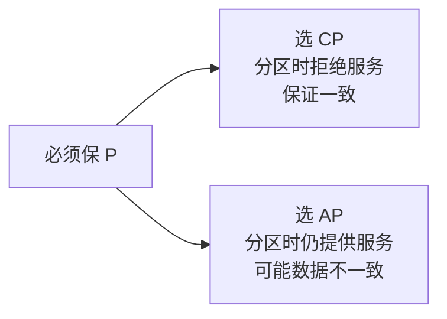
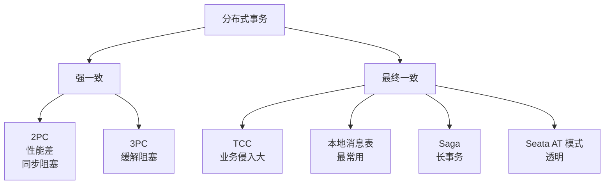
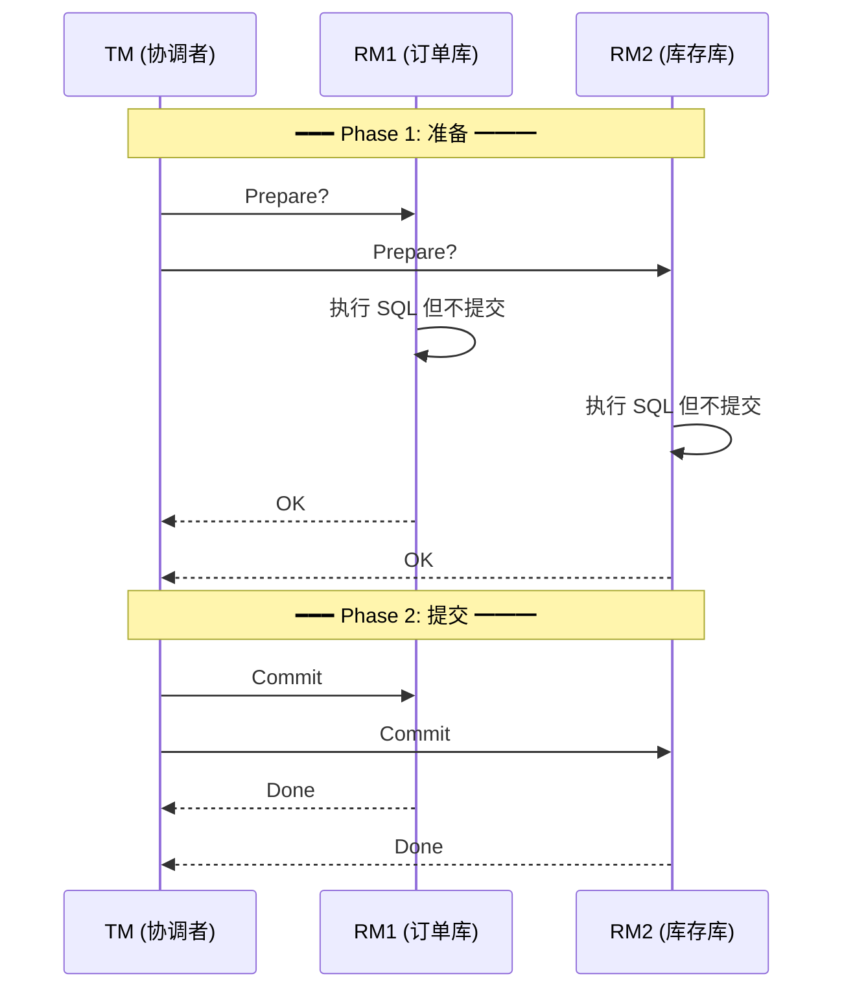
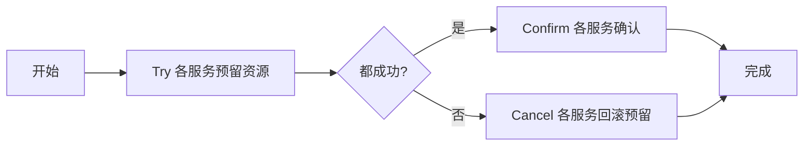
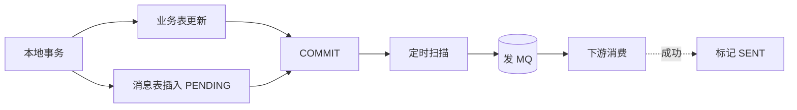
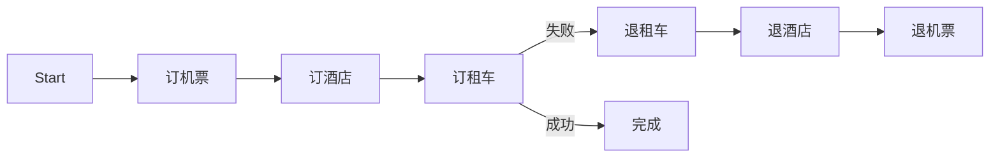
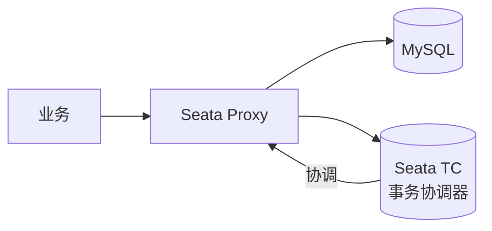
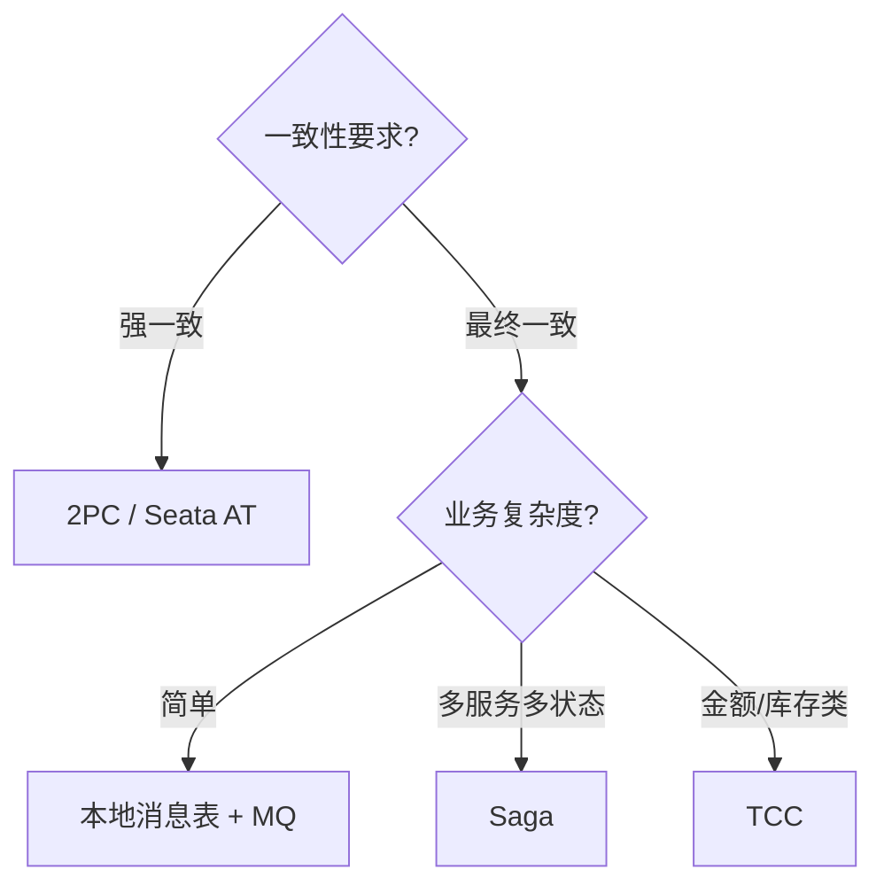
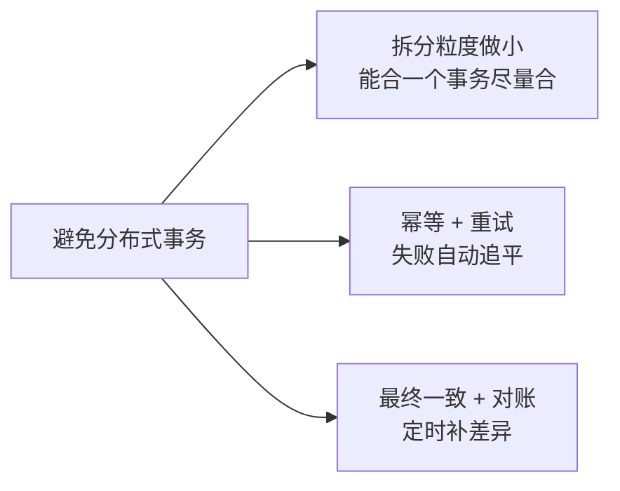

# CAP 与分布式事务

> 分布式系统两个最经典的理论 + 落地。
> CAP 解释"为什么不能既要又要"，分布式事务讲"怎么在限制内尽力做"。

---

## CAP 理论

```
   C - Consistency  一致性：所有节点同时看到一样的数据
   A - Availability 可用性：每次请求都能拿到响应（不一定最新）
   P - Partition Tolerance 分区容错：网络分区时仍能工作

           C
          ╱ ╲
         ╱   ╲
        ╱     ╲
       ╱   ⚠   ╲
      ╱  3 选 2 ╲
     ╱           ╲
    A───────────P

   分布式系统中 P 必须保（网络分区一定会发生）
   → 实际是在 C 和 A 之间二选一
```

### CP vs AP 选择



| 系统 | 选择 | 说明 |
| :--- | :--- | :--- |
| ZooKeeper / etcd | **CP** | 分区时少数派不可用 |
| Eureka | **AP** | 服务发现，宁可信息陈旧也要可用 |
| MySQL 主从 | **CP**（半同步）/ **AP**（异步） | 配置可调 |
| Redis Cluster | 偏 **AP** | 默认异步主从 |
| HBase | **CP** | 同一 RowKey 强一致 |
| Cassandra | **AP** | 可调 |

---

## BASE 理论（CAP 的工程实践）

```
   Basically Available    基本可用（允许降级）
   Soft state             软状态（允许中间状态）
   Eventually consistent  最终一致
```

**核心思想**：放弃强一致，换可用性和性能，业务上接受**短时间不一致**。

```
强一致：              最终一致：
  T0：A=10, B=10        T0：A=10, B=10
  T1：A=11, B=11        T1：A=11, B=10  ← 短暂不一致
  （同时变化）          T2：A=11, B=11  ← 自动同步过来
```

---

## 分布式事务的几种方案



---

## 一、2PC（两阶段提交）



**痛点**：
- **同步阻塞**：Phase 1 完成后所有参与者锁资源等 commit
- **协调者单点**：TM 挂了所有人卡死
- **数据不一致**：Phase 2 部分 commit 失败 → 部分提交部分回滚

XA 协议就是 2PC 标准，性能差到几乎只用于跨数据库的本地分布式事务。

---

## 二、TCC（Try-Confirm-Cancel）

业务层自己实现两阶段：

```
Try：        预留资源（冻结余额、预扣库存）
Confirm：    确认操作（真正扣款）
Cancel：     补偿（解冻）
```



### 转账例子

```
账户 A 转 100 给账户 B：
  Try：   A 冻结 100（balance -100, frozen +100）
          B 预创建一笔待入账 100
  
  Confirm：A 销账冻结 100
           B 真实入账 +100
  
  Cancel： A 解冻 100
           B 删除预创建记录
```

**痛点**：业务侵入大，每个接口要写三套，**幂等 + 空回滚 + 悬挂**都要处理。

---

## 三、本地消息表（最常用）⭐



```sql
-- 同一本地事务里写业务表 + 消息表
START TRANSACTION;
  UPDATE order SET status='PAID' WHERE id=1;
  INSERT INTO local_msg(biz_id, payload, status)
    VALUES('order_1_pay', '{...}', 'PENDING');
COMMIT;
```

定时任务扫 `PENDING` 状态发 MQ，下游消费后回调标记 `SENT`。

**优点**：
- 不依赖特殊中间件，普通 DB + MQ 就够
- 业务侵入小（只多一张表）
- 失败可重试

**缺点**：
- 引入定时任务
- 短时间内业务能感知"未发完"

---

## 四、Saga 长事务

适合**长流程**（如旅游订单：订机票 → 订酒店 → 订租车）。

```
正向：T1 → T2 → T3 → T4
失败回滚：T4↓ → 执行 C3 → 执行 C2 → 执行 C1

  每个步骤都有对应的"补偿操作"
  失败时反向执行补偿
```



**痛点**：补偿操作可能也失败 → 死循环；中间状态对用户可见。

---

## 五、Seata（生产推荐）

阿里开源的分布式事务框架，包含多种模式：

### AT 模式（最常用）

```
原 SQL：UPDATE balance SET amount=100 WHERE id=1
       ↓
       Seata Proxy:
         ① 解析 SQL，生成"反向 SQL"作为 undo log
         ② 执行原 SQL
         ③ 注册分支事务到 TC
       
   分支事务全部成功 → 提交 → 删除 undo log
   有失败 → 回滚 → 执行 undo log
```



**优点**：业务代码**几乎零侵入**，加注解 `@GlobalTransactional` 即可
**缺点**：依赖 Seata Server，运维复杂

### TCC / Saga 模式
Seata 也支持手动模式。

---

## 选型决策



| 场景 | 推荐 |
| :--- | :--- |
| 跨库支付（金融级） | TCC 或 Seata AT |
| 订单 → 库存 → 物流 | 本地消息表 |
| 跨系统长流程（旅游） | Saga |
| 简单跨库写 | Seata AT |

---

## 真正的常识

> 大多数业务**根本不需要分布式事务**，靠下面三招就解决 90% 问题：



例如：电商下单
- ❌ 分布式事务保证"创建订单+扣库存+支付"同时成功
- ✅ 用**状态机 + MQ + 对账**让它**最终一致**

---

## 一句话总结

| 方案 | 一致性 | 性能 | 业务侵入 | 适用 |
| :--- | :--- | :--- | :--- | :--- |
| 2PC | 强 | 差 | 小 | 跨库 XA |
| TCC | 强 | 中 | 大 | 金融转账 |
| 本地消息表 | 最终 | 好 | 小 | **大多数业务**⭐ |
| Saga | 最终 | 中 | 中 | 长事务 |
| Seata AT | 强 | 中 | 极小 | 透明分布式 |

> CAP 只能选 CP 或 AP；BASE 教你"先用、再补"；分布式事务能不用就不用。
