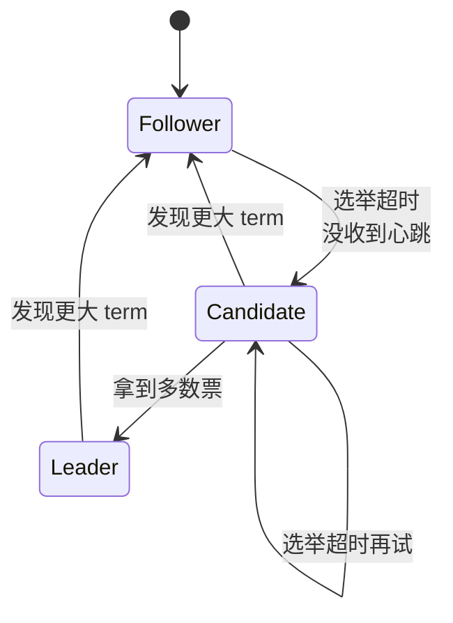
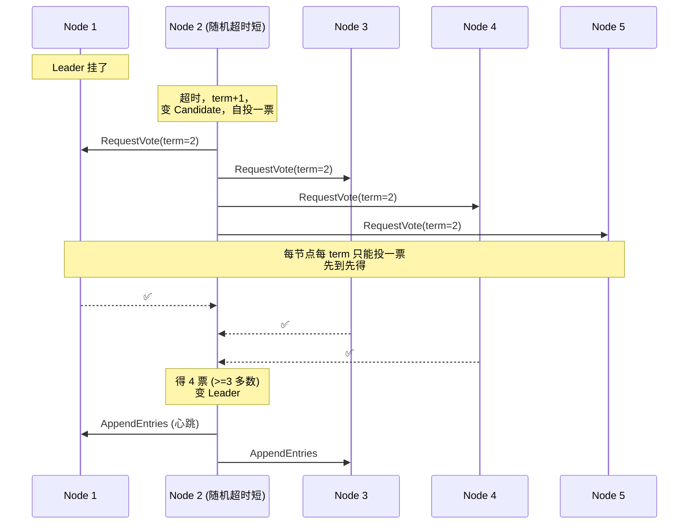
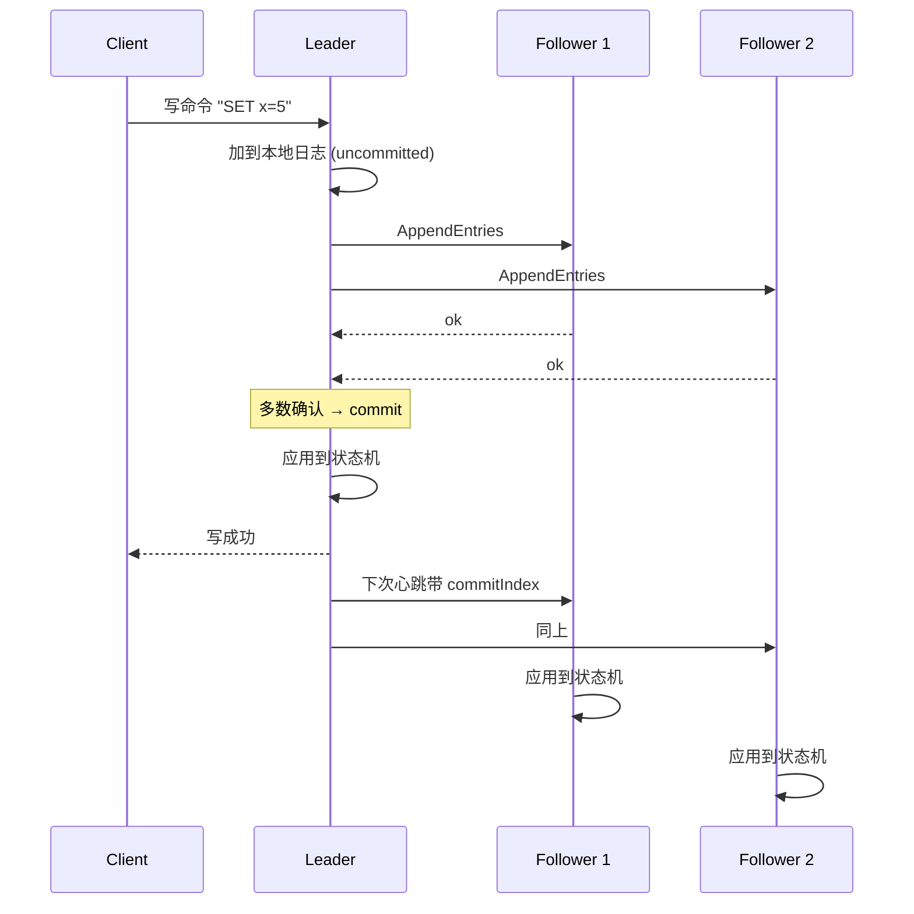
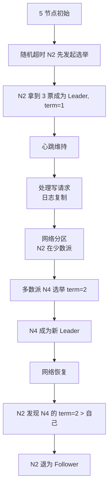
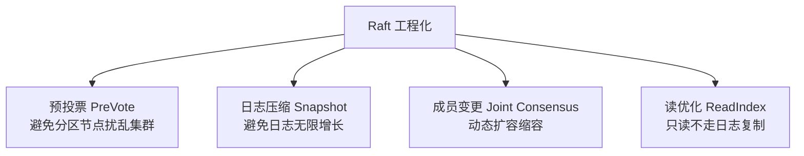

---
---

# Raft 共识算法

> 分布式系统怎么让一堆节点对"数据"达成一致？
> Paxos 太晦涩，Raft 是它的"可教学版本"，被 etcd / Consul / TiKV / CockroachDB 广泛采用。

---

## Raft 解决什么

```
场景：5 个节点存同一份数据
  
  问题 1：写入时怎么保证大家都收到？
  问题 2：主节点挂了怎么自动选新主？
  问题 3：网络分区时怎么避免脑裂？
```

Raft 把"共识"拆成三个子问题：
- **Leader 选举**
- **日志复制**
- **安全性**

---

## 三种角色

```
       ┌──────────┐
       │ Leader   │  唯一接受客户端请求的节点
       │  (1 个)  │  把日志复制给 Follower
       └──────────┘
            ▲
            │heartbeat
            ▼
       ┌──────────┐
       │ Follower │  被动接收日志
       │  (多个)  │  超时收不到心跳 → 转为 Candidate
       └──────────┘
            │
            │ 发起选举
            ▼
       ┌──────────┐
       │Candidate │  请求其他节点投票
       │ (临时态) │  得到多数票 → 变成 Leader
       └──────────┘
```



---

## 任期 Term（核心概念）

```
时间被分成无数个 Term，每个 Term：
  Term 1: [Election] → [Normal Operation]
  Term 2: [Election] → [Normal Operation]
  ...

每个 Term 最多一个 Leader。Term 是单调递增的逻辑时钟。
```

任何 RPC 都带 Term：
- 收到比自己大的 Term → **立刻变 Follower**
- 收到比自己小的 Term → **拒绝**

---

## Leader 选举



### 关键设计：随机超时

```
所有节点选举超时 = 150~300ms 之间随机
  
  Node A 超时 153ms → 先发起选举
  Node B 超时 287ms → A 已经赢了
  
  → 减少同时多个 Candidate 平分票数的概率
```

### 选票约束（防止旧 Leader 重新当选）

```
投票时，Candidate 必须比 Voter 的日志"更新"：
  - 比较最后一条日志的 (term, index)
  - 更大的更新
```

---

## 日志复制



### 日志结构

```
每个节点维护日志：
  Index:    1     2     3     4     5
  Term:     1     1     2     2     3
  Cmd:    "SET" "DEL" "SET" "INC" "SET"
            ^             ^     ^
            commitIndex   lastIndex (uncommitted)
```

### 一致性保证

```
AppendEntries RPC 携带 prevLogIndex 和 prevLogTerm：
  Follower 检查自己的日志：
    - 该位置匹配 → 接受新日志
    - 不匹配 → 拒绝
  
  Leader 收到拒绝 → 往前回退一格，重试
  → 最终 Follower 与 Leader 日志一致
```

---

## 安全性：选举限制 + 提交规则

### 选举限制
```
只投给"至少和自己一样新"的 Candidate
  → 保证新 Leader 包含所有已 commit 日志
```

### 提交规则
```
Leader 不能"提交"自己 term 之前的日志：
  → 必须先在自己 term 写一条新日志，间接 commit 前面的
  → 防止旧 Leader 复活后撤销旧 commit
```

---

## 网络分区下的行为

```
5 节点，分区为 {3} + {2}：

  多数派 (3 节点)：
    选出新 Leader → 继续工作 ✅

  少数派 (2 节点)：
    无法过半 → 不停发起选举 但拿不到多数票
    → 无 Leader → 拒绝写请求 ❌（但读可能返回旧数据）

  网络恢复后：
    少数派的 Term 比多数派低 → 自动转为 Follower
    丢掉自己未 commit 的日志，跟新 Leader 同步
```

---

## 完整生命周期示例



---

## Raft vs Paxos vs ZAB

| 算法 | 用在 | 难度 | 特点 |
| :--- | :--- | :--- | :--- |
| **Paxos** | Chubby, Spanner | ⭐⭐⭐⭐⭐ | 最早提出，理论完美但难懂 |
| **Raft** | etcd, Consul, TiKV | ⭐⭐⭐ | 易懂，Leader-Based |
| **ZAB** | ZooKeeper | ⭐⭐⭐⭐ | 类似 Raft，崩溃恢复 + 广播两阶段 |
| **Multi-Paxos** | OceanBase | ⭐⭐⭐⭐⭐ | Paxos 的工程化变种 |

---

## Raft 实战要点



### 日志压缩

```
日志达到一定大小 → 取一个 snapshot：
  
  原日志：[1...10000]
  Snapshot at index 8000：状态 = "...当前数据..."
  压缩后：snapshot + 日志 [8001...10000]
  
  新节点加入：发 snapshot + 后续日志即可
```

### ReadIndex 优化读

```
普通读：
  也走日志复制流程 → 慢
  
ReadIndex：
  Leader 确认自己仍是 Leader（一次心跳）
  → 直接返回当前已 commit 的数据
  → 不写日志，速度快 100 倍
```

---

## 用 Raft 的系统

| 系统 | 用途 |
| :--- | :--- |
| **etcd** | k8s 元数据，配置中心 |
| **Consul** | 服务发现、K/V 存储 |
| **TiKV** | TiDB 的存储层 |
| **CockroachDB** | 分布式 SQL |
| **JRaft** | 蚂蚁开源 Java 实现 |
| **Hashicorp Nomad** | 容器编排 |

---

## 一句话总结

- **核心三件事**：Leader 选举 + 日志复制 + 安全约束
- **Term + 多数派** 是两块基石
- **随机超时** 解决选举平票问题
- 比 Paxos **易懂得多**，但功能等价
- 实战必学：**预投票、日志压缩、ReadIndex**
