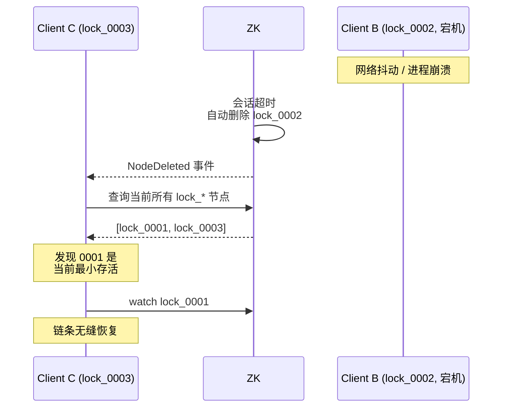

# ZooKeeper 流量被打爆（羊群效应 + 链式监听）

> 场景：1 万个节点同时抢一把分布式锁，ZK 集群 CPU 100% 瞬间打爆。
> 根因：所有人都监听同一个节点 → 释放时同时唤醒 → **羊群效应（Herd Effect）**。

---

## 羊群效应：错误的实现

```
1 万个客户端抢锁 /lock：

  Client1 ──watch──┐
  Client2 ──watch──┤
  Client3 ──watch──┤
  ...              ├──→ /lock
  Client10000 ─watch┘

  持锁者释放 /lock
       ↓
  ZK 向所有 1 万个 watcher 发通知
       ↓
  1 万个客户端同时 createNode
       ↓
  ZK 排队处理 1 万个 create 请求 → CPU 100% ❌
       ↓
  只有 1 个成功，其余 9999 个又开始 watch
       ↓
  循环往复 → ZK 雪崩
```

类比：羊群里只要一只羊乱跑，所有羊都跟着跑。

---

## 正确做法：临时顺序节点 + 链式监听

每个客户端**只监听比自己序号小的前一个节点**：

```
持锁队列结构（/lock/ 下的临时顺序节点）：
  ┌───────────┐    ┌───────────┐    ┌───────────┐    ┌───────────┐
  │ lock_0001 │ ←──│ lock_0002 │ ←──│ lock_0003 │ ←──│ lock_0004 │
  │ Client A  │    │ Client B  │    │ Client C  │    │ Client D  │
  │ (持锁)    │    │ watch 001 │    │ watch 002 │    │ watch 003 │
  └───────────┘    └───────────┘    └───────────┘    └───────────┘

释放时：
  A 释放 lock_0001
       ↓
  ZK 只通知 B（其他人不受打扰）
       ↓
  B 检查：自己是不是最小？是 → 拿锁
       ↓
  C/D 完全无感
```

> 通知开销从 O(N) 降到 O(1)，无论队列多长。

---

## 节点挂掉时怎么办


```
原链： lock_0001 ← lock_0002 ← lock_0003

如果 lock_0002 的客户端 B 宕机：
  ZK 自动删除临时节点 lock_0002（会话超时）
       ↓
  Client C 监听的 lock_0002 触发"删除"事件
       ↓
  C 醒来检查：我还是最小的吗？
  - 否：往前查找下一个存活节点（lock_0001），重新 watch
  - 是：拿到锁
```

---

## Curator 客户端的"重新链式监听"



Curator 框架封装好这套逻辑，业务方只用 `lock.acquire()` / `lock.release()`。

---

## 为什么 ZK 适合做锁

| 特性 | 说明 |
| :--- | :--- |
| 临时节点 | 客户端宕机 → 自动删除（不会死锁） |
| 顺序节点 | 天然 FIFO 公平排队 |
| Watcher | 一次性事件通知，无需轮询 |
| ZAB 强一致 | 锁状态不会因主从切换错乱 |

---

## ZK 不适合做锁的场景

- **超高并发**（10w+ QPS）：写性能跟不上，链式监听也救不了集群负载
- **短时锁**：每次都创建/删除节点 + 监听，开销比 Redis 大得多
- **跨 IDC**：ZK 写要过半 ACK，跨机房延迟很难接受

> 单机房中等并发的强一致锁 → ZK 最稳
> 高并发短锁 → 选 Redis Redisson

---

## 一句话总结

- 羊群效应 = **N 个 watch 一个节点**
- 解法 = **链式监听**（只 watch 前一个）
- 通知开销从 O(N) 降到 O(1)
- 节点中途消失 → Curator 自动重链
