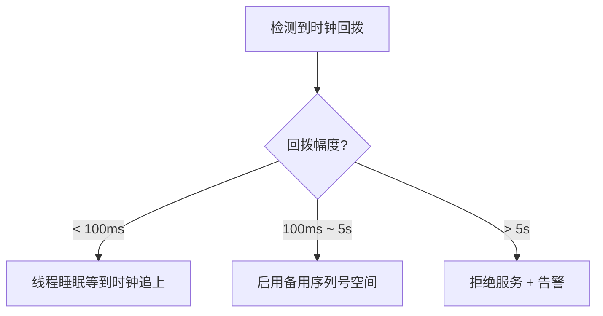
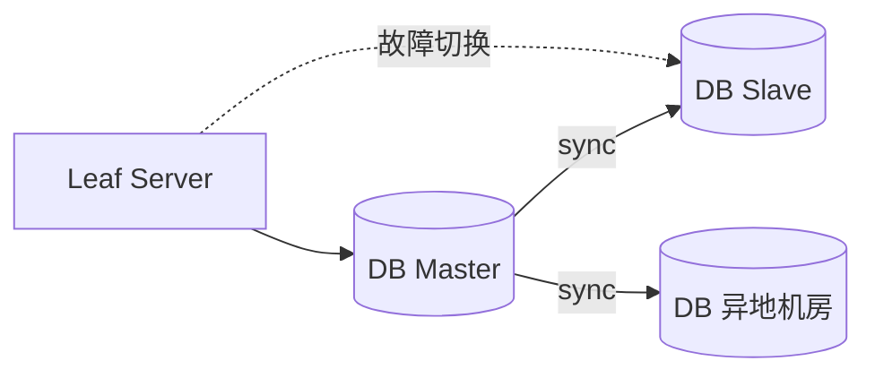
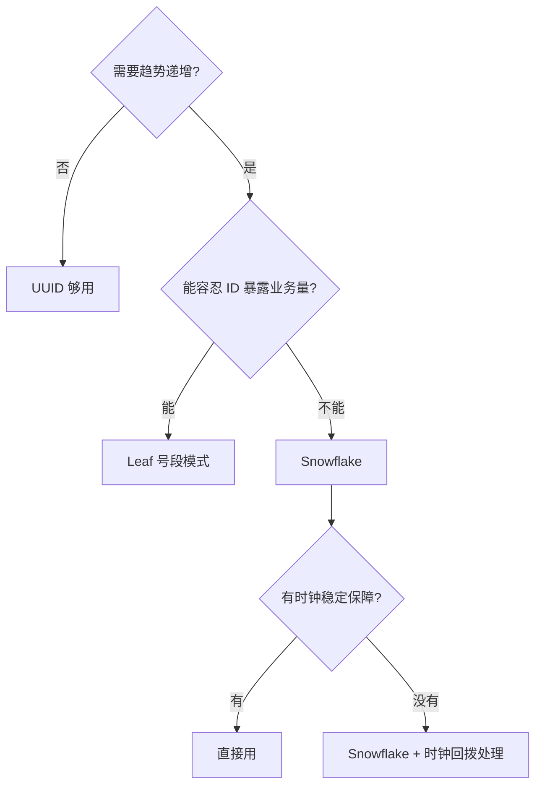

# 分布式 ID

> 单机自增主键的两个问题：
> - 分库分表后 id 重复
> - id 直接暴露业务量（黑灰产分分钟算出来你的订单数）

---

## 几种方案对比

| 方案 | 全局唯一 | 趋势递增 | 性能 | 依赖 | 痛点 |
| :--- | :--- | :--- | :--- | :--- | :--- |
| UUID | ✅ | ❌ | 极高 | 无 | 36 字符，索引性能差 |
| 数据库自增 | ✅ | ✅ | 中 | DB | 单点瓶颈 |
| Redis INCR | ✅ | ✅ | 高 | Redis | 持久化丢号风险 |
| **雪花算法 Snowflake** | ✅ | ✅ | 极高 | 无 | 时钟回拨 |
| **美团 Leaf**（号段） | ✅ | ✅ | 极高 | DB | 实现稍复杂 |

---

## 雪花算法（Snowflake）

### 64bit 结构

```
 1bit       41bit                 10bit          12bit
┌─┬──────────────────────────┬──────────────┬────────────┐
│0│   时间戳（毫秒，41位）    │ 机器 id (10) │ 序列号(12) │
└─┴──────────────────────────┴──────────────┴────────────┘
 │           │                       │              │
 符号位      可用 69 年               1024 台机器    单机单ms 4096 个
 永远为0     从某起点ms开始计时
```

- 41 bit 时间戳：`2^41 / (1000*60*60*24*365)` ≈ 69 年
- 10 bit 机器 id：可以分成 5 bit dataCenter + 5 bit machine
- 12 bit 序列号：同一机器同一毫秒内最多 4096 个 id

### 单机理论 QPS

```
4096 个/ms × 1000ms = 409.6 万 QPS（单机）
```

### 时钟回拨问题

```
正常：
  t=100 → id_1
  t=101 → id_2
  t=102 → id_3

NTP 校时把时间拨回去：
  t=102 → id_3
  t=100 → ❌ 可能生成 id_1 重复！
```

**应对方案**：



预防：
- 部署 NTP 服务，禁止大幅跳变
- ID 生成器持久化"上次时间戳"，启动时校验

---

## 美团 Leaf（号段模式）

### 思路：批发 + 零售

```
DB 表：id_alloc
  ┌────────────┬────────┬──────┐
  │ biz_tag    │ max_id │ step │
  ├────────────┼────────┼──────┤
  │ order      │ 5000   │ 1000 │
  └────────────┴────────┴──────┘

Leaf Server 启动：
  Step 1. UPDATE id_alloc SET max_id=max_id+step WHERE biz_tag='order'
          → 拿到号段 [5001, 6000]
  Step 2. 在内存里逐个分配 5001, 5002, ...
  Step 3. 号段用完，再去 DB 取下一段

业务方：
  → Leaf.next()   返回内存里的下一个号
```


### 双 Buffer 优化（解决 TP999 毛刺）

```
传统：号段用完才去 DB 拿
  ──5001─5002─...─6000─[阻塞等 DB]──6001─6002─...
                          ↑ TP999 在这里飙高

双 Buffer：用到一半（500）就异步预取下一段
  Buffer1: [5001..6000] 用到 5500 时
  Buffer2: 异步触发 → [6001..7000]
  ──5001─...─5500─...─6000─[无缝切换]─6001─...
  
  ✅ 用户感知不到 DB 延迟
```

### 优缺点

**优点**：
- 趋势递增（DB 索引友好）
- DB 短暂宕机不影响（内存还有号）
- 容易迁移、运维简单

**缺点**：
- ID 不够随机，可以推算业务量（"今天订单号 1万到 2万 → 一天 1 万单"）
- TP999 偶有毛刺（双 Buffer 缓解）

---

## DB 高可用



- 主从复制
- 多机房：主机房挂了切异地

---

## 选型建议



| 业务 | 推荐 |
| :--- | :--- |
| 订单号 | Snowflake（递增 + 不暴露量） |
| 用户 id | Leaf（递增即可） |
| 流水号、log id | Snowflake |
| 一次性 token | UUID |

---

## 一句话总结

- **要无依赖、要超高性能**：Snowflake，注意时钟回拨
- **要 DB 友好、稳定性最高**：Leaf 号段 + 双 Buffer
- **临时性、不入库**：UUID
