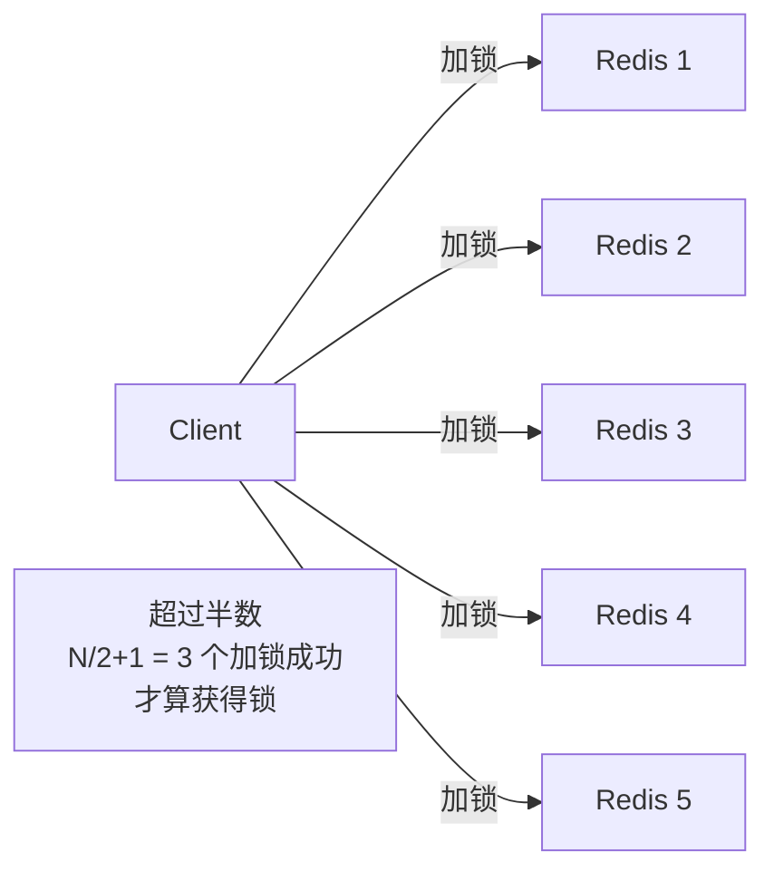
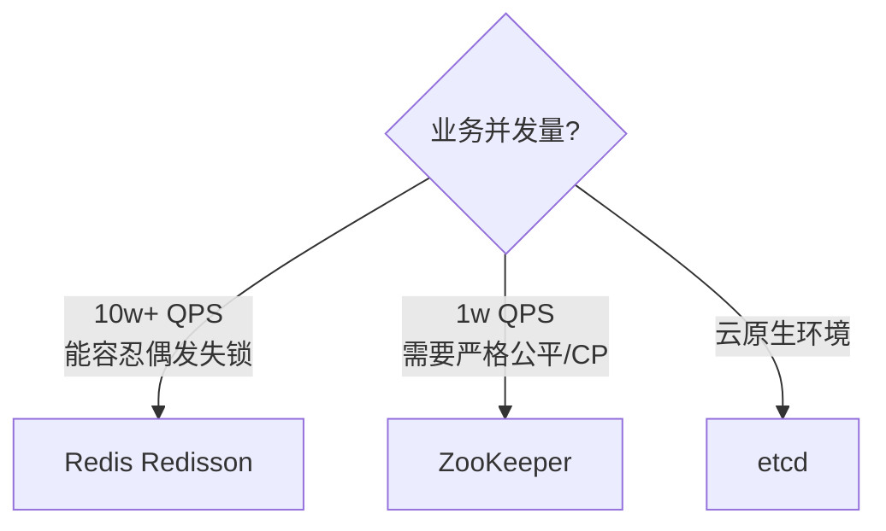

# 分布式锁

> 单机用 synchronized / ReentrantLock 就够了。多机/多进程下，要用第三方组件协调。
> Redis / ZooKeeper / etcd 是三种主流选择，**各有适合的场景**。

---

## 三选一对比

| 维度 | Redis | ZooKeeper | etcd |
| :--- | :--- | :--- | :--- |
| 协议 | 主从异步 | ZAB | Raft |
| 一致性 | 弱（AP） | 强（CP） | 强（CP） |
| 性能 | 极高（10w+ QPS） | 中（1w QPS） | 高（3w QPS） |
| 实现 | SETNX + 看门狗 | 临时顺序节点 + 监听 | 租约 lease + revision |
| 公平性 | 非公平 | 严格 FIFO | 严格 FIFO |
| 自动释放 | TTL 过期 | 会话断开 | 租约过期 |
| 典型用途 | 秒杀、防重提交 | 配置中心、Leader 选举 | k8s、云原生协调 |
| 痛点 | 主从切换可能锁丢 | 节点过多 watch 压力大 | 较新，生态没 ZK 广 |

---

## 一、Redis 锁

### 基本实现

```redis
SET lock:order_123 client_uuid NX PX 30000
   │      │           │         │  │
   │      │           │         │  └ 30s 过期
   │      │           │         └ 不存在才设置
   │      │           └ 标识持锁者，释放时校验
   │      └ 锁名
   └ 命令
```

释放（必须用 Lua 保证"判断 + 删除"原子）：
```lua
if redis.call('GET', KEYS[1]) == ARGV[1] then
    return redis.call('DEL', KEYS[1])
else
    return 0
end
```

### 看门狗（Watchdog）

业务执行时间不可控，TTL 太长易死锁，太短又怕业务还没跑完就过期。

```
Redisson 看门狗机制：
  ┌──────────┐    持锁后每 10s 续期到 30s
  │ 业务线程 │ ─────────────────────────────→ Redis
  │ 持锁 30s │                                  │
  └──────────┘    业务结束/线程崩溃 → 不再续期
                  → TTL 自然到期 → 自动释放
```

### RedLock：解决主从锁丢失

```
单 Redis 痛点：
  Client → Master 加锁成功 → Master 宕机
                              ↓ 还没同步到 Slave
  Slave 升主 → Client2 也加锁成功 ❌ 两个人同时持锁
```

RedLock（5 个独立 master）：



5 台允许挂 2 台，集群级别可用。

**RedLock 的争议（Martin Kleppmann vs antirez）**：
- 需要部署多个独立实例，运维成本高
- 加锁要访问多节点，性能降低
- **时钟漂移**：极端情况 R1 认为锁还在，R3 认为已过期，C2 抢到
- **AOF every-second**：1 秒内未持久化的锁会丢
- **GC 暂停**：Java 客户端 GC 几百毫秒，看门狗续不上 → 锁过期但业务还在跑

> 结论：**Redis 锁适合"偶尔失锁也能用幂等兜底"的场景**，不适合金融级强一致。

---

## 二、ZooKeeper 锁

### 实现：临时顺序节点 + 链式监听

```
持锁流程：
  1. 在 /lock 下创建临时顺序节点：
     /lock/lock_0001  ← 客户端 A
     /lock/lock_0002  ← 客户端 B
     /lock/lock_0003  ← 客户端 C
  2. 看自己是不是序号最小的
     - 是 → 获得锁
     - 否 → 监听"前一个"节点（A 监听 0001 没意义，B 监听 0001，C 监听 0002）
  3. 前一个节点删除时，自己被唤醒，再判断是否最小
```

**为什么不让所有人监听最小节点？**
→ 1 万个客户端监听同一节点，节点释放时同时唤醒 1 万个 → **羊群效应**。  
链式监听把通知开销摊平。详见 `Zookeeper流量被打爆.md`。

### 自动释放
客户端会话断开 → ZK 自动删除其临时节点 → 锁释放。**比 Redis 的 TTL 更可靠**（不会出现"还在干活但锁过期了"）。

### 痛点
- ZK 写性能差（强一致，要过半 ACK）
- 临时节点过多时 watch 性能下降
- 客户端 GC 暂停可能导致会话超时 → 误释放

---

## 三、etcd 锁

```
租约机制：
  1. Client 申请租约 lease（TTL=30s）
  2. PUT /lock/order_123 client_id WITH lease
     - 仅 key 不存在时成功
  3. Client 定期 KeepAlive 续约
  4. 业务结束 → DELETE key + revoke lease
  5. Client 宕机 → lease 自动过期 → key 自动删除
```

**优势**：
- Raft 强一致
- 云原生标配（k8s 选 leader 就是这套）
- API 友好

**缺点**：相对较新，生态没 ZK 那么广。

---

## 选型决策树



| 场景 | 推荐 |
| :--- | :--- |
| 秒杀、订单防重复 | Redis（短锁 + 业务幂等兜底） |
| 用户维度防连点 | Redis SETNX，TTL 3~5s |
| 活动发布、库存批任务单实例 | ZK / etcd |
| Leader 选举 | ZK / etcd |
| k8s 内部协调 | etcd |

---

## 关键经验

> **少用强一致锁**。能用乐观锁 / 原子扣减 / 幂等键解决的，不要上分布式锁。
> 锁只放在"必须串行"的小范围步骤，不要包整个业务流程。

例如秒杀：
- ❌ 用分布式锁锁整个下单流程 → 吞吐塌
- ✅ Redis Lua 原子预扣库存 + DB 唯一索引防重 → 锁只在 Lua 内部
