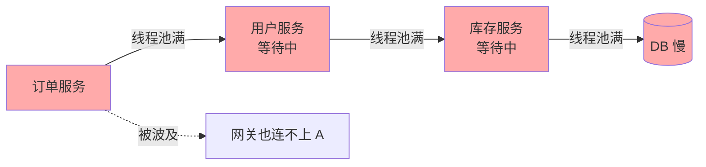
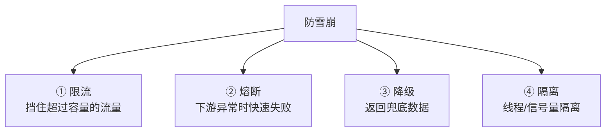
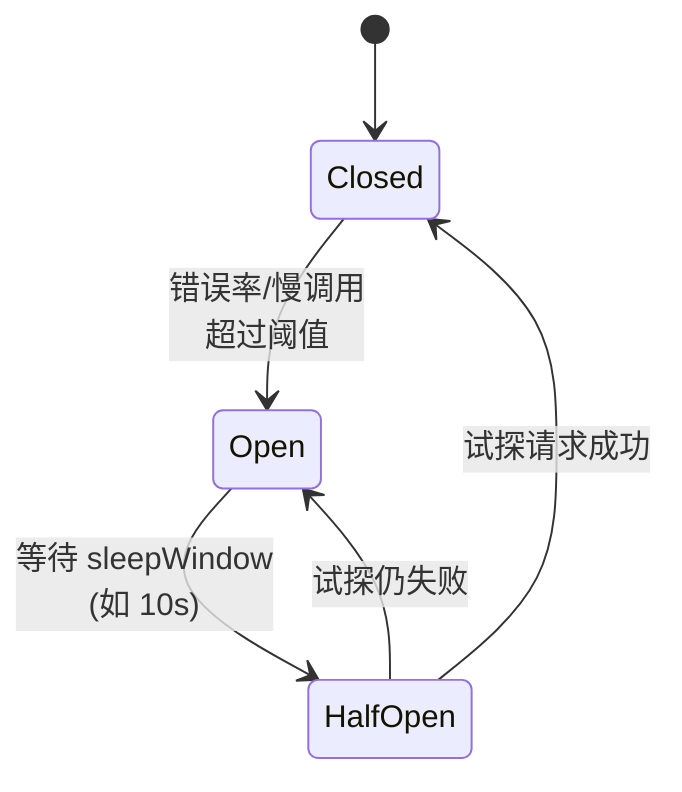
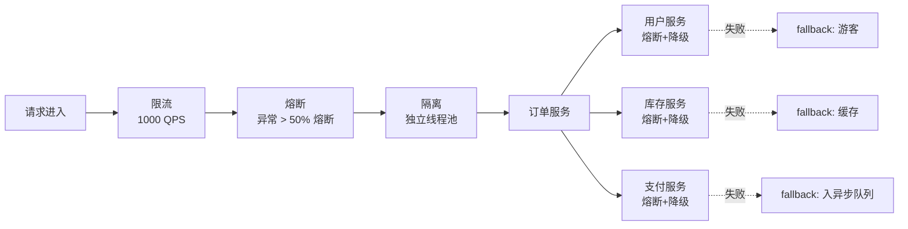
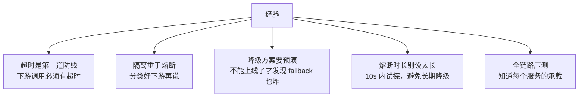

---
---

# 熔断 / 降级 / 服务雪崩

> 微服务的"血压药"：
> - **限流**：控制入口流量
> - **熔断**：感应下游异常，快速失败
> - **降级**：返回 fallback，保证服务不完全死
> - **隔离**：故障不扩散

合在一起防止**服务雪崩**。

---

## 服务雪崩怎么发生

```
正常调用链：
   A ──→ B ──→ C ──→ D
   (订单) (用户) (库存) (DB)

D 慢了：
   D 慢 → C 等 D → C 慢 → B 等 C → B 慢 → A 等 B → A 慢
   
   ↓ 关键：
   每一层的线程池都被"等待"占满
   ↓
   A 接受新请求 → 没线程可用 → 拒绝
   ↓
   整个系统不可用 ❌（即使 D 只是慢，没挂）
```



---

## 防御四件套



---

## ① 限流

详见 [限流算法.md](限流算法.md)。

```
入口处控制 QPS，让超额请求快速失败：
   令牌桶 / 漏桶 / 滑动窗口
   
配合：
   - 网关层：Sentinel / SCG RateLimiter
   - 应用层：Guava RateLimiter
   - 接口/用户/IP 多维度
```

---

## ② 熔断（Circuit Breaker）

类比家里的保险丝：电流过大就跳闸，断电而不是烧坏电器。

### 三状态机



| 状态 | 行为 |
| :--- | :--- |
| **Closed**（关闭） | 正常调用，统计失败率 |
| **Open**（打开） | **直接拒绝**，不调下游，返回 fallback |
| **Half-Open**（半开） | 放少量请求试探，恢复了就转 Closed |

### 熔断条件（Sentinel 为例）

| 维度 | 触发 |
| :--- | :--- |
| 慢调用比例 | RT > 500ms 的比例 > 30% |
| 异常比例 | 异常 / 总请求 > 50% |
| 异常数 | 1 分钟内异常 > 100 个 |

```
统计窗口：1 分钟
最小请求数：100（避免少量请求就熔断）
状态转换：满足条件 → Open → 10 秒后 → Half-Open
```

---

## ③ 降级（Fallback）

熔断时不让用户看到错误，而是返回**可接受的兜底数据**。

```java
@SentinelResource(value = "getUserProfile",
    fallback = "getUserProfileFallback")
public UserProfile getUserProfile(Long uid) {
    return userClient.get(uid);
}

// 兜底逻辑
public UserProfile getUserProfileFallback(Long uid, Throwable e) {
    return UserProfile.guest();  // 返回游客信息
}
```

### 降级策略

| 类型 | 示例 |
| :--- | :--- |
| **静态默认值** | "暂时无法获取，请稍后重试" |
| **本地缓存** | 返回最近一次成功的快照 |
| **简化版本** | 商品详情→只返回主图和价格 |
| **空响应** | 不影响主链路就返回空 |
| **MQ 异步补偿** | 写操作先入队，事后处理 |

---

## ④ 隔离

防止"一个慢服务占满全部线程"。

### 线程池隔离

```
为不同下游单独分线程池：

   订单服务有 3 个下游：用户、库存、支付
   ┌───────────────────────────────────┐
   │ ThreadPool_User    8 线程         │
   │ ThreadPool_Stock   8 线程         │
   │ ThreadPool_Pay     8 线程         │
   └───────────────────────────────────┘

   支付服务挂了 → 只把 ThreadPool_Pay 占满
   用户/库存调用不受影响 ✅
```

详见 [多线程是否只创建一个.md](../性能与故障/多线程是否只创建一个.md)。

### 信号量隔离

```
不分线程，但限制同时调用数：
   Semaphore sem = new Semaphore(10);
   
   if (sem.tryAcquire()) {
       try { call(); } finally { sem.release(); }
   } else {
       fallback();
   }

   优点：轻量，无线程切换开销
   缺点：超时控制比线程池差
```

---

## 主流框架对比

| 框架 | 厂商 | 特性 |
| :--- | :--- | :--- |
| **Hystrix** | Netflix | 老牌，**官方已停止维护** |
| **Sentinel** ⭐ | 阿里 | 国内首选，控制台好用，规则动态 |
| **Resilience4j** | 社区 | 轻量，函数式 API，Hystrix 替代 |
| **Spring Cloud Circuit Breaker** | Spring | 抽象层，底层可选 R4J/Sentinel |

### Sentinel 核心规则

```java
// 1. 流控
FlowRule flowRule = new FlowRule("/api/order")
    .setCount(100)              // 100 QPS
    .setGrade(RuleConstant.FLOW_GRADE_QPS);

// 2. 熔断
DegradeRule degradeRule = new DegradeRule("getUser")
    .setGrade(RuleConstant.DEGRADE_GRADE_RT)
    .setCount(500)              // RT > 500ms
    .setSlowRatioThreshold(0.3) // 慢调用比例 30%
    .setTimeWindow(10);         // 熔断 10s

// 3. 系统保护（自适应限流）
SystemRule sysRule = new SystemRule()
    .setHighestSystemLoad(3.0)  // 系统 Load > 3
    .setQps(2000);              // 整体 QPS > 2000
```

---

## 实战配置（电商订单）



---

## 监控告警

```
必须监控：
   - 各接口 QPS / RT / 错误率
   - 熔断器状态（Open/HalfOpen 时立即告警）
   - 线程池活跃数 / 队列长度
   - Fallback 触发次数

   一旦熔断 → 钉钉/短信 告知
```

---

## 实战经验



> **超时永远是第一道防线**：HttpClient / Feign / gRPC 一定要配 connect + read timeout。
> 没有超时 → 慢下游能拖死所有调用方。

---

## 一句话总结

| 工具 | 作用 |
| :--- | :--- |
| 限流 | 不超过容量 |
| 熔断 | 下游有病时快速失败 |
| 降级 | 失败时返回兜底 |
| 隔离 | 故障不扩散 |
| 超时 | 一切的基础 |

> 雪崩 = 慢调用 + 资源耗尽 + 多米诺骨牌。
> 这五招组合用 = 单点故障 ≠ 全局故障。
