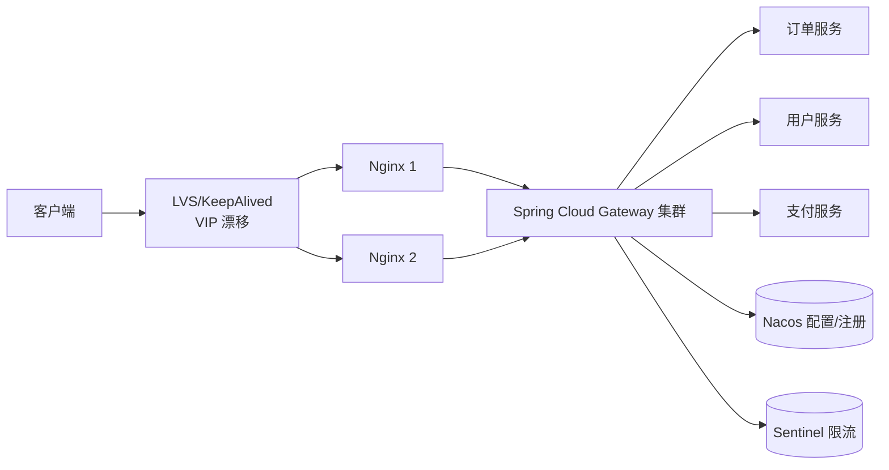
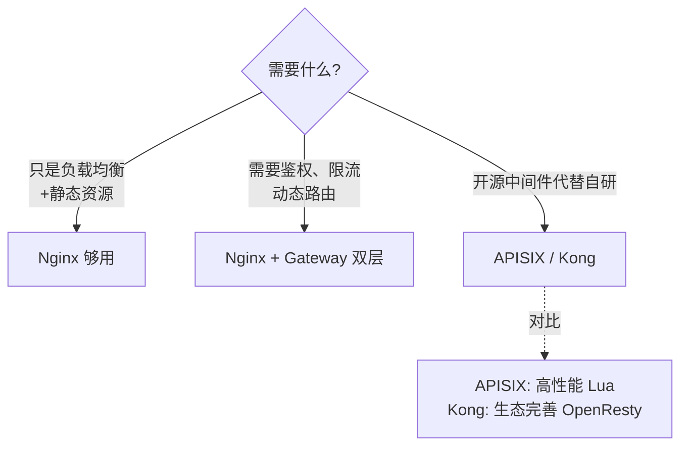

# 网关（Nginx vs 业务网关）

> 一个完整的网关层通常是**两层串联**：流量网关（Nginx）+ 业务网关（Spring Cloud Gateway）。
> 各司其职，前者抗高并发，后者管复杂业务。

---

## 双层网关架构




---

## 一、Nginx（流量网关）

**定位**：扛高并发、做基础防护、性能拉满

```
职责：
  ┌────────────────────────────────────┐
  │ 1. 反向代理 + 负载均衡             │
  │ 2. SSL/TLS 卸载（HTTPS 解密）      │
  │ 3. 静态资源托管（图片、CSS、JS）   │
  │ 4. WAF 防护（IP 黑名单、限流）     │
  │ 5. 秒杀预检（活动未开始直接挡）    │
  │ 6. 搭配 OpenResty/Lua 做扩展      │
  └────────────────────────────────────┘
```

**高可用**：LVS + KeepAlived，VIP 漂移
```
正常：VIP → Nginx_1（主）
故障：Nginx_1 挂 → VIP 漂到 Nginx_2（备）
     客户端无感切换
```

**性能**：单机 10w+ QPS（C 写、事件驱动、零拷贝）

**痛点**：
- 配置改动需要 reload，灵活性差
- 复杂业务逻辑写起来痛苦（Lua 也能写但维护难）

---

## 二、Spring Cloud Gateway（业务网关）

**定位**：处理复杂业务逻辑、可灵活编排

**底层**：Netty + Reactor 模型（异步非阻塞）

```
核心能力：
  ┌────────────────────────────────────┐
  │ 1. 动态路由（从 Nacos 拉配置）     │
  │ 2. 鉴权（JWT/Token 解析）          │
  │ 3. 限流（集成 Sentinel）           │
  │ 4. 熔断降级                        │
  │ 5. 灰度发布（蓝绿、金丝雀）        │
  │ 6. 业务日志、链路追踪              │
  │ 7. 协议转换（HTTP ↔ Dubbo/gRPC）   │
  └────────────────────────────────────┘
```

**优势**：
- Java 写代码，自定义 Filter 灵活
- 配置热更新（Nacos 推送）
- 跟微服务生态无缝（Sentinel、Sleuth）

**痛点**：JVM 内存/GC 限制吞吐量，单机一般 1~3 万 QPS

---

## 职责划分

| 层 | 关心 | 不关心 |
| :--- | :--- | :--- |
| Nginx | 流量、连接数、SSL、静态资源 | 业务规则、用户身份 |
| Gateway | 路由、鉴权、限流、灰度 | 单机性能极限 |

```
请求生命周期：
  1. DNS → LVS VIP
  2. Nginx：SSL 卸载 → IP 限流 → 静态资源直接返回
  3. Spring Cloud Gateway：动态路由 → Token 鉴权 → 业务限流
  4. 真正的微服务（订单/用户/支付）
```

---

## 流量过滤漏斗

```
       入口流量
          │
     ──── 100% ────
          │
   ┌──────▼──────┐
   │   Nginx     │  WAF/IP 限流/静态资源 → 拦截 10%
   └──────┬──────┘
          │ 90%
   ┌──────▼──────┐
   │   Gateway   │  Token 鉴权/业务限流/熔断 → 拦截 9%
   └──────┬──────┘
          │ 81% 进入业务
   ┌──────▼──────┐
   │  微服务集群  │
   └─────────────┘
```

---

## 不要混淆这些"网关"

| 名词 | 实际是什么 |
| :--- | :--- |
| API 网关 | 业务网关（Spring Cloud Gateway / Kong / APISIX） |
| 服务网关 | 同上 |
| 流量网关 | Nginx / OpenResty |
| Service Mesh | 服务间通信代理（Istio + Envoy），跟 API 网关不一回事 |

---

## 选型建议



---

## 一句话总结

- **Nginx 守门口** —— 扛量、防护、静态
- **Gateway 管业务** —— 鉴权、路由、灰度
- **双层串联是标配**，单层够用的就别上双层
