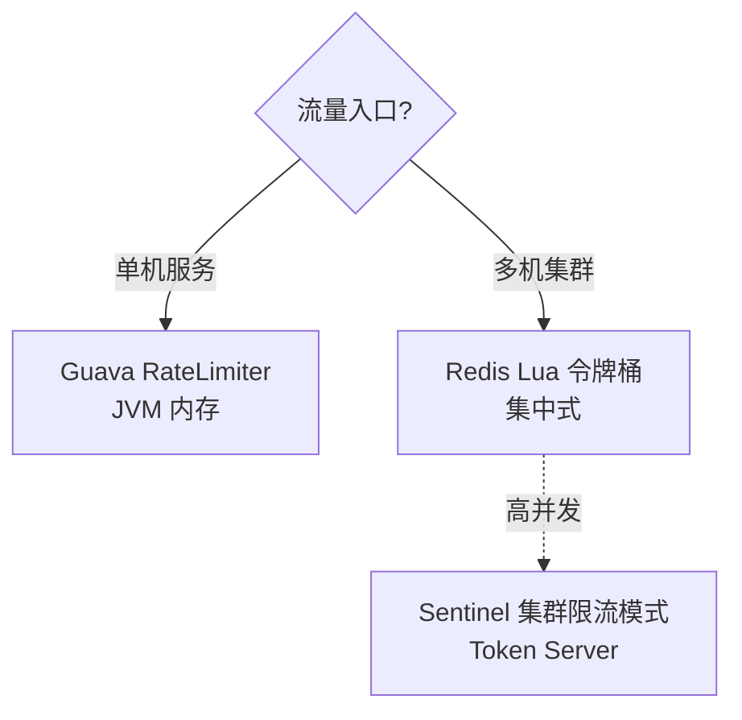

---
---

# 限流算法

> 四种算法：计数器、滑动窗口、漏桶、令牌桶。
> **应用层用令牌桶（突发友好），网关/网络层用漏桶（速率稳定）**。

---

## 一表对比

| 算法 | 平滑性 | 突发流量 | 实现复杂度 | 适合 |
| :--- | :--- | :--- | :--- | :--- |
| 计数器 | ❌ 有窗口临界 | ❌ | ⭐ | 不推荐生产 |
| 滑动窗口 | ✅ | ❌ | ⭐⭐ | 接口 QPS 控制 |
| 漏桶 | ✅ 极平滑 | ❌ 强制匀速 | ⭐⭐ | Nginx、网关、限速下载 |
| 令牌桶 | ✅ | ✅ 允许尖峰 | ⭐⭐ | 应用接口、API 网关 |

---

## 一、计数器（最朴素）

```
1 分钟窗口，限 100 QPS：
  ┌───────────────────────────────┐
  │ 00:00 ────── count++ ──── 00:60 │
  │                count<=100      │
  └───────────────────────────────┘
```

**致命缺陷：窗口临界穿透**

```
设定：每 60 秒最多 100 次
  ⏱ 00:30 ~ 00:60   100 次     （前一窗口末尾)
  ⏱ 00:60 ~ 01:00   100 次     （新窗口开头）
  
  实际 30 秒内涌入 200 次 → 限流形同虚设
```

---

## 二、滑动窗口

把大窗口拆成 N 个小窗口，时间一格一格往前滑：


```
1 分钟 = 6 个 10 秒小窗口：
  ┌───┬───┬───┬───┬───┬───┐
  │ 0 │ 1 │ 2 │ 3 │ 4 │ 5 │  ← 滑动窗口
  └───┴───┴───┴───┴───┴───┘
   c0  c1  c2  c3  c4  c5      每格独立计数

判断：c0+c1+c2+c3+c4+c5 <= 100 ?

每过 10 秒：丢掉最旧的格子，加上新格子
```

**优点**：临界穿透问题消失
**缺点**：精度越高越占内存（极端情况一格一毫秒）

> Sentinel / Hystrix 内部都是滑动窗口实现。

---

## 三、漏桶算法


```
       请求(突发流入)
            │
            ▼
        ┌──────┐  桶容量 = 100
        │ ░░░░ │  当前积压
        │ ░░░░ │
        │ ░░░░ │
        └──┬───┘
           │  匀速漏出 = 10 个/秒
           ▼
        下游处理

桶满了 → 新请求被丢弃
```


**特性**：
- 输出速率永远恒定（10 个/秒就是 10 个/秒）
- 突发流量被"压平"——多余的直接丢
- 适合"必须匀速"的场景（防爬虫、视频转码、网络限速）

**痛点**：业务突发流量也被一刀切，体验差。

---

## 四、令牌桶算法


```
       匀速生成 10 token/秒
              │
              ▼
          ┌──────┐  桶容量 = 100
          │ ●●●● │  最多攒 100 个 token
          │ ●●●● │
          │ ●●●● │
          └──┬───┘
             │
       请求来：
             ├─ 拿到 token → 放行
             └─ 拿不到 token → 拒绝或排队
```

**对比漏桶**：
```
漏桶：100 个并发瞬间到达 → 90 个被拒（强制匀速）
令牌桶：之前 10 秒没流量 → 攒了 100 个 token
       → 100 个并发到达 → 全部放行 ✅ 支持突发
```


**实现**（懒计算，不需要后台线程）：
```java
class TokenBucket {
    long capacity;          // 桶容量
    double rate;            // 每秒生成 token 数
    double tokens;          // 当前 token
    long lastRefillNanos;   // 上次填充时间

    synchronized boolean tryAcquire(int n) {
        long now = System.nanoTime();
        double delta = (now - lastRefillNanos) * rate / 1e9;
        tokens = Math.min(capacity, tokens + delta);
        lastRefillNanos = now;
        if (tokens >= n) {
            tokens -= n;
            return true;
        }
        return false;
    }
}
```

---

## 漏桶 vs 令牌桶（最常被问）

```
漏桶（强制匀速）：                令牌桶（允许突发）：
   高峰流量                          高峰流量
       │ ▌▌▌▌▌▌                       │ ▌▌▌▌▌▌
       ▼                               ▼
   ┌──────┐ 桶                     ┌──────┐ 桶（满 token）
   │░░░░░░│                         │●●●●●●│
   └──┬───┘                         └──┬───┘
      │ 匀速                            │ 一次性放过 N 个
      ▼ ▌                               ▼ ▌▌▌▌
   下游                              下游
```

口诀：
- **漏桶限流出，令牌桶限流入**
- 网络限速、QoS、Nginx → 漏桶
- 接口限流、API 网关、秒杀 → 令牌桶

---

## 生产组件对照

| 组件 | 算法 |
| :--- | :--- |
| Spring Cloud Gateway RequestRateLimiter | 令牌桶（Redis Lua） |
| Sentinel 默认 | 滑动窗口 + 令牌桶 |
| Guava RateLimiter | 令牌桶（含预热模式） |
| Nginx `limit_req` | 漏桶 |
| Nginx `limit_conn` | 计数器（连接数） |

---

## 单机 vs 分布式



Redis Lua 令牌桶模板：
```lua
local key = KEYS[1]
local rate = tonumber(ARGV[1])      -- 每秒填充
local capacity = tonumber(ARGV[2])  -- 桶容量
local now = tonumber(ARGV[3])       -- 当前时间(ms)
local requested = tonumber(ARGV[4]) -- 请求 token 数

local last = redis.call('HMGET', key, 'tokens', 'ts')
local tokens = tonumber(last[1]) or capacity
local ts = tonumber(last[2]) or now

local delta = math.max(0, (now - ts) * rate / 1000)
tokens = math.min(capacity, tokens + delta)

if tokens >= requested then
  tokens = tokens - requested
  redis.call('HMSET', key, 'tokens', tokens, 'ts', now)
  redis.call('EXPIRE', key, 60)
  return 1
else
  redis.call('HMSET', key, 'tokens', tokens, 'ts', now)
  redis.call('EXPIRE', key, 60)
  return 0
end
```

---

## 一句话总结

- **计数器** → 简单但有临界问题，别用
- **滑动窗口** → 接口监控、熔断器
- **漏桶** → 强制匀速，适合网络层
- **令牌桶** → 允许突发，应用层首选
