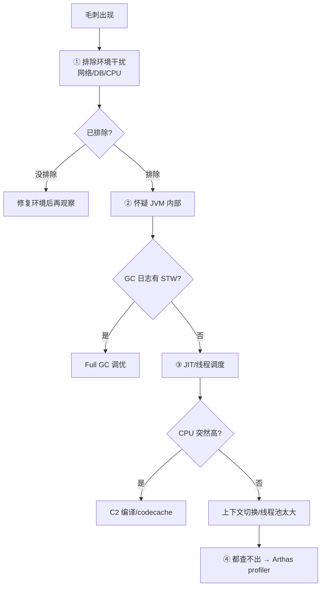
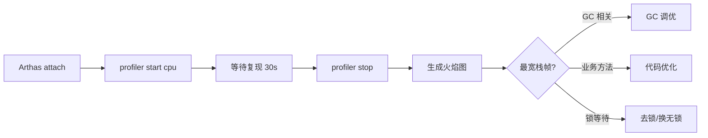
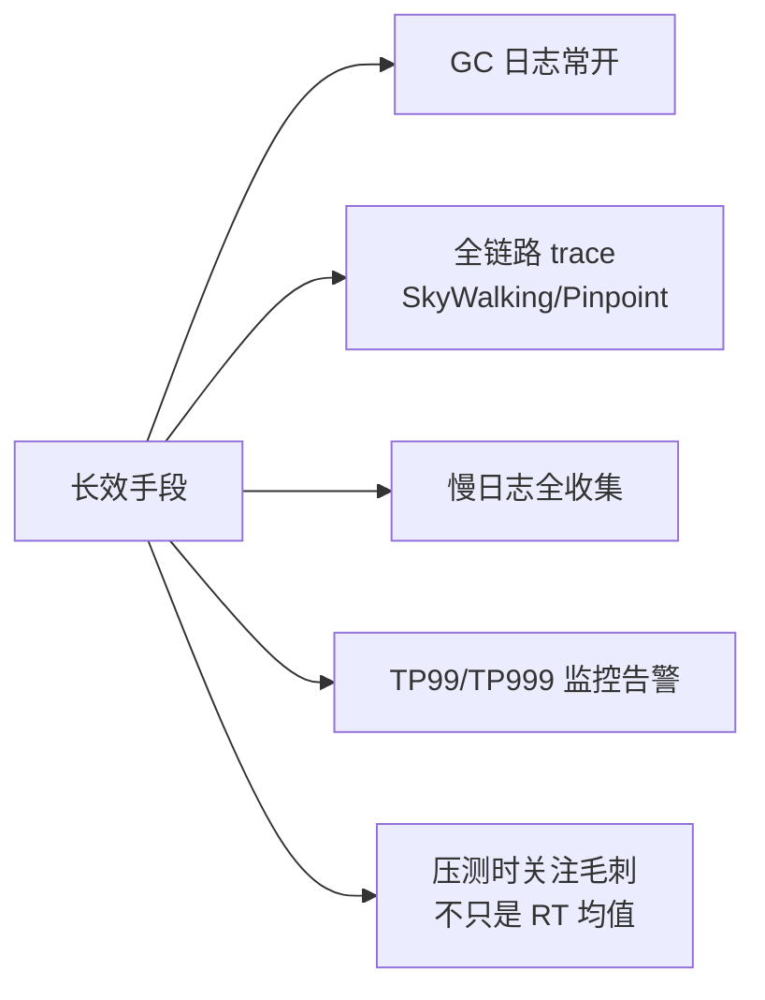

# 下单接口响应毛刺排查

> 场景：监控显示下单接口 99% 都 50ms 内返回，但**TP999 突然飙到 2 秒**。
> 这种"偶发慢"最难查，叫"毛刺"。

---

## 排查决策树



---

## 第一步：排除外部干扰

```
检查清单：
┌────────────────────────────────────────┐
│ ✅ 网络：千兆/万兆网卡，无丢包         │
│ ✅ DB：无慢 SQL，最大连接数没爆       │
│ ✅ 机器：CPU 20% 左右，无 swap        │
│ ✅ 下游服务：第三方 RT 正常            │
│ ✅ 容器：limit 没被打到（cgroup throttle）│
└────────────────────────────────────────┘
```

排查工具：
```bash
# 网络
ping -c 100 target_host
mtr target_host
ss -tnp | head        # 查 TCP 连接堆积

# DB
SHOW PROCESSLIST;
SELECT * FROM information_schema.processlist WHERE TIME > 1;

# 机器
top
vmstat 1
iostat -x 1
```

---

## 第二步：GC 是头号嫌疑

```
JVM 时间线（出问题时）：
  ──cmd──cmd──[Full GC: STW 1.5s]──cmd──cmd──
                  ↑↑↑↑↑↑↑↑↑↑↑↑↑↑↑
              所有业务线程被冻结
              用户感知：接口卡死
```

### STW 是什么

```
GC 必须等所有线程到达"安全点"才能停下来。
然后 GC 线程独占 CPU 做标记/压缩，其他线程全停。
STW 时长几百毫秒到几秒 → 业务接口卡死。
```

### 没开 GC 日志怎么办

```bash
# 启动参数（生产必备）
-Xlog:gc*,safepoint:file=/var/log/gc.log:time,uptime,level,tags
-XX:+HeapDumpOnOutOfMemoryError
-XX:HeapDumpPath=/var/log/heapdump.hprof
```

线上紧急：用 `jstat` 实时看 GC
```bash
jstat -gcutil <pid> 1000
# S0/S1/E/O/M/CCS YGC YGCT FGC FGCT GCT
# Full GC 次数和耗时直接出来
```

### 常见 GC 病因

| 症状 | 病因 | 处理 |
| :--- | :--- | :--- |
| Full GC 频繁 | 老年代漏，大对象 | 找内存泄漏 |
| Young GC 卡 100ms+ | 新生代太大 | 调小 Eden |
| 长 STW | CMS Remark 阶段 | 换 G1/ZGC |
| 突然卡顿 | Metaspace 不足 | 加 `-XX:MaxMetaspaceSize` |

---

## 第三步：JIT 编译

```
JVM 启动 → 解释执行 → 触发 C1 编译 → 触发 C2 编译
                                      ↑↑↑↑↑↑
                                  C2 编译消耗 CPU
                                  突发流量时可能尖峰

CodeCache 满了 → 反优化（deoptimization）
  → 之前编译好的代码失效
  → 又走解释模式
  → 性能断崖式下降
```

排查：
```bash
# 看 CodeCache 用量
jstat -compiler <pid>
# 或 Arthas
sysprop java.vm.name
dashboard  # 看 codecache
```

调优：
```
-XX:ReservedCodeCacheSize=512m   # 默认 240MB 经常不够
-XX:+UseCodeCacheFlushing
```

---

## 第四步：线程上下文切换

```
线程池太大：
  ┌─────────────────────────────────────┐
  │ Thread1: 这一秒在做报表             │
  │ Thread2: 下一秒在做订单保存          │
  │ Thread3: 又跳回报表                  │
  │ ...                                  │
  │ CPU 时间全花在切换上，业务进度寸步难行│
  └─────────────────────────────────────┘
```

排查：
```bash
vmstat 1
# 看 cs (context switch) 列，超过 5 万/秒 → 不正常

# 看线程数
jstack <pid> | grep "Thread-" | wc -l
```

经验数：
- CPU 密集型线程池：`核数 + 1`
- IO 密集型线程池：`核数 × 2` 或更多
- 一个进程里有 1000 个线程基本是设计错误

---

## 第五步：终极武器 Arthas

```bash
# 1. 启动
java -jar arthas-boot.jar
# 选择目标 java 进程

# 2. 火焰图（最强武器）
profiler start --event cpu
# 等 30 秒
profiler stop --format html
# 浏览器打开 HTML，看最宽的栈帧 = 最耗 CPU 的方法

# 3. 实时查方法调用栈
trace com.xxx.OrderService createOrder

# 4. 方法监控
monitor -c 5 com.xxx.OrderService createOrder

# 5. dashboard 看 JVM 全貌
dashboard
```



---

## 常见根因清单

| 根因 | 现象 | 解决 |
| :--- | :--- | :--- |
| Full GC | jstat 看到 FGCT 涨 | 找泄漏 / 调 GC |
| Young GC 慢 | 单次 GC 100ms+ | 减小新生代 / 大对象拆分 |
| JIT C2 编译 | CPU 偶尔尖峰 | 预热 / 加大 CodeCache |
| 上下文切换 | vmstat cs 很高 | 缩小线程池 |
| 锁等待 | jstack 看到 BLOCKED | 减小锁粒度 |
| 日志同步 IO | log4j sync 模式 | 换 async |
| DNS 解析 | 偶发 1s | 配本地 hosts / DNS 缓存 |
| 慢 SQL | DB CPU 飙 | 加索引 |
| Redis 阻塞 | 大 key / KEYS * | 拆 key / 用 SCAN |

---

## 长效预防



> 单看 RT 均值看不出问题，**TP999/Max 才是真相**。
