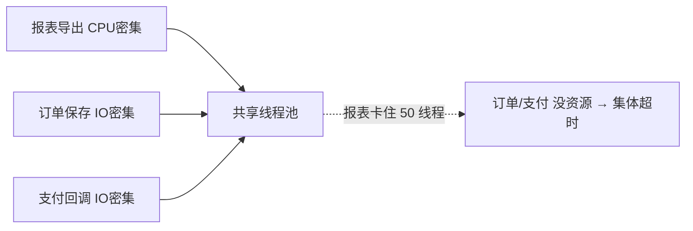
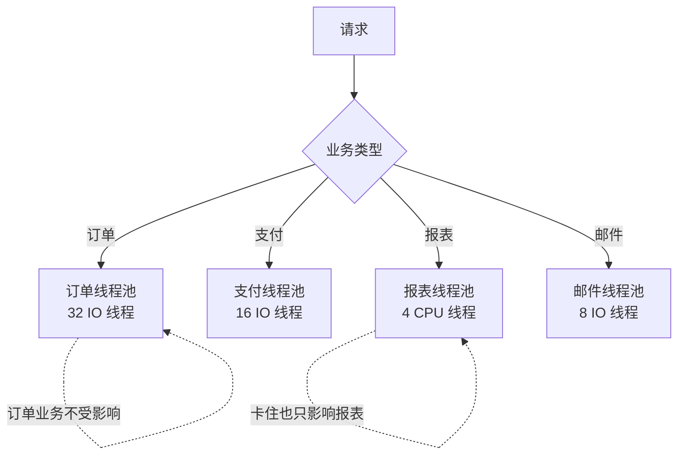
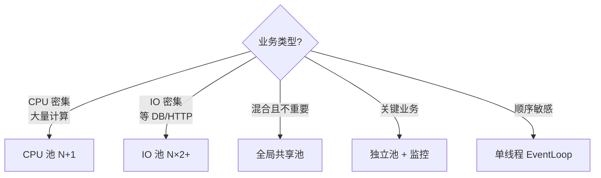

# 多线程，是否只创建一个线程池就够了？

> 一句话答案：**不**。**按业务类型隔离线程池**，否则一个慢业务能拖死所有业务。

---

## 用一个大池的痛苦

```
全局共享线程池 (200 线程):
  报表导出     ──┐
  订单保存     ──┤
  支付回调     ──┼──→ 同一个池
  邮件发送     ──┤
  Excel 解析   ──┘

  问题：
  ① 一份报表跑 5 分钟 → 占用 50 个线程 5 分钟
     此时订单/支付都没线程可用 → 全线超时
  ② 报表是 CPU 密集，订单是 IO 密集
     混在一起，调度策略两边都不优
```



---

## 隔离的两条原则

### 1. CPU 密集 vs IO 密集 分开

| 类型 | 特征 | 线程数经验 |
| :--- | :--- | :--- |
| **CPU 密集** | 计算多、等待少（加密、压缩、报表生成） | **核数 + 1** |
| **IO 密集** | 等待多、计算少（DB 查询、HTTP 调用、文件读写） | **核数 × 2** 或更多 |

```
为什么 CPU 密集型只能开核数+1？

  8 核机器 × 8 个 CPU 密集线程 = 100% 利用率
  再多 → CPU 时间全花在切换上，反而变慢

  ┌──────────────────────────────────────┐
  │ 8 线程：每个跑 100ms = 100ms 完成     │
  │ 64 线程：CPU 切换占 30%，160ms 才完成 │
  └──────────────────────────────────────┘
```

```
为什么 IO 密集型可以多开？

  线程发起 DB 查询 → 等响应 50ms 期间 CPU 空闲
  → 让别的线程占用 CPU
  → 64 个线程能让 CPU 一直忙

  公式参考：N = 核数 × (1 + 等待时间/计算时间)
  DB 查询：50ms 等 / 5ms 算 = 等 10 倍
        → 8 核 × (1 + 10) = 88 线程
```

### 2. 按业务隔离（舱壁模式 Bulkhead）



类比船舱：一个舱进水了，其他舱独立，不会整船沉。

---

## 线程池怎么配

```java
// IO 密集（订单/支付/普通接口）
ThreadPoolExecutor orderPool = new ThreadPoolExecutor(
    16,                      // 核心线程
    32,                      // 最大线程
    60, TimeUnit.SECONDS,    // 空闲存活
    new LinkedBlockingQueue<>(1000),  // 队列
    new ThreadFactoryBuilder().setNameFormat("order-pool-%d").build(),
    new ThreadPoolExecutor.CallerRunsPolicy()  // 满了让调用者自己跑
);

// CPU 密集（报表/Excel）
ThreadPoolExecutor reportPool = new ThreadPoolExecutor(
    9,                       // 8 核 + 1
    9,
    0, TimeUnit.SECONDS,
    new ArrayBlockingQueue<>(100),
    new ThreadFactoryBuilder().setNameFormat("report-pool-%d").build(),
    new ThreadPoolExecutor.AbortPolicy()  // 满了直接拒绝
);
```

---

## 拒绝策略选哪个

| 策略 | 行为 | 适合 |
| :--- | :--- | :--- |
| AbortPolicy | 抛异常 | 默认，能感知 |
| **CallerRunsPolicy** | 调用者自己跑 | 接口降级，反向限流 |
| DiscardPolicy | 静默丢弃 | 几乎不用 |
| DiscardOldestPolicy | 丢最老的任务 | 几乎不用 |
| 自定义 | 落 MQ / 落库重试 | 不能丢的关键业务 |

---

## 单线程更好的场景

不是所有场景都要"并发越高越好"。

```
单线程的好处：
  ✅ 无锁，无并发 bug
  ✅ 无上下文切换开销
  ✅ 数据顺序性天然保证
  ✅ JIT 友好（单线程热点代码更容易编译）

典型代表：
  Redis、Node.js 单线程事件循环
  Netty EventLoop（一个 Loop 一个线程）
  Kafka 分区单线程消费
```

---

## 监控线程池

不监控的线程池就是定时炸弹。

```java
// 关键指标
pool.getActiveCount();        // 活跃线程数
pool.getQueue().size();       // 队列长度
pool.getCompletedTaskCount(); // 累计完成
pool.getPoolSize();           // 当前池子大小
```

接入监控（Prometheus + Grafana），告警阈值：
- 活跃数 > 核心数 80% 持续 5 分钟
- 队列长度 > 50% 持续 1 分钟
- 拒绝次数 > 0

---

## 选型决策



---

## 一句话总结

| 错误 | 后果 | 解法 |
| :--- | :--- | :--- |
| 一个池所有业务共用 | 一处卡死全死 | **按业务隔离** |
| CPU 密集开几百线程 | 切换开销吃满 CPU | **核数+1** |
| IO 密集只开几个线程 | CPU 闲死 | **核数 × 2 或更多** |
| 没监控 | 出事才知道 | **指标 + 告警** |
