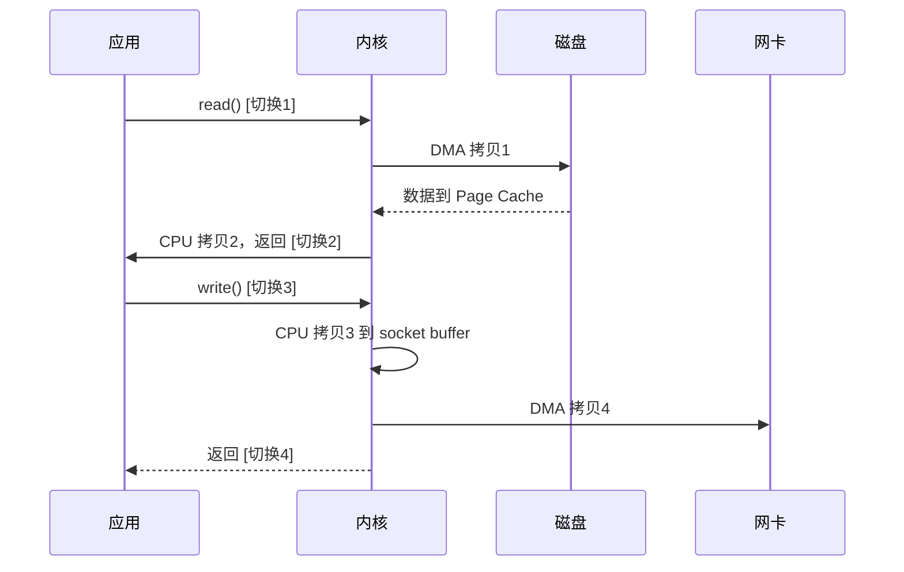
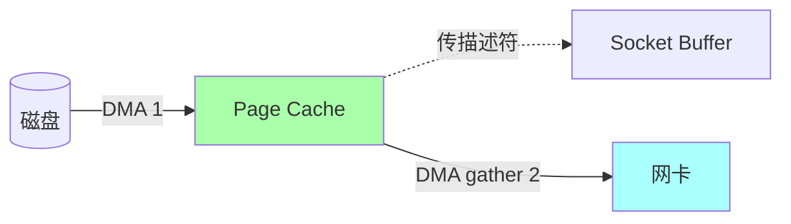
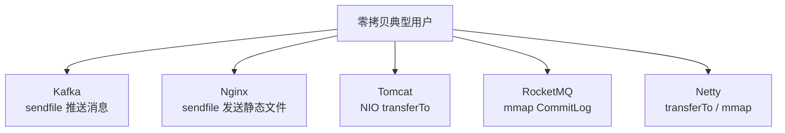

# 零拷贝原理

> Kafka 百万 QPS、Nginx 静态资源、Java NIO transferTo 都靠它。
> "零"不是真的没拷贝，是**消除了 CPU 参与的多余拷贝**。

---

## 为什么需要零拷贝

**典型场景**：把磁盘文件发送到网络（如 Nginx 静态资源、Kafka 消息推送）。

```
传统方式（read + write）：

  CPU
   │
   │ read(file, buf)
   ▼
   ┌────────┐  DMA 拷贝1   ┌──────────────┐
   │  磁盘   │ ────────→  │ 内核 Page Cache │
   └────────┘             └──────┬───────┘
                                 │ CPU 拷贝2
                                 ▼
                          ┌──────────────┐
                          │  用户 buffer  │
                          └──────┬───────┘
   │ write(socket, buf)
   ▼                              │ CPU 拷贝3
                          ┌──────▼───────┐
                          │ Socket Buffer │
                          └──────┬───────┘
                                 │ DMA 拷贝4
                                 ▼
                          ┌──────────────┐
                          │    网卡       │
                          └──────────────┘

  4 次拷贝 + 4 次上下文切换
```



### 浪费在哪？

- **CPU 拷贝 2、3** 完全多余：数据从内核读出来，啥也没改又写回内核
- **上下文切换** 浪费 CPU 周期
- **多份内存副本** 浪费 RAM

---

## mmap + write（减少一次 CPU 拷贝）

```
mmap：把内核 Page Cache 映射到用户空间地址
     → 用户和内核共享同一份物理内存
     → 用户访问 buf 就是访问 Page Cache

  CPU
   │
   │ mmap(file)
   ▼
   ┌────────┐  DMA 拷贝1   ┌──────────────┐
   │  磁盘   │ ──────→     │ 内核 Page Cache │ ←──共享 mmap
   └────────┘             └──────┬───────┘
                                 │ CPU 拷贝2
   │ write(socket, mmap)         ▼
   ▼                      ┌──────────────┐
                          │ Socket Buffer │
                          └──────┬───────┘
                                 │ DMA 拷贝3
                                 ▼
                          ┌──────────────┐
                          │    网卡       │
                          └──────────────┘

  3 次拷贝 + 4 次切换
  适合：需要先修改文件内容（如压缩、加密）再发送
```

---

## sendfile（真正的零拷贝）

```
sendfile：内核内部直接把数据从文件 fd 送到 socket fd

  CPU 几乎不参与
   ┌────────┐  DMA 拷贝1   ┌──────────────┐
   │  磁盘   │ ──────→     │ Page Cache    │
   └────────┘             └──────┬───────┘
                                 │ CPU 拷贝2（→ Socket Buffer）
                                 ▼
                          ┌──────────────┐
                          │ Socket Buffer │
                          └──────┬───────┘
                                 │ DMA 拷贝3
                                 ▼
                          ┌──────────────┐
                          │    网卡       │
                          └──────────────┘

  3 次拷贝 + 2 次切换（一次 sendfile 系统调用）
```

```c
ssize_t sendfile(int out_fd, int in_fd, off_t *offset, size_t count);
```

```
应用调一次 sendfile：
  内核内部：file → Page Cache → Socket Buffer → 网卡
  应用全程不接触数据
```

---

## sendfile + DMA gather（终极零拷贝）

Linux 2.4+ 配合网卡 DMA gather 功能：

```
  ┌────────┐  DMA 拷贝1   ┌──────────────┐
  │  磁盘   │ ──────→     │ Page Cache    │
  └────────┘             └───────────────┘
                                 │ 只传"位置+长度"信息给 socket buffer
                                 │ 不复制数据本身
                                 ▼
                          ┌──────────────┐
                          │ Socket Buffer │
                          │ (只有描述符)  │
                          └──────┬───────┘
                                 │ DMA gather 直接从 Page Cache 读 + 拼接 + 送网卡
                                 ▼
                          ┌──────────────┐
                          │    网卡       │
                          └──────────────┘

  2 次拷贝（都是 DMA）+ 2 次切换
  CPU 完全不参与数据拷贝
```



---

## 4 种方案对比

| 方案 | 拷贝次数 | 切换次数 | 适用 |
| :--- | :--- | :--- | :--- |
| read + write | 4 | 4 | 通用，但慢 |
| mmap + write | 3 | 4 | 需要修改数据 |
| sendfile | 3 | 2 | 文件→Socket |
| sendfile + DMA gather | 2 | 2 | **终极方案** |

---

## splice 与 tee

```
splice：在两个 fd 之间通过"管道"传输数据，无需用户空间
  适合：管道、socket 之间的传输

tee：把一个 pipe 的内容"复制"到另一个 pipe
  适合：日志同时写到多个地方
```

---

## Java 零拷贝

### FileChannel.transferTo

```java
FileChannel fileChannel = new FileInputStream("data.bin").getChannel();
SocketChannel socketChannel = ...;

// 一行代码 = sendfile
fileChannel.transferTo(0, fileChannel.size(), socketChannel);
```

底层就是调 sendfile。

### MappedByteBuffer

```java
RandomAccessFile raf = new RandomAccessFile("data.bin", "rw");
FileChannel fc = raf.getChannel();
MappedByteBuffer buffer = fc.map(MapMode.READ_WRITE, 0, fc.size());
// 直接读写 buffer = 操作磁盘文件 = mmap
```

---

## 谁用了零拷贝



### Kafka 怎么用

```
Consumer 拉消息：
  1. Broker 接到 fetch 请求
  2. 找到对应文件位置
  3. sendfile(file, socket)
     → 文件数据直接进网卡
     → JVM 堆完全不参与
     → 即使百万消息也几乎不增加 GC 压力
```

### RocketMQ 用 mmap

```
原因：RocketMQ 需要按 index 文件随机读 + CommitLog 顺序读
      sendfile 不支持随机访问
      → 改用 mmap 把 CommitLog 映射到内存
```

---

## 零拷贝的副作用

```
不是银弹：

  ❌ sendfile 只能"文件 → socket"，不能反向
  ❌ mmap 大文件可能耗尽虚拟内存
  ❌ Page Cache 失效（如 directIO）零拷贝失效
  ❌ Linux 2.4 之前 sendfile 性能并不好
```

---

## 怎么验证

```bash
# strace 看系统调用
strace -e trace=read,write,sendfile,mmap ./your_app

# perf 看上下文切换
perf stat -e context-switches ./your_app
```

---

## 一句话总结

| 阶段 | 拷贝次数 |
| :--- | :--- |
| 原始 read+write | 4 次（2 次 CPU + 2 次 DMA） |
| mmap+write | 3 次（1 次 CPU + 2 次 DMA） |
| sendfile | 3 次（1 次 CPU + 2 次 DMA） |
| sendfile + DMA gather | 2 次（**全 DMA**，CPU 不参与） |

> 零拷贝的本质：**减少内核态/用户态之间的来回拷贝，让 DMA 干所有事**。
