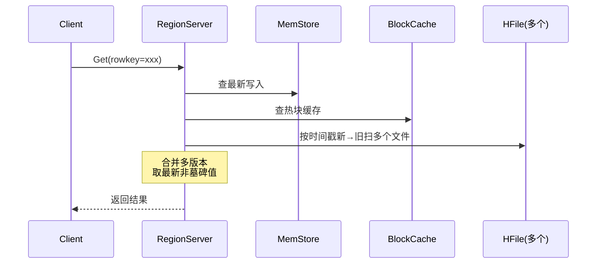
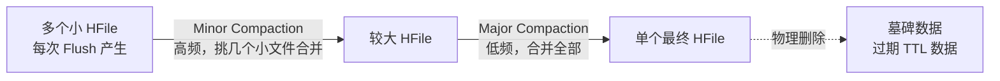

# HBase

## 适用场景
- 抖音弹幕、海量日志、IM 历史消息、用户画像、时序数据
- 单表百亿行级别，**强写入吞吐**，稀疏列友好
- 强一致读写（同 RowKey），但不支持复杂事务、不支持 SQL join

关系型数据库用 B+ 树，**随机写慢**（磁头到处跳）；HBase 用 LSM 树，**全顺序写**，吞吐压倒性。

---

## 写路径：LSM 树

```
   Client 写请求
        │
        ▼
 ┌─────────────────┐
 │  WAL (HLog)     │  顺序追加到磁盘日志，宕机重放用
 └────────┬────────┘
          ▼
 ┌─────────────────┐
 │  MemStore       │  内存中跳表，按 RowKey 排序
 │  （每个 Region  │  达到阈值（默认 128MB）→ Flush
 │    一个）       │
 └────────┬────────┘
          ▼ Flush
 ┌──────────────────────────────┐
 │  HFile  HFile  HFile  ...    │  磁盘上不可变文件
 │  （StoreFile，HDFS 上）       │  每个文件内部 RowKey 有序
 └──────────────────────────────┘
```

核心思想：**所有写都是顺序追加**。删除、更新都不是真删，而是写一条带"墓碑"标记的新记录，旧记录在 Major Compaction 时被物理清理。

---

## 读路径



**问题**：HFile 越多，读放大越严重（一次 Get 可能扫几十个文件）→ 需要 Compaction。

---

## 合并流程 Compaction



| 类型 | 触发 | 作用 | 代价 |
| :--- | :--- | :--- | :--- |
| Minor | 小文件数超阈值 | 减少文件数，降低读放大 | 小，IO 可控 |
| Major | 默认 7 天一次 | **物理清理墓碑**、过期 TTL | 大，全量重写 |

**生产建议**：关闭自动 Major（`hbase.hregion.majorcompaction=0`），凌晨业务低峰手动触发，避免白天 IO 抖动。

---

## 抖音弹幕场景设计

**需求**：几百万人同时发弹幕，视频回放时按时间倒序拉最近 N 条。

```
RowKey 设计：
  videoId_${MAX_LONG - timestamp}_userId
        │            │                │
        │            │                └── 同毫秒去重
        │            └── 反向时间戳：新弹幕排前面
        └── 视频维度分片

举例：videoId=10086
  RowKey1: 10086_9223372036854775806_u1  (新)
  RowKey2: 10086_9223372036854775900_u2  (旧)
```

要点：
- **反向时间戳**：Scan 时天然倒序，无需 reverse
- **预分区**：用 videoId 高位 hash 散列，避免单 Region 热点
- **列族拆分**：弹幕内容（高频读）+ 举报记录（低频）分两个 CF
- **TTL**：弹幕保留 7~30 天自动过期，不用业务清理

---

## 三个核心字（口诀：写、合、读）

- **写**：WAL → MemStore → Flush 成 HFile（全顺序）
- **合**：Minor 合小文件，Major 清墓碑（控制读放大）
- **读**：MemStore + BlockCache + 多个 HFile 多版本归并
