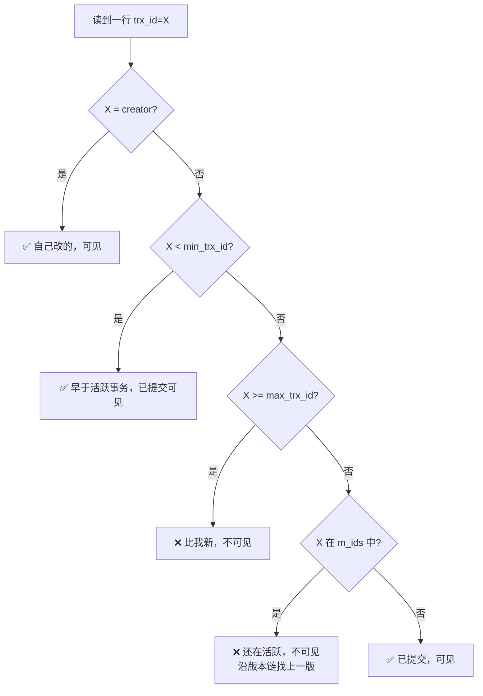
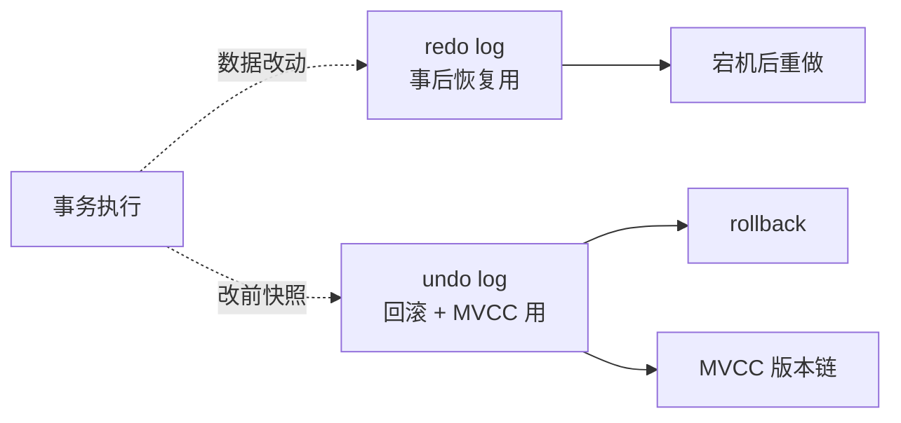
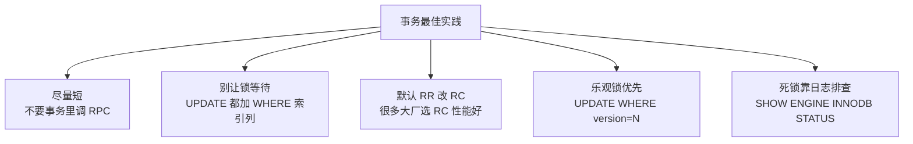

# MySQL 事务与 MVCC

> 事务 ACID 是基本盘，**MVCC 是 InnoDB 实现并发读写的核心**。
> 没有 MVCC，读会被写阻塞，整个数据库吞吐塌一半。

---

## ACID

| 属性 | 含义 | InnoDB 实现 |
| :--- | :--- | :--- |
| **Atomicity** 原子性 | 要么全成要么全败 | undo log |
| **Consistency** 一致性 | 数据约束不被破坏 | 业务+数据库共同保证 |
| **Isolation** 隔离性 | 并发事务互不干扰 | **MVCC + 锁** |
| **Durability** 持久性 | 提交后不丢 | redo log |

---

## 4 种隔离级别

```
                     脏读      不可重复读   幻读       性能
                     ───────────────────────────────────
读未提交 RU         ❌可发生   ❌可发生    ❌可发生   最高
读已提交 RC         ✅防住    ❌可发生    ❌可发生   高 ← Oracle 默认
可重复读 RR         ✅防住    ✅防住     ⚠ 准防住   中 ← MySQL 默认
串行化 Serializable ✅防住    ✅防住     ✅防住    最低
```

### 三种异常解释

```
脏读：
  事务 A 改了未提交 → 事务 B 读到 → A 回滚 → B 拿到不存在的数据

不可重复读：
  事务 A 第一次读 x=10 → 事务 B 改成 20 提交 → A 再读变成 20

幻读：
  事务 A 读 WHERE age=18 共 5 行 → 事务 B 插入新一行 → A 再读变 6 行
```

---

## MVCC（多版本并发控制）

> 核心思想：**读不加锁，每行保留多个版本，读旧版本不阻塞写**。

### 行的隐藏字段

```
每行真实存储：
  ┌──────────┬─────────┬──────────────┬──────────────┐
  │ 业务字段  │ DB_ROW_ID│ DB_TRX_ID    │ DB_ROLL_PTR  │
  │ name=张三 │  rowid   │ 最后修改它的  │ 指向 undo log │
  │ age=18    │          │ 事务 ID       │ （旧版本链）  │
  └──────────┴─────────┴──────────────┴──────────────┘
```

### Undo log 版本链

```
  当前行：张三 18  (trx_id=100)
              │
              ▼ DB_ROLL_PTR
          ┌────────────────────┐
          │ 张三 17  (trx_id=80)│
          └─────────┬──────────┘
                    ▼
          ┌────────────────────┐
          │ 张三 15  (trx_id=50)│
          └─────────┬──────────┘
                    ▼
                  NULL
                  
  ↑ 每次 UPDATE 把旧值挂到链上
    每个版本带"哪个事务改的"标记
```

### ReadView（快照）

事务开始时（RR）或每次查询时（RC）生成一个快照：

```
ReadView = {
  m_ids:       [当前活跃事务 ID 列表]
  min_trx_id:  最小活跃事务 ID
  max_trx_id:  下一个待分配事务 ID
  creator:     当前事务 ID
}
```

### 可见性判断



简化记忆：**只读已提交事务的版本，没提交的沿 undo log 找上一个**。

---

## RR vs RC 的差异

| 级别 | ReadView 创建时机 | 现象 |
| :--- | :--- | :--- |
| RC | **每条 SELECT 都新建** | 同一事务内多次 SELECT 可能不同 |
| RR | **事务第一条 SELECT 时建** | 事务内所有快照读结果一致 |

```
RC 示例：
  事务 A 开始
    SELECT x   → x=10  (新建 RV1)
  事务 B 改 x=20 提交
    SELECT x   → x=20  (新建 RV2 → 看到 B 已提交)
  → 不可重复读 ❌

RR 示例：
  事务 A 开始
    SELECT x   → x=10  (新建 RV1)
  事务 B 改 x=20 提交
    SELECT x   → x=10  (复用 RV1 → B 不在快照里)
  → 可重复读 ✅
```

---

## 快照读 vs 当前读

```
快照读：普通 SELECT
  → 走 MVCC，读历史版本，不加锁

当前读：以下语句
  SELECT ... LOCK IN SHARE MODE   （加 S 锁）
  SELECT ... FOR UPDATE            （加 X 锁）
  INSERT / UPDATE / DELETE         （隐式加 X 锁）
  → 必须读最新版本 + 加锁
```

---

## RR 怎么防幻读：Next-Key Lock

```sql
-- 表 t，索引在 age 上，已有 age=10, 20, 30
SELECT * FROM t WHERE age > 15 FOR UPDATE;
```

```
Next-Key Lock = Record Lock + Gap Lock
  锁定区间：(10, 20]  (20, 30]  (30, +∞)
  
  即使是不存在的"间隙"也被锁住
  → 其他事务无法插入 age=25 等
  → 防住了幻读

  示意：
    age:  10    15(查询条件)    20    25(想插入)❌    30   ...
                ─────────────────────────────────────
                            被 next-key 锁覆盖
```

> 但 RR 只在**当前读**时防幻读；快照读靠 ReadView 防（不可能看到新行）。
> 大厂常考的"RR 完美防幻读"是有前提的。

---

## 死锁

```
事务 1：UPDATE A → 等 B 的锁
事务 2：UPDATE B → 等 A 的锁
                    ↑↑↑↑
                  死锁
```

InnoDB 死锁检测：发现就**回滚代价小的事务**。

```sql
-- 实时看锁
SELECT * FROM performance_schema.data_locks;
SHOW ENGINE INNODB STATUS;  -- LATEST DETECTED DEADLOCK 段

-- 解决：
-- 1. 保证加锁顺序一致（先 A 后 B，所有事务都这样）
-- 2. 减小事务粒度
-- 3. 用乐观锁（version 字段）代替悲观锁
```

---

## redo / undo log 角色



- **redo log**：物理日志，"在 X 页 Y 位置写 Z"。崩溃恢复用。
- **undo log**：逻辑日志，"原来是这样的"。回滚 + MVCC 用。
- **binlog**：逻辑日志，主从同步用。

详见 [MySQL三大日志.md](MySQL三大日志.md)。

---

## 实战经验



为什么很多大厂用 RC 而不是 RR？
- RC 不需要 Gap Lock → 死锁少
- RC 性能更高
- 业务幻读靠应用层幂等保证

---

## 一句话总结

- ACID：**A 靠 undo，I 靠 MVCC+锁，D 靠 redo**
- **MVCC = 版本链 + ReadView**，读不加锁，写不阻塞读
- RR 用 **Next-Key Lock** 防当前读的幻读
- 死锁靠**加锁顺序一致**预防
