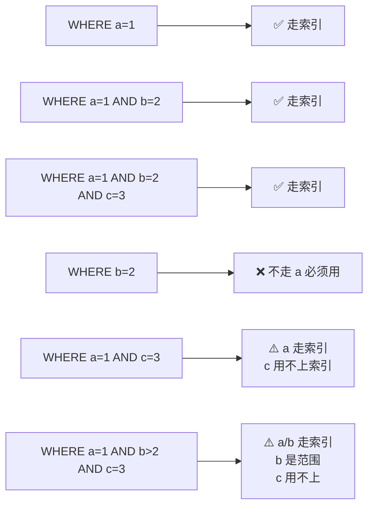
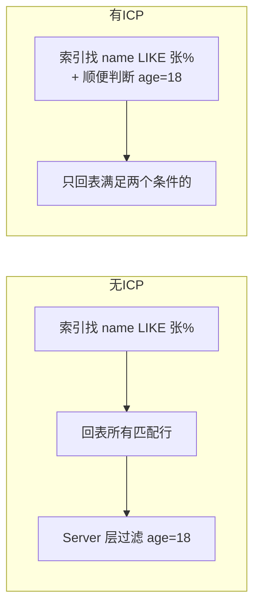

# MySQL 索引原理

> 索引面试**永远的开胃菜**。核心：**B+ 树为什么是它，怎么用好它**。

---

## 为什么是 B+ 树而不是别的

| 数据结构 | 问题 |
| :--- | :--- |
| 数组 | 二分查找快，但插入删除 O(n) |
| 链表 | 插入快，查找慢 |
| 哈希表 | 查单值快，**范围查询拉胯**（哈希后顺序乱了） |
| 二叉搜索树 | 容易退化成链表 |
| 红黑树 | 树太高，每层一次磁盘 IO，IO 次数多 |
| B 树 | 节点存数据，叶子节点没串起来，范围扫描差 |
| **B+ 树** ⭐ | 节点只存索引、数据在叶子、叶子是双向链表 |

---

## B+ 树结构

```
                ┌────────────────────────┐
   非叶子节点 →  │   10  │  30  │  60     │
                └───┬─────┬──────┬───────┘
                    │     │      │
        ┌───────────┘     │      └────────────┐
        ▼                 ▼                    ▼
   ┌────────┐       ┌──────────┐         ┌──────────┐
   │ 1│5│9  │ ─→    │11│18│25 │ ─→     │35│42│55 │ ─→ ...
   └────────┘       └──────────┘         └──────────┘
        ▲             叶子节点                       叶子节点
        │             双向链表串起来 ←─→ 范围扫描极快
        │
   叶子节点存"真实数据"（聚簇索引）
   或"主键 + 索引值"（非聚簇索引）
```

### 三个关键设计

1. **非叶子节点不存数据**：每页能存更多索引项 → 树更矮 → IO 更少
2. **叶子节点用双向链表串起来**：范围查询 `WHERE id BETWEEN 10 AND 100` 不用回到树上
3. **数据全在叶子节点**：所有查询路径长度相同（稳定 O(log n)）

### 树高度的现实

```
假设：
  非叶子节点一页 16KB，存 1000 个索引项
  叶子节点一页 16KB，存 100 行数据

三层 B+ 树能存：
  1000 × 1000 × 100 = 1 亿行数据

查任意一行：最多 3 次磁盘 IO（其中前两层通常在内存里）
```

---

## 聚簇索引 vs 非聚簇索引（二级索引）

```
聚簇索引（主键索引）：           非聚簇索引（普通索引）：
叶子节点 = 完整行数据             叶子节点 = (索引值, 主键)

       [PRIMARY]                      [idx_name]
           │                              │
       ┌───┴───┐                      ┌───┴───┐
       │       │                      │       │
   ┌───┴─┐ ┌──┴──┐                ┌───┴─┐ ┌──┴──┐
   │id=1 │ │id=5 │                │张三 │ │李四 │
   │完整  │ │完整  │                │ → 1 │ │ → 5 │  ← 只存主键
   │行数据│ │行数据│                └─────┘ └─────┘
   └─────┘ └─────┘                     ↓
                                       回表
                                       根据主键再查聚簇索引
                                       拿完整行
```

### 一次普通索引查询（要回表）

```sql
SELECT * FROM users WHERE name = '张三';
```


**回表 = 多一次 IO**。能避免就避免。

---

## 覆盖索引（避免回表）

```sql
-- 表：users(id, name, age, email)，有索引 idx_name_age(name, age)

-- ❌ 不是覆盖索引，要回表
SELECT * FROM users WHERE name = '张三';

-- ✅ 覆盖索引，索引里已有 name 和 age，无需回表
SELECT name, age FROM users WHERE name = '张三';
```

```
覆盖索引：
  查询的字段全部在索引里 → 直接从索引返回 → 不用回表
  
查询计划里能看到 "Using index"
```

---

## 联合索引与最左前缀

```sql
CREATE INDEX idx_abc ON t(a, b, c);
```

索引内部是按 `(a, b, c)` 顺序排序的：

```
   (a=1, b=2, c=3)
   (a=1, b=2, c=5)
   (a=1, b=4, c=1)
   (a=2, b=1, c=8)
   (a=2, b=3, c=2)
   ...
```



**口诀**：
- 必须包含**最左字段**才能用索引
- 中间断了或用了**范围（>、<、BETWEEN、LIKE）**，后面字段失效

---

## 索引失效场景

```sql
-- ① 函数 / 表达式：索引列上做计算
SELECT * FROM users WHERE YEAR(create_time) = 2025;  -- ❌
SELECT * FROM users WHERE create_time >= '2025-01-01' AND create_time < '2026-01-01';  -- ✅

-- ② 类型不匹配：隐式转换
-- name 是 varchar，传入了数字
SELECT * FROM users WHERE name = 123;  -- ❌ 字符串转数字，全表扫
SELECT * FROM users WHERE name = '123';  -- ✅

-- ③ LIKE 前模糊
SELECT * FROM users WHERE name LIKE '%张%';  -- ❌
SELECT * FROM users WHERE name LIKE '张%';   -- ✅ 后模糊可走索引

-- ④ OR 连接非索引列
SELECT * FROM users WHERE name = '张三' OR age = 18;  -- 如果 age 没索引 → 全表扫
-- 改成 UNION

-- ⑤ NOT / != / NOT IN
SELECT * FROM users WHERE status != 1;  -- ❌ 通常不走

-- ⑥ IS NULL（取决于 MySQL 版本，老版不走）
```

---

## 索引下推（ICP，Index Condition Pushdown）

MySQL 5.6+ 的优化。

```sql
-- 索引 idx_name_age(name, age)
SELECT * FROM users WHERE name LIKE '张%' AND age = 18;
```

```
不开 ICP：
  存储层：找到所有 name 'LIKE 张%' 的索引项 → 回表
  Server 层：逐条比对 age=18 → 筛选

开 ICP：
  存储层：找 name LIKE '张%' 的同时直接判断 age=18 → 减少回表
```



---

## 怎么排查慢 SQL

```sql
-- 1. 看执行计划
EXPLAIN SELECT * FROM users WHERE name = '张三';

-- 重点列：
-- type: ALL(全表) < index < range < ref < eq_ref < const  （越往右越好）
-- key:  实际用的索引（NULL 说明没用）
-- rows: 扫描行数估计
-- Extra: Using index(覆盖) / Using where / Using filesort / Using temporary
```

| Extra 含义 | 解释 |
| :--- | :--- |
| Using index | 覆盖索引 ✅ |
| Using where | 用了 WHERE 过滤 |
| Using filesort | **额外排序**，慢 |
| Using temporary | **建临时表**，慢 |
| Using join buffer | join 没用索引 |

---

## 索引设计原则

```mermaid
flowchart TD
  A[加索引的判断] --> B{该列经常出现在<br/>WHERE/ORDER BY/JOIN?}
  B -->|否| N1[不加]
  B -->|是| C{选择性高?<br/>distinct值多]
  C -->|低 例如性别| N2[不加]
  C -->|高| D{已有联合索引<br/>包含该列?}
  D -->|是| N3[不重复加]
  D -->|否| E[加索引]
```

**经验**：
- 单表索引数 **≤ 5 个**（多了写入成本高）
- 高选择性优先：身份证 > 手机号 > 年龄 > 性别
- 联合索引顺序：**等值前置、范围最后**
- 字符串列长 → 用**前缀索引**（如 `INDEX(email(10))`）

---

## 一句话总结

- **B+ 树**：节点只索引、数据在叶子、叶子链表 → 范围 + 单点都快
- **聚簇索引**叶子存完整行；**普通索引**叶子存主键，要**回表**
- **覆盖索引**避免回表；**最左前缀**决定联合索引能否走
- 函数 / 类型不匹配 / 前模糊 → **索引失效**
- 排查靠 **EXPLAIN**，重点看 type / key / rows / Extra
