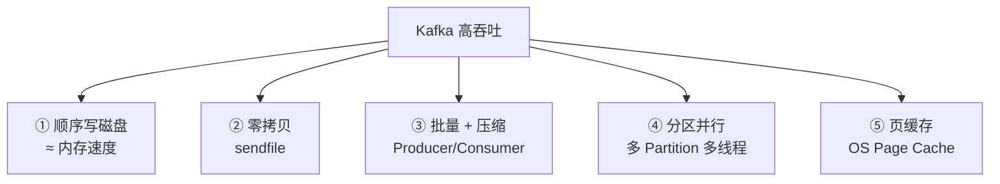
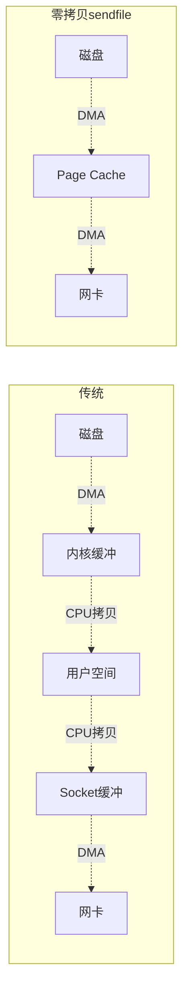
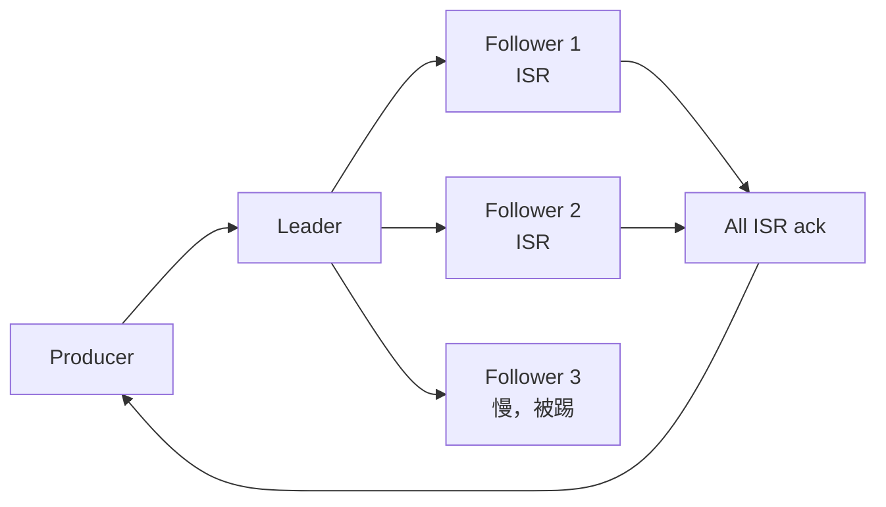
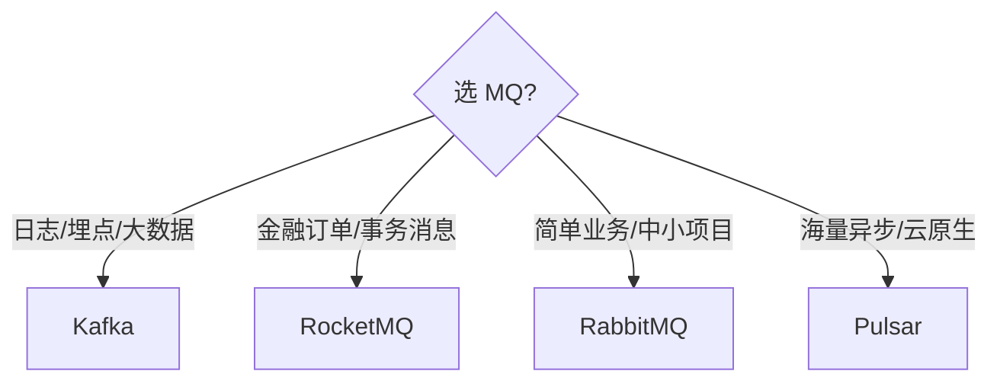

# Kafka 高吞吐原理

> Kafka 单机能扛 **百万级 QPS**，原因不是黑魔法，是几个工程优化的极致组合：
> **顺序写 + 零拷贝 + 批量 + 分区并行 + 页缓存**。

---

## 总览：5 个杀手锏



---

## ① 顺序写磁盘

```
随机写 vs 顺序写（机械盘）：
   随机写：磁头跳来跳去  ~100 KB/s
   顺序写：连续追加     ~500 MB/s
   
   差 5000 倍！

固态盘也类似，顺序写比随机写快 10 倍以上。
```

Kafka 把消息**只追加到文件末尾**，永远不修改/不插入。

```
   commit log 文件：
   ┌──────────────────────────────────────────┐
   │ msg1 │ msg2 │ msg3 │ msg4 │ ...  │ msgN │ ←追加位置
   └──────────────────────────────────────────┘
   
   永远只往后写，类似 WAL
   旧数据按 retention 策略整段删除（不是逐条删）
```

> 这跟数据库的 LSM 树思想一脉相承。

---

## ② 零拷贝（Zero-Copy）

传统消费消息的数据路径：

```
传统方式（4 次拷贝 + 4 次上下文切换）：

  磁盘 → 内核 Page Cache  (DMA 拷贝 1)
       ↓
  内核 → 用户空间 Buffer   (CPU 拷贝 2)  ←切换 1
       ↓
  用户空间 → 内核 Socket Buffer  (CPU 拷贝 3)  ←切换 2
       ↓
  Socket Buffer → 网卡  (DMA 拷贝 4)  ←切换 3,4
```

零拷贝（sendfile 系统调用）：

```
零拷贝（2 次拷贝 + 2 次切换）：

  磁盘 → 内核 Page Cache  (DMA 拷贝 1)
       ↓
  Page Cache → 网卡       (DMA 拷贝 2)  ←切换 1,2

  ✅ 数据全程不进用户空间
  ✅ CPU 不参与拷贝（DMA 完成）
```



详见 [零拷贝原理.md](../操作系统/零拷贝原理.md)。

---

## ③ 批量 + 压缩

### Producer 批量发送

```java
// 默认配置
batch.size=16384         # 攒满 16KB 才发
linger.ms=0              # 改成 10~50 ms 等更多消息
compression.type=lz4     # 压缩
```

```
不批量：
  100 万条消息 = 100 万次网络请求

批量（每批 1000 条）：
  100 万条消息 = 1000 次网络请求
  
  网络开销 / 1000
  + 压缩比 3:1 → 流量再 / 3
```

### Consumer 批量拉取

```java
max.poll.records=500     # 每次最多拉 500 条
fetch.min.bytes=1024     # 至少积累 1KB 再返回
fetch.max.wait.ms=500    # 最多等 500ms
```

---

## ④ 分区并行（Partition）

```
一个 Topic 多个 Partition：

   Topic: orders
   ┌───────────────────────────────────┐
   │ Partition 0 ──→ Consumer 1        │
   │ Partition 1 ──→ Consumer 2        │
   │ Partition 2 ──→ Consumer 3        │
   │ Partition 3 ──→ Consumer 4        │
   └───────────────────────────────────┘

  并发度 = Partition 数
  Partition 越多吞吐越高（有上限）
```

### Partition 与 Consumer 的 1:N

```
每个 Partition 同时只能被一个 Group 内的一个 Consumer 消费：

   Partition 0 ──→ Consumer A    （Group X）
   Partition 1 ──→ Consumer A    （一个 Consumer 可以拿多个 Partition）
   Partition 2 ──→ Consumer B
   Partition 3 ──→ Consumer B

  → 同组 Consumer 数 > Partition 数：多出来的闲着
  → 同组 Consumer 数 ≤ Partition 数：才能利用并行
```

详见 [MQ消息堆积1亿条数据.md](MQ消息堆积1亿条数据.md)。

---

## ⑤ 页缓存（Page Cache）

```
Kafka 不维护自己的内存缓存：

  Producer 写：
    数据 → Page Cache → 异步刷盘
    （不等磁盘写完就返回，速度极快）
  
  Consumer 读：
    优先从 Page Cache 读（命中率 95%+）
    没命中才从磁盘读

  → JVM 堆只用很少（GC 压力小）
  → 重启后 Page Cache 还在 OS 里，热数据不丢
```

---

## ISR（In-Sync Replicas）机制

```
Partition 副本：
   ┌────────────────────────────────────────┐
   │ Leader │ Follower 1 │ Follower 2 │ ... │
   └────────────────────────────────────────┘

  ISR = 与 Leader 同步进度差不多的 Follower 集合
  
  acks=all：写入要全部 ISR 都收到才回 ack
  Leader 挂了：从 ISR 选新 Leader
  Follower 太慢：踢出 ISR（不阻塞 acks=all）
```



---

## 文件结构

```
topic-partition 目录：
  topic-orders-0/
    ├── 00000000000000000000.log    ← 段文件 (Segment)
    ├── 00000000000000000000.index  ← 偏移量索引
    ├── 00000000000000000000.timeindex  ← 时间戳索引
    ├── 00000000000000100000.log
    ├── 00000000000000100000.index
    └── ...

  每个 segment 默认 1GB，写满后切下一段
  老 segment 可整段删除（按 retention.ms / retention.bytes）
```

### 稀疏索引

```
.index 文件：稀疏存储
  offset 0     → position 0
  offset 100   → position 12345
  offset 200   → position 25678
  ...

  查 offset=150：
    1. 二分查找 .index 找到 ≤150 的最大项（100, 12345）
    2. 从 .log 的 12345 开始顺序扫到 150
    
  → 索引文件很小，查找快
```

---

## Kafka vs RocketMQ 对比

| 维度 | Kafka | RocketMQ |
| :--- | :--- | :--- |
| 起源 | LinkedIn | 阿里 |
| 单机吞吐 | 百万 QPS | 十万 QPS |
| 延迟 | ms 级 | 更低 |
| 顺序消息 | 单 Partition 内 | 单 Queue 内（同 Kafka） |
| 事务消息 | 支持 | 原生支持，更完善 |
| 延时消息 | ❌ 不原生支持 | ✅ 18 个固定档位 |
| 消息回溯 | 按 offset | 按时间戳 + offset |
| 适合 | **日志、流处理、大数据** | **业务消息、订单、支付** |



---

## 高吞吐的代价

```
✘ Kafka 不擅长：
  - 业务级延时消息（要靠业务自己实现）
  - 消息按优先级
  - 单机吞吐高但单条延迟波动大
  - 配置复杂，运维门槛高

✘ Kafka 顺序读 / 顺序写优化对随机访问 unfriendly：
  - 不适合"按消息 ID 精确查找"的场景
```

---

## 一句话总结

| 优化 | 收益 |
| :--- | :--- |
| 顺序写磁盘 | 比随机写快 5000 倍 |
| 零拷贝 sendfile | 消费阶段 CPU 不参与拷贝 |
| 批量 + 压缩 | 网络流量 / 3000 |
| 分区并行 | 并发度 = Partition 数 |
| Page Cache | 用 OS 内存做缓存，JVM 轻 |

> Kafka 不是某一招特别厉害，是**所有招都做到极致的组合**。
