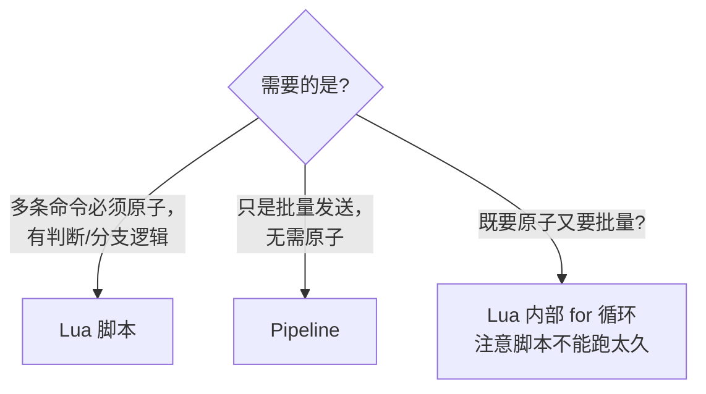

# Lua 脚本 vs Pipeline

> 一句话：**Lua 要的是原子性**（多个命令必须一起成功/失败）；**Pipeline 要的是吞吐**（多个命令一次网络往返发完）。

## 对比一览

| 维度 | Lua 脚本 | Pipeline |
| :--- | :--- | :--- |
| 目的 | 原子执行 | 减少 RTT、提高吞吐 |
| 原子性 | ✅ 整个脚本原子，期间不被其他命令打断 | ❌ 命令之间可被打断 |
| 网络 | 一次 RTT | 一次 RTT |
| 服务端 | 脚本内可读写、可判断 | 只是把多条命令打包发送 |
| 失败回滚 | ❌ 不支持事务回滚（一条失败后续仍执行） | ❌ 同 |
| Cluster 支持 | ❌ 不能跨槽位 | ❌ 跨槽位需客户端拆 |
| 典型用途 | 秒杀扣库存、防重 Token、限流计数 | 批量写、批量 hgetall、数据导入 |

---

## 执行模型对比

```
没优化（每条都 RTT）：           Pipeline（一次 RTT 多条命令）：
  Client ──cmd1──→ Redis           Client ──cmd1,cmd2,cmd3──→ Redis
  Client ←──r1───  Redis                                       │
  Client ──cmd2──→ Redis                                       │ 串行执行
  Client ←──r2───  Redis                                       │ 之间可被插入
  Client ──cmd3──→ Redis           Client ←──r1,r2,r3──        Redis
  Client ←──r3───  Redis

Lua（一次 RTT，服务端原子）：
  Client ──EVAL "script" KEYS ARGS──→ Redis
                                       │
                                       │ 单线程执行整个脚本
                                       │ 其他客户端阻塞等待
                                       │
  Client ←──result───────────────────  Redis
```

---

## Lua 实战：秒杀扣库存

```lua
-- KEYS[1] = stock:product:1001
-- ARGV[1] = 扣减数量
local stock = tonumber(redis.call('GET', KEYS[1]))
if not stock or stock < tonumber(ARGV[1]) then
  return 0   -- 库存不足
end
redis.call('DECRBY', KEYS[1], ARGV[1])
return 1     -- 扣减成功
```

> 关键：判断 + 扣减在脚本内一气呵成，**绝不会出现"判断时够、扣减时不够"的中间状态**。
> 普通的 `GET + DECRBY` 两条命令，并发下会超卖。

---

## Pipeline 实战：批量初始化用户积分

```java
try (Jedis jedis = pool.getResource()) {
    Pipeline p = jedis.pipelined();
    for (long uid = 1; uid <= 10000; uid++) {
        p.set("score:" + uid, "0");
    }
    p.sync();  // 一次性把 10000 条命令发送出去
}
```

> 一万条 SET 如果每条都走 RTT，1ms RTT * 10000 = 10s；用 Pipeline 通常 ~50ms。

---

## 什么时候用哪个



---

## 易踩坑

- **Lua 不是事务**：脚本中某条命令报错，**前面的修改不会回滚**。
- **Lua 超时阻塞所有客户端**：Redis 是单线程，脚本里别写慢操作（KEYS、循环 10 万次）。
- **Cluster 模式**：Lua 中所有 key 必须落在同一 slot（用 `{hashtag}` 强制），否则报 `CROSSSLOT`。
- **Pipeline 不保证顺序原子**：中间会插入别人的命令，仅"省 RTT"。
