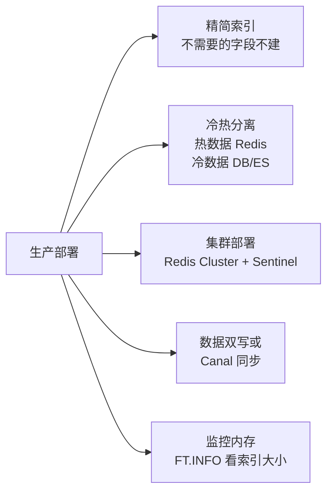

# RedisSearch（Redis 全文检索）

> 用 Redis 作为检索引擎，**替代部分 MySQL 模糊查询和小规模 ES**。
> 内存级速度 + 倒排索引 + 多条件聚合排序，适合中等数据量（百万到千万级）。

Redis 8 已**原生集成 RedisSearch**，老版本需要安装 `redisearch` 插件。

---

## 为什么需要它

```
传统 MySQL：                       RedisSearch：
  SELECT * FROM products            FT.SEARCH idx:products "苹果"
  WHERE name LIKE '%苹果%'
  ─────────────────────             ─────────────────────
  ❌ LIKE '%xx%' 不走索引            ✅ 倒排索引，毫秒级返回
  ❌ 百万行扫表                       ✅ 内存计算
  ❌ 不支持高亮                       ✅ 高亮、聚合、排序一站式
```

---

## 核心原理：倒排索引

```
原始数据（正排）：
  product:1 → "iPhone 16 黑色"
  product:2 → "小米 15 黑色"
  product:3 → "华为 Mate 70 苹果同款竞品"

分词后建立倒排索引：
  ┌─────────┬─────────────────────────┐
  │ 词 token │  出现在哪些文档          │
  ├─────────┼─────────────────────────┤
  │ iPhone  │  product:1               │
  │ 16      │  product:1               │
  │ 黑色    │  product:1, product:2    │
  │ 小米    │  product:2               │
  │ 15      │  product:2               │
  │ 华为    │  product:3               │
  │ 苹果    │  product:3               │
  │ ...     │                          │
  └─────────┴─────────────────────────┘

查询 "黑色"：
  直接查倒排表 → [product:1, product:2]，O(1) 命中
```

> 这是 ES、Lucene、Solr 一脉相承的核心思想，RedisSearch 把它做在内存里，更快。

---

## 字段类型

| 类型 | 含义 | 适合 |
| :--- | :--- | :--- |
| `TEXT` | 全文检索（会分词） | 商品名、文章正文 |
| `NUMERIC` | 数字（支持范围） | 价格、库存、销量 |
| `TAG` | 标签精确匹配（不分词） | 分类、品牌 |
| `GEO` | 地理坐标 | 附近的人/店铺 |
| `SORTABLE` | 修饰符，允许排序 | 任何要 ORDER BY 的字段 |

---

## 实战：电商商品搜索

### Step 1. 创建索引（≈建表）

```
FT.CREATE idx:products
  SCHEMA
  name      TEXT
  price     NUMERIC
  category  TAG
  brand     TAG
  sales     NUMERIC SORTABLE
```

### Step 2. 插入数据（用 HSET，索引自动维护）

```
HSET product:1 name "iPhone 16 512G 黑色" price 7999 category "手机" brand "苹果" sales 1200
HSET product:2 name "小米15 1TB 白色"     price 4299 category "手机" brand "小米" sales 3500
HSET product:3 name "华为Mate70 Pro 黑色" price 5699 category "手机" brand "华为" sales 2800
HSET product:4 name "AirPods Pro 2代"     price 1899 category "耳机" brand "苹果" sales 9000
```

### Step 3. 各种查询姿势

```bash
# 全文：搜"苹果"
FT.SEARCH idx:products "苹果"

# 全文：搜"黑色"
FT.SEARCH idx:products "黑色"
# → iPhone 16, 华为 Mate70

# 多条件：手机分类 + 价格 < 6000
FT.SEARCH idx:products "@category:{手机} @price:[0 6000]"

# 筛选 + 排序：手机按销量降序
FT.SEARCH idx:products "@category:{手机}" SORTBY sales DESC

# 分页
FT.SEARCH idx:products "*" LIMIT 0 2

# 高亮
FT.SEARCH idx:products "苹果" HIGHLIGHT

# 精确匹配品牌 = 苹果
FT.SEARCH idx:products "@brand:{苹果}"
```

---

## 查询语法速查

```
全文匹配:   "苹果"               → 包含"苹果"的文档
否定:       "苹果 -二手"          → 包含苹果但不含"二手"
短语:       "iPhone 16"           → 必须连续出现
范围:       "@price:[100 500]"    → 100~500
                "@price:[-inf 500]"   → ≤500
TAG:        "@brand:{苹果|华为}"  → 苹果或华为
组合:       "@category:{手机} @price:[0 6000] -二手"
排序:       SORTBY sales DESC
分页:       LIMIT 0 10
高亮:       HIGHLIGHT
返回字段:   RETURN 2 name price
```

---

## 生产建议



- **数据全量在内存** → 提前估算内存：建议预留 50%
- **索引也吃内存**：通常索引占数据的 30%~50%
- **不适合超大数据**（10亿+）→ 上 ES

---

## 选型对比

| 引擎 | 数据量 | 速度 | 部署 | 全文能力 |
| :--- | :--- | :--- | :--- | :--- |
| MySQL LIKE | 几十万 | 慢 | 简单 | 弱 |
| RedisSearch | 百万~千万 | 极快 | 中等 | 强 |
| Elasticsearch | 千万~百亿 | 快 | 复杂 | 极强 |

> 中小型项目用 RedisSearch 性价比最高；超大规模再上 ES。
