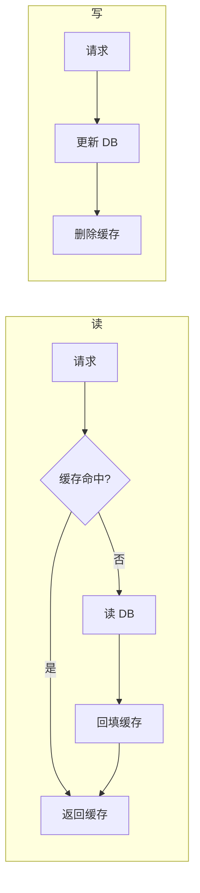
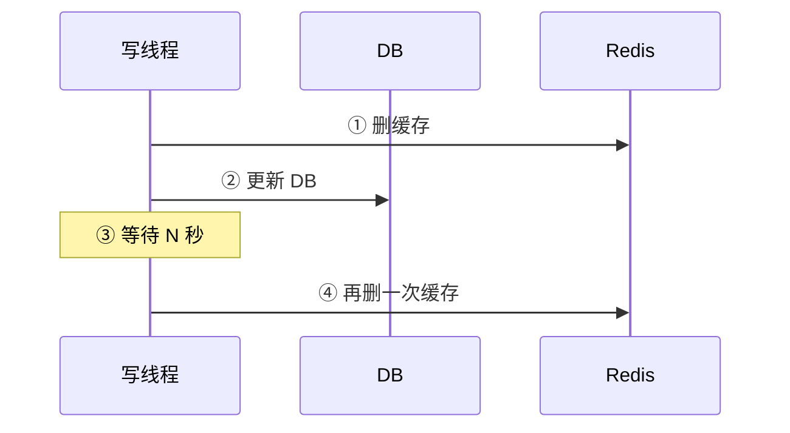
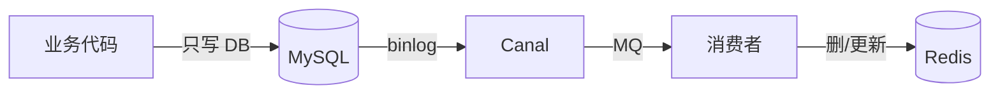
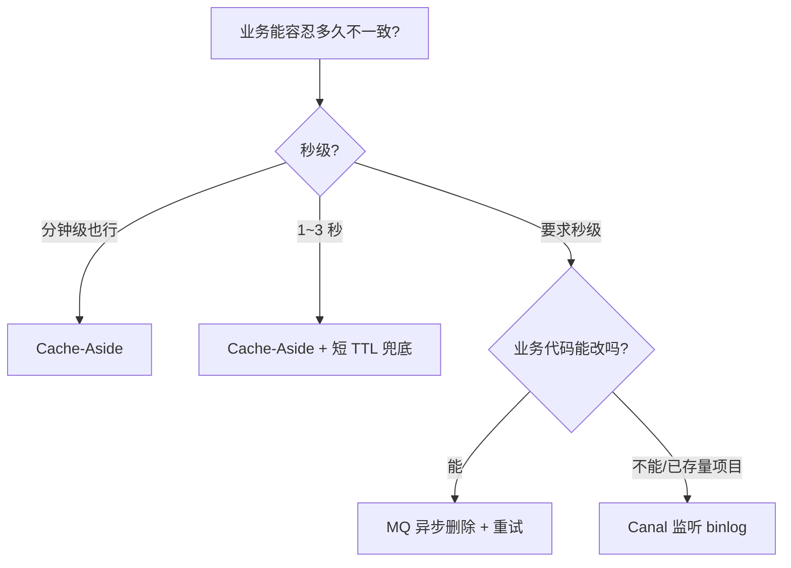

# Redis 与数据库一致性

> 缓存和数据库本质是两份数据，**无法做到强一致**，只能做到**最终一致**。
> 选方案的关键：**业务能容忍多久的不一致？**

---

## 核心矛盾

```
两个写请求并发：
  T1: 写线程    T2: 读线程
   │             │
   ▼             ▼
  更新 DB        缓存 miss
   │             │
   │             读 DB(旧值)
   删缓存          │
   │             写缓存(旧值)  ← ❌ 脏数据被写回
```

不管什么策略，并发下都有时间窗口出现不一致。差别只是**窗口大小**和**复杂度**。

---

## 方案对比一览

| 方案 | 一致性 | 实时性 | 复杂度 | 适用场景 |
| :--- | :--- | :--- | :--- | :--- |
| Cache-Aside（写时删缓存） | 弱 | 高 | ⭐ | 大多数业务 |
| 延迟双删 | 较弱 | 中 | ⭐⭐ | 短时间不一致可接受 |
| MQ 异步删除 | 较强 | 中 | ⭐⭐⭐ | 需要重试保障 |
| Binlog 监听（Canal） | 强 | 高 | ⭐⭐⭐⭐ | 强一致、解耦业务 |

---

## 方案 1：Cache-Aside（最常用，默认）



**为什么写时删除不是更新？**
- 多个写并发 → 缓存被覆盖成旧值
- 删除是幂等的，再次读时按 miss 流程回填
- 避免无效缓存（写了但没人读）

---

## 方案 2：延迟双删



为什么要延迟二删？防止"读线程在你更新 DB 期间把旧值回填了"。

**痛点**：N 取多大？
- 取小：还没等读完旧值就二删了，二删无效
- 取大：用户在 N 秒内读到的全是旧值

**适用**：业务对 1~3 秒不一致无所谓的场景（如商品详情）。

---

## 方案 3：MQ 异步删除（带重试）


**优势**：
- 不阻塞写请求
- 失败自动重试，最终一致有保障

**痛点**：
- 业务代码侵入（要发 MQ）
- 仍然有"DB 写完 → MQ 发出去"的中间空窗

---

## 方案 4：Binlog 监听（Canal）⭐ 最优雅



**优势**：
- 业务代码 0 侵入（不用关心缓存）
- 实时性最高（binlog 是 DB 内部就有的）
- 解耦：换缓存技术不用改业务

**痛点**：
- 部署复杂（Canal/Maxwell + MQ）
- Canal 自身要高可用
- 适合中大型项目

---

## 选型决策树



---

## 兜底：永远要设 TTL

> 没有什么策略是 100% 不出 bug 的。**所有缓存都加 TTL（如 10 分钟）**，最坏情况下不一致也能自愈。

> 业务上还要分级：
> - **强一致**（金额、库存）→ **不缓存**，直接打 DB（DB 自己上事务/锁）
> - **弱一致**（商品详情、文章）→ Cache-Aside + TTL 足够
