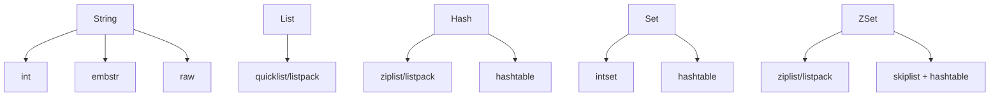

# Redis 数据结构与底层

> Redis 表面 5 大数据结构，**底层是 9 种内部编码**。
> 大厂会问："你看到的 List，底层到底是什么？什么情况下会变？"

---

## 5 大常用类型 + 内部编码

```
                  外部类型              内部编码
                  ──────                ──────────────────────
   String         ──→                  int / embstr / raw
   List           ──→                  ziplist / quicklist (Redis 7 后 listpack)
   Hash           ──→                  ziplist / hashtable
   Set            ──→                  intset / hashtable
   ZSet (有序集合) ──→                  ziplist / skiplist + hashtable
```

**编码切换原则**：小数据用紧凑结构（省内存），大数据用更通用结构（保性能）。

---

## 1. String

### 三种底层

```
   int      ：value 是个数字且 ≤ 8 字节 → 直接存为 long
   embstr   ：value 是短字符串 ≤ 44 字节 → 一次性分配 sdshdr+str
   raw      ：value > 44 字节 → 分两次分配
```

### SDS（Simple Dynamic String）

```
   SDS 结构：
   ┌────────┬──────────┬──────┬─────────────┐
   │  len   │  alloc   │ flag │  buf[]      │
   │ 已用长  │ 总容量    │      │  实际字节    │
   └────────┴──────────┴──────┴─────────────┘
   
   相比 C 字符串的优势：
   ① O(1) 取长度（不用 strlen 扫到 \0）
   ② 二进制安全（buf 里可以有 \0）
   ③ 预分配 + 惰性释放，减少 realloc
   ④ 不会缓冲区溢出
```

### 应用

```redis
SET counter 100          # 计数器（int 编码）
INCR counter             # 原子自增
SETEX session:abc 3600 user_data  # 带过期的 session
```

---

## 2. List

### Redis 3.2 前后

```
3.2 前：
  小 list → ziplist（紧凑）
  大 list → linkedlist（双向链表）

3.2+：统一用 quicklist
  ┌─────────────┬─────────────┬─────────────┐
  │ ziplist 块1 │ ziplist 块2 │ ziplist 块3 │
  └─────────────┴─────────────┴─────────────┘
       双向链表把多个 ziplist 串起来
       
  优势：内存紧凑（ziplist 部分）+ 增删 O(1)（链表部分）

7.0+：listpack 替换 ziplist
  解决 ziplist 的"连锁更新"问题（一个元素变长触发后续全部 realloc）
```

### 应用

```redis
LPUSH msg:user:1 "hello"   # 消息队列（消费者用 BRPOP 阻塞拉）
LRANGE timeline 0 19       # 朋友圈最近 20 条
```

---

## 3. Hash

```
小 hash（field < 128 且 value < 64 字节）：ziplist/listpack
大 hash：hashtable（数组 + 链表）

ziplist：
  ┌────┬────┬────┬────┬─────┬───────┐
  │ zlbytes│zlend│ f1 │ v1 │ f2 │ v2  │ ...
  └────────────────────────────────┘
  顺序存，找 field 要遍历 → 适合小数据

hashtable：
  数组下标存 hash 桶，每个桶是个链表
  ┌──┬──┬──┬──┬──┐
  │  │  │  │  │  │
  └─┬┴──┴─┬┴──┴─┬┘
    ▼     ▼     ▼
   E1    E2    E3
```

### 渐进式 rehash

```
扩容时不一次性 rehash 全部（会阻塞）：
  ht[0]：旧表
  ht[1]：新表（2 倍大小）
  rehashidx：当前迁移到哪个桶
  
  每次增删改查都顺手迁移一个桶
  → 把开销分摊到很多次操作里
```

### 应用

```redis
HSET user:1001 name "张三" age 18 city "北京"
HGETALL user:1001         # 整对象一次拿完
```

---

## 4. Set

```
全是整数且数量少 → intset（有序数组）
否则 → hashtable（value=null 的哈希表）

intset：
  [3, 8, 12, 25, 50]    内部有序，二分查找 O(log n)
  
hashtable：
  哈希表，平均 O(1) 查找
```

### 应用

```redis
SADD tags:article:1 "java" "redis" "mysql"
SINTER tags:user:A tags:user:B   # 共同关注
SISMEMBER online_users 1001       # 检查在线
```

---

## 5. ZSet（最复杂）

```
小 zset：ziplist/listpack
大 zset：skiplist + hashtable（两个数据结构同时维护）

为什么需要两个？
  - skiplist：按 score 排序，范围查询快
  - hashtable：根据 member 找 score，O(1)
  - 两个加起来：所有操作都很快
```

### Skiplist（跳表）

```
                              ┌────┐
                              │ 35 │
                              └─┬──┘
                ┌────┐          │             ┌────┐
                │ 12 │──────────┼─────────────│ 60 │
                └─┬──┘          │             └─┬──┘
       ┌────┐    │     ┌────┐  │   ┌────┐    │     ┌────┐
       │  5 │────│─────│ 12 │──│───│ 35 │────│─────│ 60 │
       └─┬──┘    │     └─┬──┘  │   └─┬──┘    │     └─┬──┘
   ─────●───────●───────●─────●─────●───────●───────●─────  最底层 (全数据)
        1       5       12   20    35      48      60

  查找 35：
    顶层：12 < 35，往右
    中层：12 < 35 < 60，往下
    再中层：12 < 35，对了！
  
  时间复杂度 O(log n)，类似平衡树但实现简单得多
```

### 为什么 Redis 不用红黑树/B 树？

- **范围查询**：跳表底层是链表，扫范围天然 O(k)
- **实现简单**：跳表代码只有几十行，红黑树几百行
- **缓存友好**：跳表的链表节点局部性好

### 应用

```redis
ZADD leaderboard 100 player1 95 player2 80 player3
ZREVRANGE leaderboard 0 9 WITHSCORES   # Top 10
ZRANGEBYSCORE leaderboard 80 100        # 范围
ZINCRBY leaderboard 5 player1           # 加分
```

---

## 进阶类型

| 类型 | 用途 |
| :--- | :--- |
| **Bitmap** | 用 String 做位运算。亿级用户在线状态、签到 |
| **HyperLogLog** | 概率统计 UV，12KB 能算亿级别 |
| **Geo** | 地理位置（基于 ZSet 的 GeoHash） |
| **Stream** | 消息流（类 Kafka），消费者组 |

### Bitmap 签到

```redis
SETBIT sign:user:1001:202605 13 1   # 5月14号签到
BITCOUNT sign:user:1001:202605       # 当月签到次数
BITPOS sign:user:1001:202605 0       # 第一个未签到的天
```

```
一天用 1 bit，一个月 30 bit = 4 字节
亿级用户 × 12 个月 = ~50GB 即可
```

### HyperLogLog UV

```redis
PFADD uv:20260513 user1 user2 user3
PFCOUNT uv:20260513         # 估算 UV，误差 < 1%
PFMERGE uv:week uv:20260501 uv:20260502  # 合并多天
```

固定 12KB，无论多少个元素。

---

## 编码自动转换示例

```redis
# Hash 默认 ziplist
HSET h field1 value1
OBJECT ENCODING h    # → "ziplist"

# 加到 129 个 field
for i (1..129) HSET h field$i value$i
OBJECT ENCODING h    # → "hashtable"  自动升级！
```

**配置项**：
```
hash-max-ziplist-entries 128
hash-max-ziplist-value 64
list-max-listpack-size -2
zset-max-listpack-entries 128
set-max-intset-entries 512
```

---

## 一图记住



---

## 一句话总结

| 类型 | 小数据 | 大数据 | 经典场景 |
| :--- | :--- | :--- | :--- |
| String | int / embstr | raw（SDS） | 计数、session |
| List | ziplist / quicklist | quicklist | 消息队列、时间线 |
| Hash | ziplist | hashtable | 对象存储 |
| Set | intset | hashtable | 标签、去重 |
| ZSet | ziplist | **skiplist + hashtable** | 排行榜、延时队列 |

- **ZSet 双结构**：skiplist 做排序，hashtable 做 O(1) 找
- **渐进式 rehash**：扩容不阻塞
- 高级类型 **Bitmap / HLL / Geo / Stream** 各有妙用
