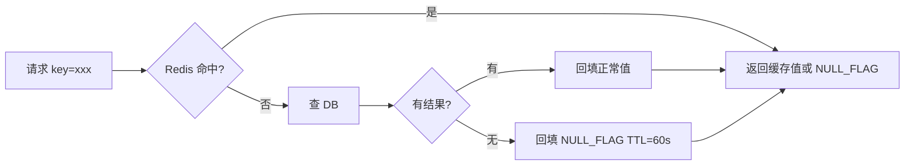
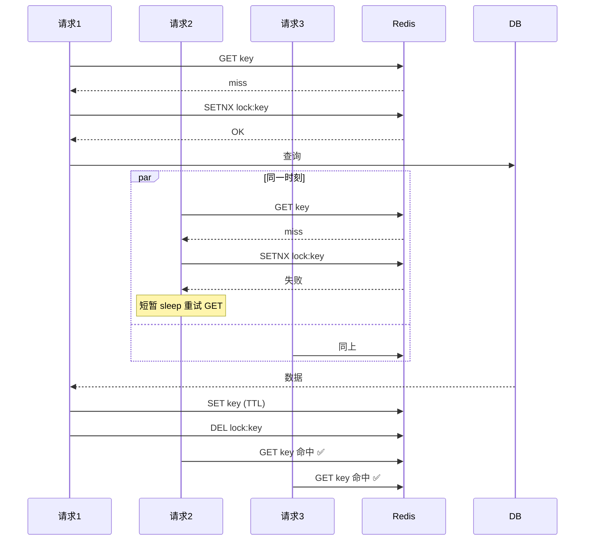
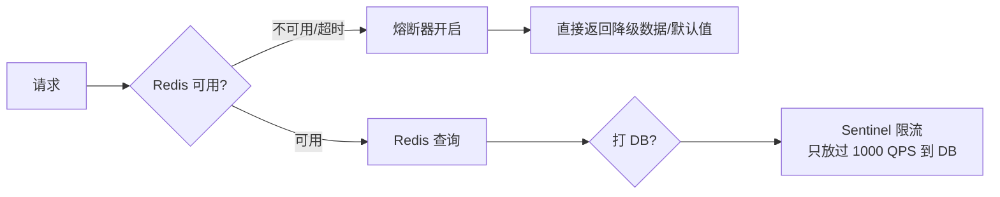
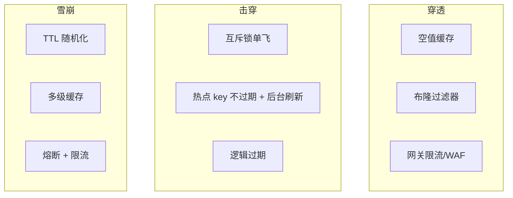

# 缓存穿透 / 击穿 / 雪崩

> 三个名字容易混。先把概念分清：

| 名词 | 一句话 | 攻击/故障 | 危险等级 |
| :--- | :--- | :--- | :--- |
| **穿透** | 查询**不存在**的 key，每次都打到 DB | 多为恶意攻击 | ⭐⭐⭐ |
| **击穿** | 某个**热点 key 过期瞬间**，海量请求压向 DB | 单点压力 | ⭐⭐⭐ |
| **雪崩** | **大量 key 同时过期**，瞬间打挂 DB | 设计缺陷 | ⭐⭐⭐⭐⭐ |

---

## 直观对比图

```
缓存穿透（key 根本不存在）：
   Client ──查 key_xxx(不存在)──→ Redis(miss) ──→ DB(NULL)
   Client ──查 key_xxx(不存在)──→ Redis(miss) ──→ DB(NULL)
   Client ──查 key_xxx(不存在)──→ Redis(miss) ──→ DB(NULL)
                                                   ↑ 反复打 DB

缓存击穿（一个热点 key 过期）：
   key=hot_product TTL=10 (突然过期)
   100万个并发请求同时来 ──→ Redis(miss) ──┐
                                            ├──→ DB ❌ 被打挂
                                          ──┘

缓存雪崩（一批 key 集体过期）：
   key1 TTL=600  ┐
   key2 TTL=600  │  (都是同一时间写入)
   key3 TTL=600  │  → 同一时间集体过期
   ...           │
   key1000 TTL=600
                 ↓
   10000 个 key 同时 miss ──→ DB ❌ 被打挂
```

---

## 一、缓存穿透（查询不存在的 key）

### 场景
- 恶意攻击：用伪造的 id（如 `userId=-1` 或 `99999999`）反复打你接口
- 业务 bug：前端传错参数

### 方案 A：缓存空值（最简单）



**注意**：空值 TTL 要短（30~60s），否则刚创建的真实数据被空值挡住。

### 方案 B：布隆过滤器

```
            布隆过滤器
            ┌─────────────┐
请求──→     │ 所有合法 id │  ──→ 在 ──→ 查 Redis/DB
            │             │  ──→ 不在 ──→ 直接拒绝
            └─────────────┘
```

**适合**：合法 key 集合可枚举（如商品 id 全集）  
**痛点**：
- 假阳性（少量非法 key 也会过）
- **不能删除**（删一个 key 会影响其他）
- 需要预热和定期重建

> 一般业务用方案 A 足够。布隆过滤器适合"全局公共服务"。

### 方案 C：网关层防护（更上游）

- WAF（云厂商提供）：识别恶意扫描、撞库、脚本
- Nginx `limit_req` / `limit_conn` 按 IP 限流
- 接口签名校验（无效请求直接拒）

---

## 二、缓存击穿（一个热点 key 过期）

经典场景：某商品突然上热搜，缓存恰好到期 → 几十万 QPS 全打 DB。

### 方案 A：互斥锁（单飞）



**实现要点**：
- 锁的 TTL 要短（防锁主宕机后死锁）
- 锁内部超时也要重试拿值
- 用 Redisson 或 SET NX EX

### 方案 B：热点 key 不过期 + 后台异步更新

```
key 永不过期，背后起一个定时任务：
  ─────────────────────────────────────────
  │ 每 5 分钟扫描热点 key 列表             │
  │ 异步查 DB → 写 Redis（覆盖）           │
  ─────────────────────────────────────────

用户请求永远命中缓存，最坏情况读到 5 分钟前的数据。
```

**适合**：明确知道哪些是热点（商品 top100、首页 banner）。

### 方案 C：逻辑过期（高级玩法）

```
缓存的值里嵌一个 expireAt 字段：
  {
    "data": {...},
    "expireAt": 1700000000
  }

读取时：
  - 取出来发现 expireAt 已过期
  - 但还是返回旧值（不阻塞）
  - 同时开异步任务去更新 Redis
```

---

## 三、缓存雪崩（大量 key 同时过期）

### 根因
通常是**集中批量预热**：开服时一次性 SET 了 10 万个 key，TTL 全是 600s → 10 分钟后集体阵亡。

### 方案 A：TTL 加随机扰动

```java
int ttl = 600 + ThreadLocalRandom.current().nextInt(300);  // 600~900 秒
redis.setex(key, ttl, value);
```

让过期时间散开 5 分钟，DB 压力线性而非脉冲。

### 方案 B：多级缓存

```
请求 ──→ JVM Caffeine(本地) ──miss──→ Redis ──miss──→ DB
         TTL 5 分钟              TTL 30 分钟
```

- Caffeine 顶住 Redis 不可达的情况
- Redis 雪崩时由 Caffeine 拦截大部分
- 注意本地缓存的"分布式不一致"

### 方案 C：熔断 + 限流（兜底）



---

## 一图总览解决方案



---

## 一句话口诀

- 穿透：**给不存在也存个标记**
- 击穿：**只让一个人去查 DB**
- 雪崩：**别让大家一起过期**
