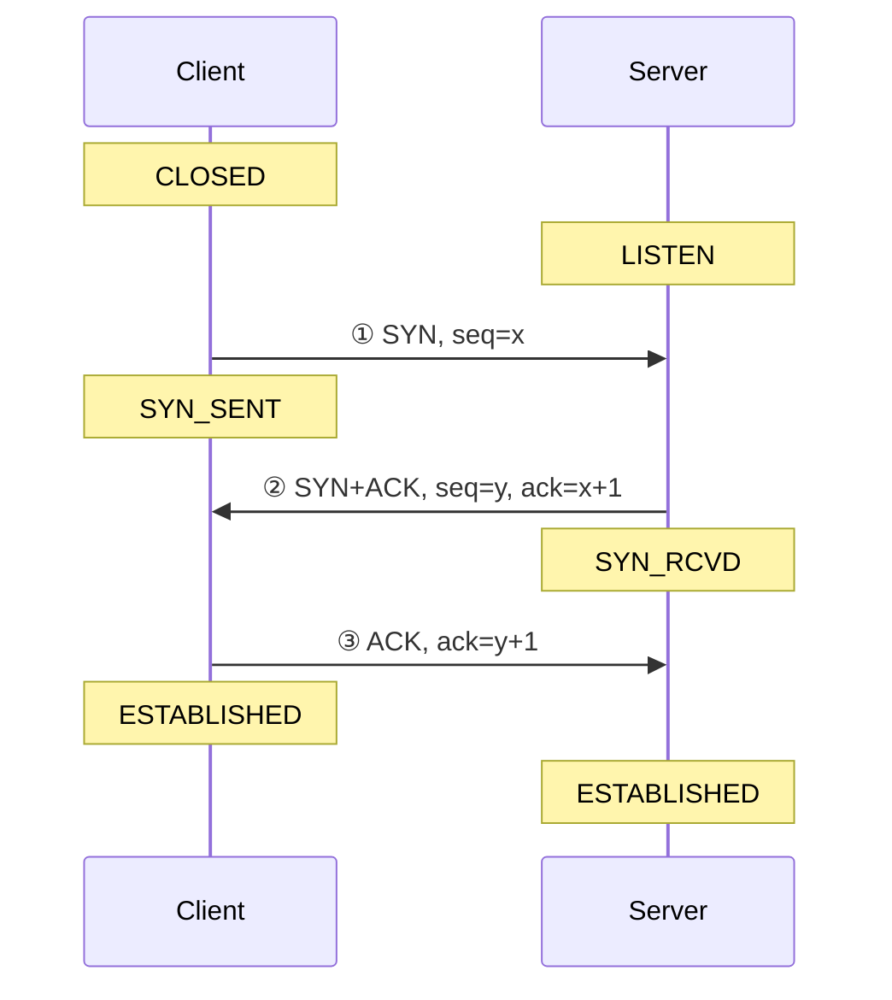
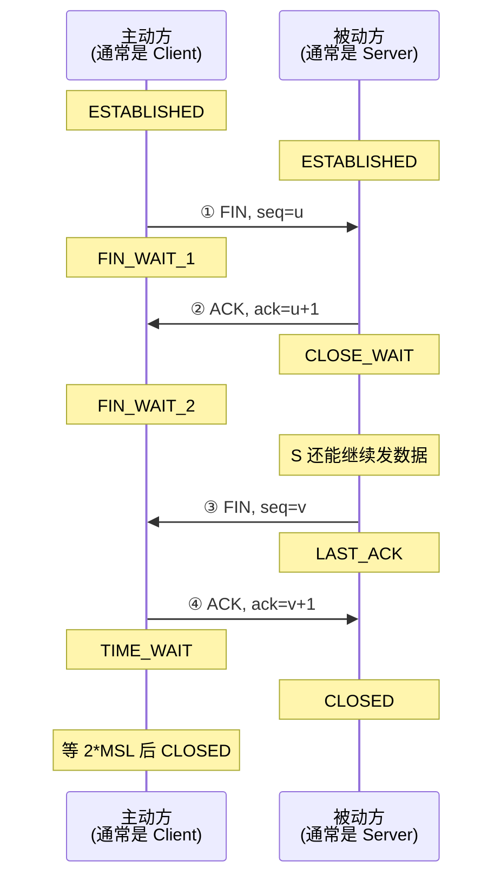
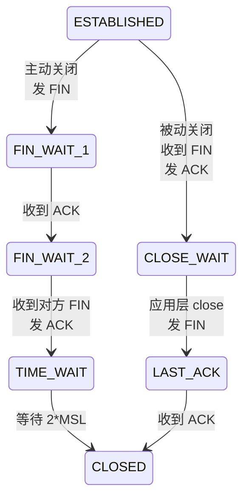
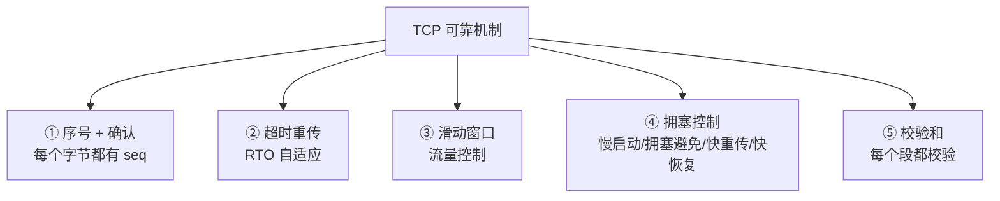

# TCP 三次握手与四次挥手

> 大厂网络面试**第一道菜**。不只是背流程，要懂**为什么是这样**。

---

## 三次握手（建立连接）



```
状态变化：
   Client:  CLOSED ─SYN→ SYN_SENT ─ACK→ ESTABLISHED
   Server:  LISTEN ─SYN+ACK→ SYN_RCVD ─ACK→ ESTABLISHED
```

### 为什么是三次，不是两次？

```
假设两次：
   ① Client → SYN
   ② Server → ACK

  痛点：旧的 SYN（网络中滞留）也会让 Server 误以为 Client 想建连
        Server 分配资源，但 Client 根本没发起
        → 资源浪费、半连接

三次：
   Client 还要再 ACK 一次才算真建连
   → 旧 SYN 也不会让 Client 配合（Client 知道自己没发）
```

### 为什么不需要四次？

```
理论上：Server 的 SYN 和 ACK 可以拆开发
  ② Server → ACK x+1
  ③ Server → SYN y
  ④ Client → ACK y+1
  
  但 Server 在收到 SYN 后立刻就知道自己要发 SYN，没必要拆
  → 把 ACK 和 SYN 合并成一个包就够了 → 三次
```

---

## 四次挥手（断开连接）



### 为什么是四次？

```
TCP 是全双工，两个方向都要单独关：

  Client：我没东西发了 (FIN)
  Server：好的 (ACK)        ← Server 此时可能还有数据要发
  Server：我也没了 (FIN)
  Client：好的 (ACK)
  
  ② 和 ③ 不能合并，因为 Server 可能还在传数据
  → 必须分开
```

### 状态机



---

## TIME_WAIT 问题

```
TIME_WAIT 持续 2*MSL（通常 60 秒）

为什么需要？
  ① 保证最后一个 ACK 到达对方
     - 如果 ACK 丢了，对方会重发 FIN
     - 我方在 TIME_WAIT 期间能再次响应
  
  ② 防止"旧连接的延迟包"被新连接误认
     - 等所有可能的旧包消失
```

### 生产痛点：TIME_WAIT 太多

```
高并发短连接场景：
  大量 TIME_WAIT 占满端口
  端口耗尽 → 新连接建不了
  
解决：
  1. 长连接（HTTP Keep-Alive）
  2. 调整内核参数：
     net.ipv4.tcp_tw_reuse = 1   # 复用 TIME_WAIT 连接（仅客户端）
     net.ipv4.tcp_max_tw_buckets = 5000  # 上限
  3. 调大端口范围：
     net.ipv4.ip_local_port_range = 1024 65535
```

> ⚠️ `tcp_tw_recycle` 已在新内核移除（NAT 网络下不安全）。

---

## SYN Flood 攻击

```
攻击者大量发 SYN 包，但不发第三次 ACK：
  Server 端积压大量 SYN_RCVD 半连接
  半连接队列被打满 → 正常请求被拒绝
```

防御：
```
1. SYN Cookies（内核默认开）：
   收到 SYN 时不分配资源，把信息编码进 cookie 返回
   收到 ACK 才真正建连接

2. 半连接队列扩大：
   net.ipv4.tcp_max_syn_backlog = 65536

3. 防火墙 / WAF 过滤
```

---

## TCP 可靠传输



### 滑动窗口（流量控制）

```
发送方                       接收方
  ┌──────────────────┐        Receive Buffer = 4KB
  │ 已发已确认       │        
  │ 已发未确认 (窗口) │        ← 接收方通告自己剩多少空间
  │ 可发未发         │        发送方按这个调整窗口
  │ 不可发           │
  └──────────────────┘

  → 接收方处理慢 → 通告窗口变小 → 发送方放慢
  → 避免接收方被打爆
```

### 拥塞控制

```
   cwnd（拥塞窗口）变化：

   cwnd
    ↑
    │       ╱╲     ╱╲              ← 拥塞避免（线性）
    │      ╱  ╲   ╱  ╲
    │     ╱    ╲ ╱    ╲
    │    ╱      v       
    │   ╱  慢启动 (指数翻倍)
    │  ╱
    │ ╱
    └─────────────────→ time
            ↑ 丢包 → cwnd 减半
            
   阶段：
   1. 慢启动：cwnd 指数增长（每 RTT × 2）
   2. 拥塞避免：到 ssthresh 后线性增长
   3. 快重传：收到 3 个重复 ACK → 立即重传
   4. 快恢复：ssthresh = cwnd/2，cwnd = ssthresh + 3
```

---

## UDP vs TCP

| 维度 | TCP | UDP |
| :--- | :--- | :--- |
| 连接 | 面向连接（要握手） | 无连接 |
| 可靠 | 可靠（重传、有序） | 不可靠 |
| 顺序 | 保证 | 不保证 |
| 速度 | 慢（多开销） | 快 |
| 头部 | 20 字节 | 8 字节 |
| 适合 | HTTP、SSH、文件传输 | DNS、视频会议、游戏 |

---

## TCP 粘包 / 拆包

```
应用层发了两条消息：
   msg1: "hello"
   msg2: "world"

TCP 看不到消息边界（只是字节流）：
   接收方一次收到 "helloworld"   ← 粘包
   或分两次收到 "hel" + "loworld" ← 拆包
```

**解决**：应用层定义协议
- **固定长度**：每条 100 字节
- **分隔符**：用 `\n` 分隔（Redis 协议）
- **长度前缀**：先发 4 字节长度，再发数据（最常用）

```
+──────────+──────────────────+
│ 长度 (4)  │  payload          │
+──────────+──────────────────+
```

---

## 抓包工具

```bash
# tcpdump
tcpdump -i eth0 -nn port 80 -w cap.pcap

# 看 TCP 握手
tcpdump -i eth0 'tcp[tcpflags] & (tcp-syn|tcp-ack) != 0'

# Wireshark：图形化分析 .pcap
```

---

## 高频面试题

**Q: 服务端大量 CLOSE_WAIT 怎么办？**
- 说明服务端**收到 FIN 后没有调 close()**
- 应用层 bug：catch 了异常但没关闭 socket
- 排查代码，确保 finally 里 close

**Q: 大量 TIME_WAIT 怎么办？**
- 主动方才会有 TIME_WAIT
- 服务端大量 TIME_WAIT → 它是主动断的（短连接）
- 改用 Keep-Alive，或调内核参数

**Q: TCP 怎么保证数据有序？**
- 每个字节有 seq
- 接收方按 seq 重排，缺的等重传

**Q: TCP 为什么粘包？UDP 为什么没有？**
- TCP 是**流**，没有消息边界
- UDP 是**数据报**，一次 send 一次 recv，边界明确

---

## 一句话总结

- 三次握手：**防旧 SYN 误建连**
- 四次挥手：**全双工，两端单独关**
- TIME_WAIT 2*MSL：**保证 ACK 到达 + 旧包消失**
- 可靠 = **序号 + 确认 + 重传 + 窗口 + 拥塞控制**
- 粘包靠**应用层协议**（长度前缀最常用）
