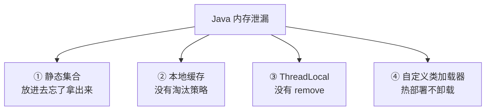

---
---

# Java 内存泄漏的四大场景

> **内存泄漏 ≠ 内存溢出**：
> - 泄漏 = 对象用不到了却释放不掉，慢慢吃满堆
> - 溢出 = 直接撑爆堆（OOM）
> 泄漏的终点就是溢出。

---

## 总览：四种典型泄漏



---

## 场景 1：静态集合类引用

```java
// ❌ 经典翻车
public class Cache {
    private static final Map<Long, BigObject> CACHE = new HashMap<>();
    
    public static void add(Long id, BigObject obj) {
        CACHE.put(id, obj);
    }
    // 没有 remove，没有过期机制
}
```

```
静态字段的生命周期 = JVM 进程生命周期
─────────────────────────────────────
被它引用的对象永远不会被 GC
↓
请求越多，CACHE 越大
↓
最终 OOM
```

**修复**：
```java
// 用 LRU
private static final Map<Long, BigObject> CACHE =
    Collections.synchronizedMap(new LinkedHashMap<>(100, 0.75f, true) {
        protected boolean removeEldestEntry(Map.Entry e) {
            return size() > 1000;
        }
    });

// 或用 Caffeine（生产推荐）
Cache<Long, BigObject> cache = Caffeine.newBuilder()
    .maximumSize(1000)
    .expireAfterAccess(10, TimeUnit.MINUTES)
    .build();
```

---

## 场景 2：本地缓存无淘汰

```java
// ❌ 用 ConcurrentHashMap 当本地缓存
private final Map<String, User> userCache = new ConcurrentHashMap<>();

public User get(String id) {
    return userCache.computeIfAbsent(id, this::loadFromDB);
}
```

每访问一个新 id 加一个 entry，**没有上限、没有过期** → 撑爆。

**修复**：
- 用 Caffeine / Guava Cache
- 设 maxSize / TTL
- 配合 weakKey/weakValue（弱引用，能被 GC）

---

## 场景 3：ThreadLocal 没 remove

```java
// ❌ 典型陷阱
private static final ThreadLocal<UserContext> USER = new ThreadLocal<>();

public void handleRequest(Request req) {
    USER.set(new UserContext(req.getUser()));
    process(req);
    // 漏了 USER.remove()
}
```

```
为什么会泄漏？

  Thread → ThreadLocalMap → Entry(key=WeakRef<ThreadLocal>, value=UserContext)
    ↑                                                            ↑
    │                                                            │
  线程池里的 Thread 复用                              强引用，不会被 GC
  → 这个 Map 一直存在
  → value（UserContext）一直被强引用着
```

**线程池场景尤其严重**：线程不死，set 的对象永远不死。

**修复**：
```java
public void handleRequest(Request req) {
    USER.set(new UserContext(req.getUser()));
    try {
        process(req);
    } finally {
        USER.remove();  // ✅ 必须在 finally 里
    }
}
```

或用 Spring 的 RequestContextHolder（自动清理）。

---

## 场景 4：自定义类加载器 / 热部署

```
正常情况：
  ClassLoader A 加载 Class X → 包含静态字段、Class 元数据
  ClassLoader A 不再被引用 → 整个 ClassLoader 连同其加载的 Class 一起 GC

热部署时：
  ClassLoader_v1 加载 Class X (旧版本)
  → 引用了它的对象还在内存里（比如线程、缓存、单例）
  → ClassLoader_v1 无法被 GC
  → Metaspace 持续增长
  → 部署几十次后 OOM "Metaspace"
```


**修复**（极其麻烦）：
- 卸载前显式清理：单例、线程池、定时任务
- ShutdownHook 释放资源
- 生产环境**禁用热部署**，老老实实重启

---

## 排查工具


### jstat

```bash
jstat -gcutil <pid> 1000 10
#  S0   S1   E    O    M    CCS  YGC  YGCT FGC FGCT GCT
#  0.00 99.0 80.0 95.0 96.0 92.0 1234 12.3 50  80.2 92.5
#       ↑↑↑                                  ↑↑↑↑↑↑↑↑↑↑
#  Old 区接近 100%                          Full GC 已经 50 次
```

### jmap 堆 dump

```bash
# 不阻塞业务（推荐）
jmap -dump:live,format=b,file=/tmp/heap.hprof <pid>

# 自动 dump（启动参数）
-XX:+HeapDumpOnOutOfMemoryError
-XX:HeapDumpPath=/var/log/heapdump.hprof
```

### MAT / VisualVM

打开 hprof → 看 **Histogram** 找最大的对象 → 看 **Dominator Tree** 找谁在引用 → 定位代码。

---

## 实战：IDEA 复现内存泄漏

```
1. 打开 Run Configuration → 编辑 Spring Boot 启动项

2. VM options 填入：
   -Xms256m -Xmx256m
   -XX:MetaspaceSize=96m -XX:MaxMetaspaceSize=96m
   -XX:+HeapDumpOnOutOfMemoryError
   -XX:HeapDumpPath=./logs/heapdump.hprof
   -Xlog:gc*,safepoint:file=./logs/gc.log:time,uptime,level,tags
   -XX:+UseG1GC

3. 用接口反复压测（每种泄漏一个接口）：
   - 静态集合泄漏：/learn/cache-leak/static/add
   - 本地缓存泄漏：/learn/cache-leak/local-cache/put
   - ThreadLocal 泄漏：/learn/cache-leak/thread-local/run
   - 类加载器泄漏：/learn/cache-leak/classloader/hot-deploy

4. 观察：
   - IDEA Memory 指标持续上升不回落
   - logs/gc.log 频繁 Full GC
   - OOM 后生成 heapdump.hprof（用 MAT 分析）
```

> 把内存调小（如 -Xmx128m）更容易复现，便于观察。

---

## 一句话总结

| 泄漏点 | 防御 |
| :--- | :--- |
| 静态集合 | 加 maxSize / TTL |
| 本地缓存 | 用 Caffeine，别裸 Map |
| ThreadLocal | try-finally remove |
| 类加载器 | 别在生产热部署 |

> 内存泄漏 = **对象失去业务价值但还有引用链可达**。找到那条引用链 = 找到 bug。
