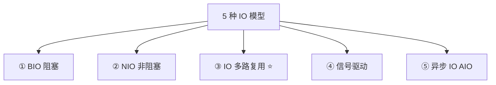
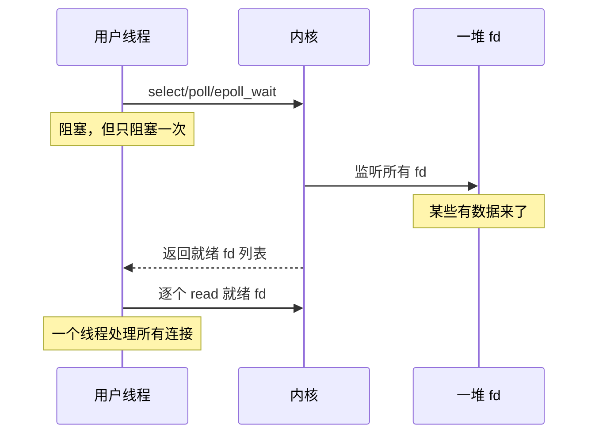
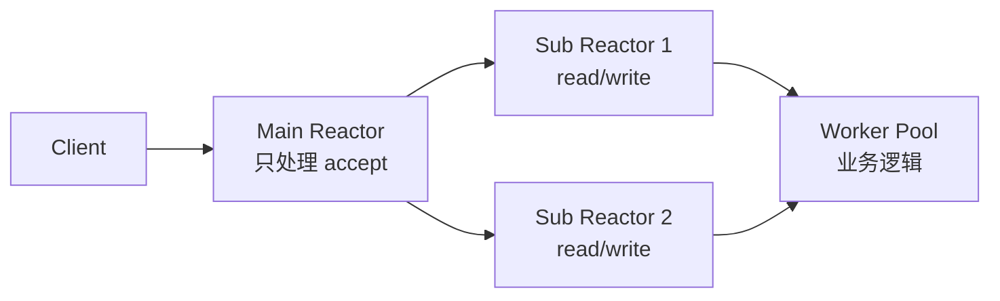

---
---

# IO 模型与多路复用

> 大厂必考。**Redis / Nginx / Netty 单线程扛十万 QPS 的秘密**就在这。

---

## 5 种 IO 模型



理解关键：**一次完整的 IO 分两步**：
- **等待数据就绪**（数据到达内核缓冲）
- **拷贝数据到用户空间**

不同模型处理这两步的方式不同。

---

## ① BIO（阻塞 IO）

```
用户进程
    │
    │ read()
    ▼
   等待数据 ──── 阻塞 ──── 数据到达 ──── 拷贝到用户空间 ──── 返回
                ↑                              ↑
            进程睡觉                      进程也阻塞着

  特点：调用方全程阻塞，啥也干不了
```

```java
// Java BIO 写服务器
ServerSocket server = new ServerSocket(8080);
while (true) {
    Socket socket = server.accept();   // 阻塞，等连接
    new Thread(() -> {
        InputStream in = socket.getInputStream();
        byte[] buf = new byte[1024];
        int n = in.read(buf);          // 阻塞，等数据
        // 处理...
    }).start();
}
```

**问题**：1 万连接需要 1 万线程 → 资源爆炸。

---

## ② NIO（非阻塞 IO）

```
用户进程
    │
    │ read()
    ▼
   立刻返回 EAGAIN（没数据）
    │
    │ read()
    ▼
   立刻返回 EAGAIN
    │
    │ ... 轮询 ...
    │
    │ read()
    ▼
   数据来了 ──── 拷贝 ──── 返回

  特点：不阻塞，但用户要循环问"好了没"，浪费 CPU
```

```c
fcntl(fd, F_SETFL, O_NONBLOCK);  // 设为非阻塞
while (true) {
    int n = read(fd, buf, sizeof(buf));
    if (n < 0 && errno == EAGAIN) {
        // 没数据，做点别的
        continue;
    }
    // 处理数据
}
```

**问题**：纯轮询太蠢，CPU 飙高。

---

## ③ IO 多路复用 ⭐

让**一个线程同时盯一堆 fd**，谁就绪处理谁。

```
       ┌────── 1 个线程 ──────┐
       │                       │
       │   监听 1 万个 fd      │ ─→ epoll_wait
       │                       │
       └───────────────────────┘
                  ↓
       内核告诉你哪些就绪了
                  ↓
       逐个处理就绪的 fd
```



> 这是 **Redis / Nginx / Netty 的核心机制**。

---

## select / poll / epoll 对比

| 维度 | select | poll | epoll |
| :--- | :--- | :--- | :--- |
| 数据结构 | bitmap（fd_set） | 链表 | 红黑树 + 就绪链表 |
| fd 数量上限 | 1024（编译时） | 无限制 | 无限制 |
| 找就绪 fd | O(n) 遍历 | O(n) 遍历 | **O(1)** 直接返回 |
| 每次调用拷贝 fd | 全部从用户态拷到内核 | 全部拷贝 | **只拷一次**（epoll_ctl） |
| 就绪通知 | 轮询返回 | 轮询返回 | 回调机制 |
| 触发模式 | LT | LT | **LT + ET** |
| 平台 | 跨平台 | 类 Unix | Linux 独有 |


### epoll 的两次"优化"

```
痛点 1：select 每次调用都要把 fd 集合从用户态拷到内核
   epoll 解法：epoll_ctl 一次添加 fd 到内核维护的红黑树
              epoll_wait 不用再传 fd 集合

痛点 2：select 返回后要遍历所有 fd 找就绪的
   epoll 解法：内核维护一个"就绪链表"，事件来了直接挂上
              epoll_wait 直接返回就绪 fd
```

### epoll 三个 API

```c
int epfd = epoll_create(1024);     // 创建 epoll 实例

struct epoll_event ev;
ev.events = EPOLLIN;
ev.data.fd = sockfd;
epoll_ctl(epfd, EPOLL_CTL_ADD, sockfd, &ev);  // 添加 fd

struct epoll_event events[100];
int n = epoll_wait(epfd, events, 100, -1);    // 等待就绪
for (int i = 0; i < n; i++) {
    int fd = events[i].data.fd;
    // 处理...
}
```

---

## LT 和 ET 触发模式

```
LT（Level-Triggered，水平触发，默认）：
  只要 fd 还有数据没读完，epoll_wait 就一直返回
  → 友好，但可能"打扰"多次

ET（Edge-Triggered，边缘触发）：
  fd 从无数据→有数据的"瞬间"才通知一次
  → 必须一次读完所有数据（while + EAGAIN）
  → 性能更高，但编程难度大

Nginx 默认 ET，Redis 默认 LT。
```

---

## ④ 信号驱动 IO

```
用户进程
    │
    │ 注册信号处理函数 + 立刻返回
    │
    │  ... 干别的事 ...
    │
    ▼
   收到 SIGIO ──── read() ──── 拷贝数据 ──── 完成

  痛点：信号编程复杂、不能精确知道是哪个 fd
  实际很少使用
```

---

## ⑤ 异步 IO（AIO）

```
用户进程
    │
    │ aio_read() + 立刻返回
    │
    │  ... 干别的事 ...
    │
    │ 内核完成所有事：等数据 + 拷贝
    │
    ▼
   收到完成通知 ──── 数据已经在 buffer 里了

  → 用户完全不阻塞，连"拷贝"那一步也不参与
  → 真正的"全异步"

Linux 的 AIO（io_uring）才真正能用，老 AIO 实现很烂
Java 的 AIO（NIO.2）底层在 Linux 上还是 epoll 模拟
```

---

## 一张表对比

| 模型 | 等待数据 | 拷贝数据 | 阻塞用户 |
| :--- | :--- | :--- | :--- |
| BIO | 阻塞 | 阻塞 | 全程 |
| NIO | 非阻塞轮询 | 阻塞 | 拷贝时 |
| 多路复用 | 阻塞在 select | 阻塞 | select + 拷贝时 |
| 信号驱动 | 异步通知 | 阻塞 | 拷贝时 |
| AIO | 异步通知 | 异步通知 | 完全不阻塞 |

```mermaid
gantt
    title 5 种 IO 模型的阻塞时间对比
    dateFormat  X
    axisFormat %s
    section BIO
    等待数据   :a1, 0, 5
    拷贝       :a2, after a1, 2
    section NIO
    轮询      :crit, b1, 0, 5
    拷贝       :b2, after b1, 2
    section 多路复用
    epoll_wait :c1, 0, 5
    拷贝       :c2, after c1, 2
    section AIO
    干别的     :done, d1, 0, 7
```



---

## Java NIO 与多路复用

```
Java NIO = "non-blocking IO"
  - Channel（通道）
  - Buffer（缓冲）
  - Selector（多路复用器）

Java AIO = "asynchronous IO"
  - AsynchronousChannel
```

底层在 Linux 上：
- NIO Selector → epoll
- 老 AIO → epoll 模拟
- 新 Netty / io_uring 才是真异步

---

## Reactor 模式（Netty 用的）

```
单 Reactor 单线程：
   ┌─────────────────┐
   │   Reactor       │ ─── select/epoll
   │   accept        │      │
   │   read          │      ▼
   │   handle        │   就绪事件分发
   │   write         │
   └─────────────────┘
   适合：连接少（Redis 就是这个）

主从 Reactor 多线程（Netty 推荐）：
   Main Reactor       Sub Reactor 1    Sub Reactor N
     │                   │                 │
     accept              read/write        read/write
     新连接 → 分发到 Sub Reactor
     
   Worker 线程池处理业务逻辑
```



---

## 谁用什么

| 系统 | IO 模型 |
| :--- | :--- |
| **Redis** | 单 Reactor + epoll（LT） |
| **Nginx** | 多进程 + epoll（ET） |
| **Netty** | 多 Reactor + epoll |
| **Node.js** | libuv + epoll |
| **Tomcat NIO** | NIO + Selector（连接器） |
| **Kafka** | NIO（Selector） |

---

## 高频面试题

**Q: 为什么 Redis 单线程也能扛 10w QPS？**
1. 纯内存
2. epoll 多路复用（一个线程管所有连接）
3. 无锁
4. 高效数据结构

**Q: select 和 epoll 的区别？**
- select 每次拷贝全部 fd，遍历找就绪，上限 1024
- epoll 用红黑树维护，回调机制找就绪，无上限

**Q: LT 和 ET 区别？**
- LT：有数据就一直通知
- ET：状态变化时通知一次（必须一次读完）

**Q: Reactor 和 Proactor 区别？**
- Reactor：等就绪 → 自己读（同步非阻塞）
- Proactor：等完成 → 数据已经在 buffer 里了（异步）

---

## 一句话总结

- BIO 一连接一线程；NIO 轮询太蠢；**多路复用 = 一线程盯多 fd**
- epoll 战胜 select 靠 **红黑树 + 回调 + 不重复拷贝**
- LT 友好，ET 高性能
- Redis/Nginx/Netty 都基于 epoll 实现高并发
