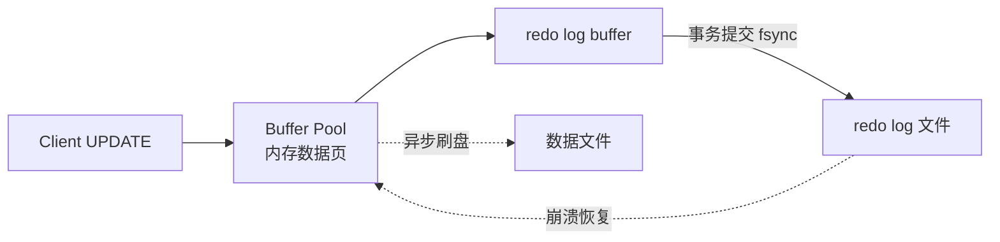
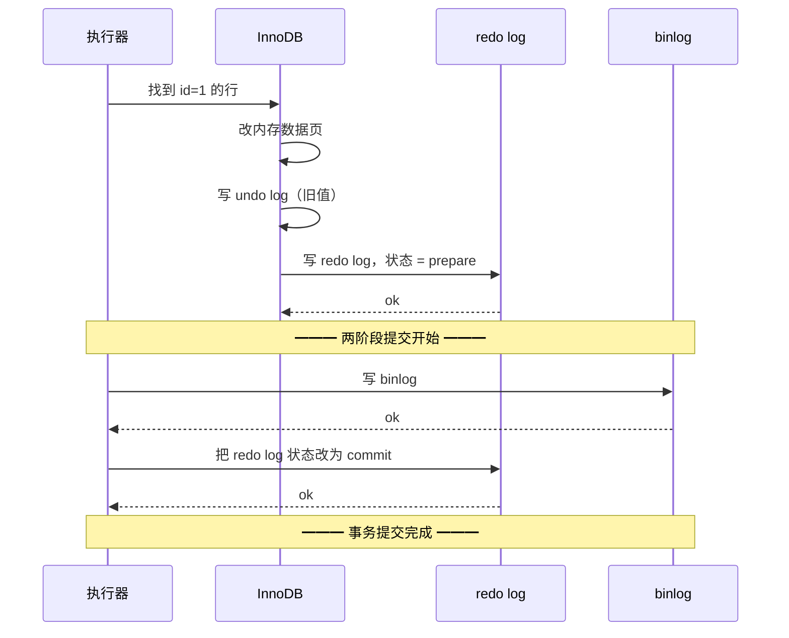

---
---

# MySQL 三大日志（redo / undo / binlog）

> 三大日志各管一摊，**配合保证 ACID 和主从一致**。
> 面试经典：一个事务从开始到提交，三个日志各做了什么？

---

## 三个一句话

| 日志 | 谁的 | 作用 | 物理还是逻辑 |
| :--- | :--- | :--- | :--- |
| **redo log** | InnoDB 存储引擎 | 崩溃恢复 + 持久性（D） | 物理日志 |
| **undo log** | InnoDB 存储引擎 | 回滚 + MVCC | 逻辑日志 |
| **binlog** | MySQL Server 层 | 主从复制 + 时间点恢复 | 逻辑日志 |

```
                  ┌─── MySQL Server ───┐
                  │  连接器/分析器/优化器/执行器  │
                  │  ┌─────────────┐    │
                  │  │  binlog    │    │  ← Server 层
                  │  └─────────────┘    │
                  └────────┬───────────┘
                           │
                  ┌────────▼───────────┐
                  │   InnoDB 引擎       │
                  │  ┌──────┐ ┌──────┐ │
                  │  │ redo │ │ undo │ │  ← 引擎层
                  │  └──────┘ └──────┘ │
                  └────────────────────┘
```

---

## redo log（崩溃恢复）

### 解决什么问题

```
没有 redo log 时：
  UPDATE → 改内存中的数据页（Buffer Pool）
  → 异步刷盘
  → 宕机 → 内存数据丢了 → 数据不一致 ❌

有 redo log：
  UPDATE → 改内存数据页 + 写 redo log（顺序写极快）
  → fsync redo log 成功 = 事务提交成功
  → 宕机后用 redo log 重做
```

### Buffer Pool + redo 的协作



详见 [WAL机制.md](WAL机制.md)。

### 写入策略

```
innodb_flush_log_at_trx_commit:
  = 1（默认）：每次提交 fsync 到磁盘 → 最安全，性能略低
  = 0       ：每秒由后台线程 fsync → 性能高，宕机丢 1 秒
  = 2       ：每次提交 write 到 OS Cache，OS 决定 fsync → 折中
```

**生产强制 = 1**。

### Redo log 是循环写

```
两个 ib_logfile，循环覆盖：

  ─────────────────────────────────────
  ib_logfile0:  [写入位置 →]
  ib_logfile1:  [........  CheckPoint 已刷盘到这里]
  ─────────────────────────────────────
  
  写入位置追上 CheckPoint → 暂停业务，强制刷脏页
```

---

## undo log（回滚 + MVCC）

### 解决什么问题

```
事务 ROLLBACK 时怎么撤回？
  没有 undo log → 无法回退已经改过的数据 ❌
  有 undo log → 按日志反向操作

MVCC 读历史版本时怎么找？
  → 沿 undo log 链往前找
```

### 内容

```
INSERT 的 undo：删除该行
UPDATE 的 undo：恢复旧值
DELETE 的 undo：恢复该行
```

### 版本链（MVCC 的核心）

```
当前行(trx_id=100) → undo → 旧版本(trx_id=80) → undo → 更旧版本(trx_id=50)
       │                       │                          │
       └─最新提交               └─历史版本                 └─历史版本
```

详见 [MySQL事务与MVCC.md](MySQL事务与MVCC.md)。

### Purge 线程

undo 不能无限保留，**没有活跃事务还需要看它时**，被 Purge 线程清理。

---

## binlog（主从 + PITR）

### 解决什么问题

```
1. 主从复制：从库重放主库 binlog → 数据一致
2. 数据恢复：全量备份 + binlog → 恢复到任意时间点（PITR）
```

### 三种格式

| 格式 | 记录 | 优缺点 |
| :--- | :--- | :--- |
| STATEMENT | 原始 SQL | 文件小，但有些 SQL（NOW()/UUID）主从不一致 |
| **ROW** ⭐ | 行变化前后值 | 文件大，但绝对一致；生产标准 |
| MIXED | 自动选 | MySQL 自己挑，不可控 |

**生产强制 ROW**。否则误删恢复都没法精确。

### binlog 是顺序追加

```
binlog.000001
binlog.000002
binlog.000003   ← 当前正在写
...

binlog 文件名 + position 组成 "位点"，主从同步靠它
```

---

## 一次 UPDATE 的完整流程（两阶段提交）

```sql
UPDATE users SET name = '张三' WHERE id = 1;
```



### 为什么要两阶段

```
如果不用两阶段：
  ① 先写 redo 再写 binlog
     → redo 写完后宕机
     → 重启后 redo 重做了，但 binlog 没记
     → 从库没这条数据 → 主从不一致 ❌
  
  ② 先写 binlog 再写 redo
     → binlog 写完后宕机
     → 主库没改成（redo 没成），但 binlog 有
     → 从库执行了不存在的更新 ❌

两阶段提交：
  prepare → 写 binlog → commit
  
  崩溃恢复时：
    redo 是 prepare 且 binlog 有 → 提交（视为成功）
    redo 是 prepare 且 binlog 无 → 回滚（视为失败）
```

---

## 三个日志对比表

| 维度 | redo log | undo log | binlog |
| :--- | :--- | :--- | :--- |
| 层级 | 引擎层（InnoDB） | 引擎层 | Server 层 |
| 日志形式 | 物理 | 逻辑 | 逻辑（ROW 偏物理） |
| 何时写 | 事务执行中持续 | 事务执行中 | 事务**提交时** |
| 用途 | 崩溃恢复 | 回滚 + MVCC | 主从、PITR |
| 文件 | ib_logfile（循环） | ibdata / undo tablespace | binlog.NNN（追加） |
| 默认开 | ✅ | ✅ | ❌（要 log_bin=ON） |

---

## 主从复制


```
Master                Slave
  ┌──────┐            ┌──────────────┐
  │binlog│ ──TCP──→  │ IO Thread     │ → relay log
  └──────┘            └──────┬────────┘
                             ▼
                      ┌──────────────┐
                      │ SQL Thread   │ → 应用到 Slave
                      └──────────────┘

  主从延迟来源：
    - 网络
    - SQL Thread 单线程（5.7 后可并行）
    - 主库 DDL / 大事务
```

---

## binlog 实战：PITR 恢复

```bash
# 全量恢复
mysql < full_backup.sql

# binlog 回放到指定时间
mysqlbinlog \
  --start-position=456789 \
  --stop-datetime="2026-03-23 14:25:29" \
  /var/lib/mysql/binlog.000123 \
  | mysql
```

详见 [mysql误删数据恢复.md](mysql误删数据恢复.md)。

---

## 一句话总结

- **redo**：崩溃后能重做 → 持久性
- **undo**：能往回退 → 原子性 + MVCC
- **binlog**：能同步给别人 → 主从 + PITR
- **两阶段提交**：保证 redo 和 binlog 一致，防止主从数据不齐
