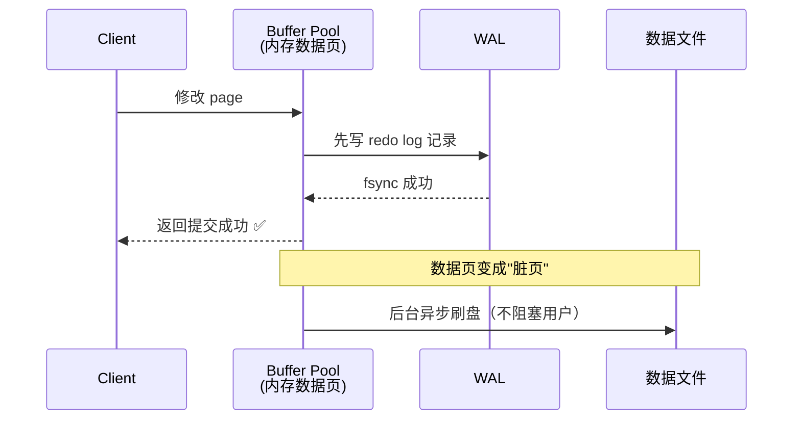
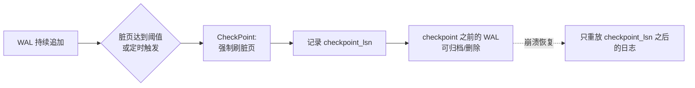

---
---

# WAL 机制（Write-Ahead Log）

> 核心思想：**先写日志，再改数据**。日志是顺序写（极快），数据页是随机写（慢）。崩溃后用日志重放，保证持久性。
> MySQL InnoDB 的 redo log、PostgreSQL 的 WAL、HBase 的 HLog、Kafka 的 commit log，全是这套思路。

---

## 为什么需要 WAL：随机写 vs 顺序写

```
随机写（直接刷数据页）：           顺序写（先写 WAL）：
  ┌──────────────────┐              ┌──────────────────┐
  │ 数据文件         │              │ WAL 日志         │
  │ ┌──┐  ┌──┐ ┌──┐  │              │ ──→──→──→──→──→  │  ← 顺序追加
  │ └──┘  └──┘ └──┘  │              │ 极快 ~500MB/s   │
  │ 磁头四处跳       │              └──────────────────┘
  │ ~50MB/s          │                  ↓ 后台异步
  └──────────────────┘              ┌──────────────────┐
                                    │ 数据页（脏页）   │
                                    │ 慢慢刷盘         │
                                    └──────────────────┘
```

**类比**：古代管家记账——交易当场写流水（WAL），晚上再把总账（数据页）抄一遍。账本丢了，按流水可以补回来。

---

## 写入流程



关键点：**WAL fsync 成功 = 事务提交成功**。脏页什么时候刷盘不影响用户。

---

## 崩溃恢复 Replay

断电时：WAL 已落盘，但部分脏页还没刷到数据文件 → 数据不一致。

```
重启后：

  扫描 WAL：    LSN=100 LSN=101 LSN=102 LSN=103 LSN=104 LSN=105
                  │       │       │       │       │       │
                  ▼       ▼       ▼       ▼       ▼       ▼
              对每条日志：检查目标数据页的 LSN，决定是否重放
```

---

## LSN（Log Sequence Number）日志序列号

每条 WAL 都有递增的 LSN，每个数据页头也存"最后应用的 LSN"。

```
情况一：数据页 LSN=100，WAL LSN=105
   page                wal
   ┌──┐                ┌───┐
   │100│  <  105       │105│  → 需要重放
   └──┘                └───┘

情况二：数据页 LSN=106，WAL LSN=105
   page                wal
   ┌──┐                ┌───┐
   │106│  >  105       │105│  → 跳过（已经更新过）
   └──┘                └───┘
```

**作用**：避免重复重放，保证幂等。

---

## CheckPoint：减少恢复时长

WAL 无限增长会导致：
1. 占满磁盘
2. 崩溃后重放时间过长

**CheckPoint 做什么**：把内存中的脏页强制刷到数据文件，并记录一个"安全点"。该点之前的 WAL 就可以归档/删除。



---

## PITR 时间点恢复（Point-In-Time Recovery）

> 下午两点误删了库 → 想恢复到 13:59:59 的状态。

需要两样东西：
- **全量备份**（基线快照）
- **归档的 WAL**（从备份点开始的所有日志）

```
   13:00         13:30                  14:00 ❌DROP TABLE
    │             │                       │
    │             │                       │
    ▼             ▼                       ▼
  全量备份    WAL 持续追加           误操作发生
    ▲             ▲                     ▲
    │             │                     │
    └─步骤1─→     └─步骤2────────────→  │
   恢复全量       重放 WAL              │
                  到 13:59:59  ◀────────┘ stop-time
```

操作流程：
1. 用全量备份恢复到临时库
2. 用 `mysqlbinlog --stop-datetime="..."` 重放 WAL，停在误操作前 1 秒
3. 校验数据，再回灌到生产（按表，避免整库覆盖）

**关键坑**：
- 没有全量备份只有 WAL → 无法恢复（WAL 不是快照）
- stop 时间取晚了 → DELETE 也会被重放进去
- 直接在生产库回放 → 风险极高，必须先临时库验证

---

## 一句话总结

> WAL = **日志先行 + 顺序写优化 + 崩溃可恢复**。LSN 防重放、CheckPoint 防膨胀、PITR 实现时光机。
