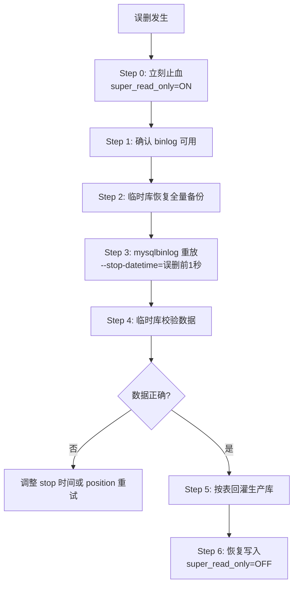
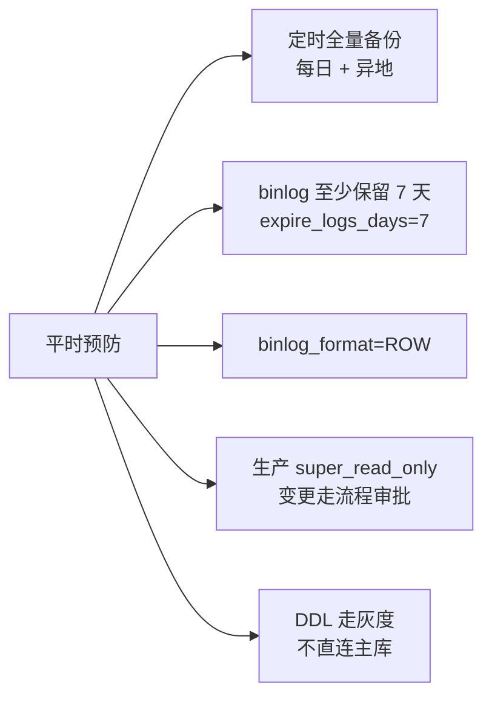

---
---

# MySQL 误删数据恢复（PITR）

## 大局观：PITR 的本质

```
   全量备份(T0)              binlog                    误删(Tx)         现在
       │═══════════════════════════════════════════════│════════════════│
       │                                               │
       └───── ① 恢复全量到临时库 ──→                  │
                                                       │
                ② 重放 binlog 到 Tx-1秒  ◀─────────────┘
                                                       │
                ③ 校验后回灌生产库（按表，不要整库覆盖）
```

**前提条件**（缺一不可）：
- binlog 开启且为 **row 模式**（`binlog_format=ROW`）
- 有最近的**全量备份**
- 从备份点到现在的 binlog 文件**完整保留**

> ⚠️ 没有全量备份只有 binlog → 通常无法恢复（binlog 不是快照，只是增量日志）。


---

## 完整操作流程（MySQL 8 + Linux）



---

### Step 0. 先止血（最关键）

```sql
-- 立刻禁止所有写入，避免 binlog 继续漂移
SET GLOBAL super_read_only = ON;
```

> 这一步非常重要：如果继续写，恢复后还要再做差异合并，难度爆炸。

---

### Step 1. 确认 binlog 配置

```sql
SHOW VARIABLES LIKE 'log_bin';         -- 必须 ON
SHOW VARIABLES LIKE 'binlog_format';   -- 必须 ROW
SHOW BINARY LOGS;                       -- 看有哪些日志文件
SHOW MASTER STATUS;                     -- 当前正在写的文件和位置
```

---

### Step 2. 演练环境造数据（可跳过，用于训练）

```sql
CREATE DATABASE IF NOT EXISTS pitr_demo;
USE pitr_demo;
CREATE TABLE user_order (
  id BIGINT PRIMARY KEY AUTO_INCREMENT,
  user_id BIGINT NOT NULL,
  amount DECIMAL(10,2) NOT NULL,
  created_at DATETIME NOT NULL
);
INSERT INTO user_order(user_id, amount, created_at) VALUES
  (101, 88.00, NOW()),
  (102, 66.00, NOW()),
  (103, 99.00, NOW());
```

---

### Step 3. 全量备份

```bash
mysqldump -uroot -p \
  --single-transaction \
  --set-gtid-purged=OFF \
  --master-data=2 \
  pitr_demo > /data/backup/pitr_demo_full.sql
```

参数解释：
- `--single-transaction`：InnoDB 一致性快照，**不锁表**
- `--master-data=2`：备份文件里记录 binlog 起点（注释形式）

查看备份里的 binlog 起点：
```bash
grep -n "MASTER_LOG_FILE\|MASTER_LOG_POS" /data/backup/pitr_demo_full.sql
# 例如：
# MASTER_LOG_FILE='binlog.000123'
# MASTER_LOG_POS=456789
```

---

### Step 4. 模拟误删

```sql
USE pitr_demo;
DELETE FROM user_order WHERE id <= 2;
```

记录误删时间，例如：`2026-03-23 14:25:30`  
恢复时取 **误删前 1 秒**：`2026-03-23 14:25:29`

---

### Step 5. 临时库恢复全量

```bash
mysql -uroot -p -e "CREATE DATABASE IF NOT EXISTS pitr_demo_restore;"
mysql -uroot -p pitr_demo_restore < /data/backup/pitr_demo_full.sql
```

> 关键：**永远不要在生产库上回放**，必须先在临时库验证。

---

### Step 6. binlog 重放到误删前

```bash
mysqlbinlog \
  --start-position=456789 \
  --stop-datetime="2026-03-23 14:25:29" \
  /var/lib/mysql/binlog.000123 \
  /var/lib/mysql/binlog.000124 \
  | mysql -uroot -p pitr_demo_restore
```

---

### Step 7. 校验 & 回灌

```sql
SELECT * FROM pitr_demo_restore.user_order ORDER BY id;
```

确认数据正确后，**按表导出导入**（不要整库覆盖）：
```bash
mysqldump -uroot -p pitr_demo_restore user_order > /data/backup/user_order_recovered.sql
mysql -uroot -p pitr_demo < /data/backup/user_order_recovered.sql
```

---

### Step 8. 恢复写入

```sql
SET GLOBAL super_read_only = OFF;
```

---

## 实战常见坑

| 坑 | 后果 | 解决 |
| :--- | :--- | :--- |
| 只有 binlog 没有全量备份 | 无法恢复 | 平时务必定期全量 |
| stop-datetime 取晚了 | DELETE 被重放进去 | 取误删前 1 秒 |
| 直接在生产库回放 | 老数据被覆盖 | 永远先临时库验证 |
| binlog 格式是 STATEMENT | 部分 SQL 无法精确回放 | 统一改 ROW 模式 |
| GTID 环境直接 import | 报 GTID 冲突 | `--set-gtid-purged=OFF` |

---

## 平时怎么防



> **真理**：备份不是给你看的，是给你救命的。没演练过的备份等于没备份——每季度一次恢复演练。
