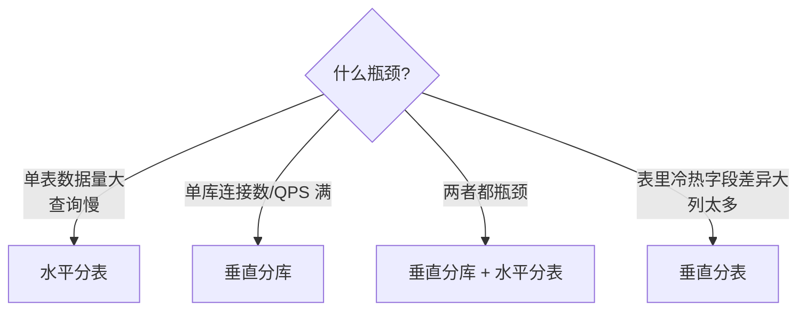
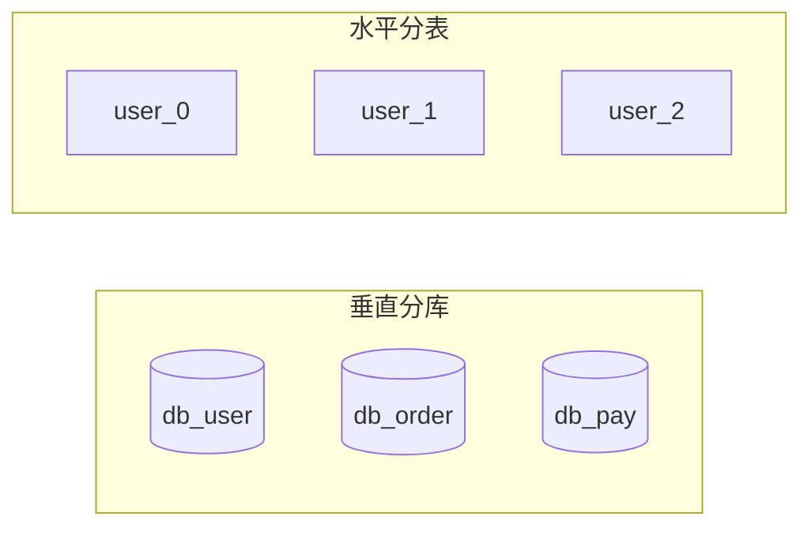
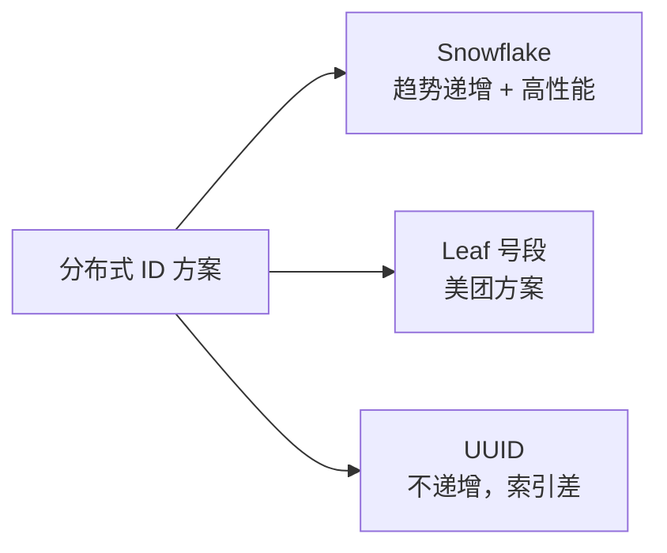
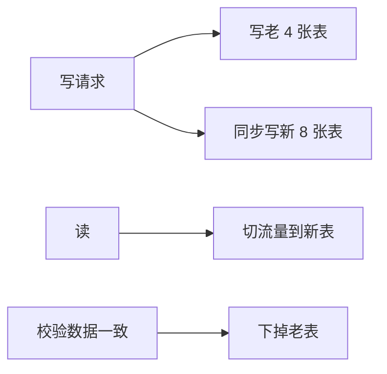
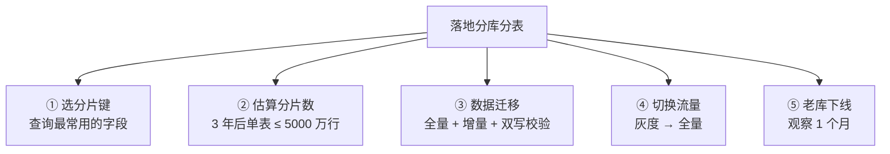

---
---

# 分库分表

> 单库单表的极限：**单表 2000 万行 / 单库 1 万 QPS**。再大就该分了。
> 分库分表是双刃剑——解决了容量，引入了**分布式事务、跨库 join、扩容**等新问题。

---

## 什么时候要分



### 优先级
```
1. 先做读写分离（主从）
2. 再做表索引优化
3. 再做缓存（Redis）
4. 再做归档（冷数据搬走）
5. 最后才分库分表
```

> 分库分表是终极方案，不到万不得已不上。

---

## 四种切分方式

```
原始：一个库 (db) 一张表 (user)，列 (id, name, age, addr, ...)

垂直分库：按业务拆库
  db_user        db_order
  ├─ user       ├─ order
  └─ profile    └─ pay

垂直分表：按列拆表（拆字段）
  user_main         user_ext
  ├─ id            ├─ id (FK)
  ├─ name          ├─ addr
  └─ age           └─ avatar

水平分库：同一表数据按规则散到多个库
  db_0.user     db_1.user     db_2.user
  (id%3=0)      (id%3=1)      (id%3=2)

水平分表：同一库内拆成多张表
  db.user_0     db.user_1     db.user_2
```



---

## 分片策略（水平拆分用）

### 1. 范围分片（Range）

```
按主键区间拆：
  user_0: id ∈ [1,   10000000)
  user_1: id ∈ [10000000, 20000000)
  user_2: id ∈ [20000000, 30000000)
```

**优点**：扩容简单（再加一片）  
**缺点**：**最新数据全打一个分片**（热点）

### 2. 哈希分片（Hash）⭐ 最常用

```
user_${userId % 16}
```

**优点**：数据分布均匀，无热点  
**缺点**：**扩容麻烦**（取模值变了，几乎全表迁移）

### 3. 一致性哈希

```
哈希环上 N 个虚拟节点：
  
       Node0
        │
   Node3 ─── Node1
        │
       Node2

  key 落到环上 → 顺时针找最近节点
  加一个 Node4 → 只影响 Node4 前一段的数据，不是全表
```

**优点**：扩容时只迁移**部分**数据  
**缺点**：实现复杂

### 4. 业务字段分片

```
按 user_id 分片 → 同一用户的订单在一个分片
按 month 分片  → 月报表查询快
按 region 分片 → 地域亲和
```

---

## ShardingSphere（行业标准）

```
应用                              MyBatis
  │                                  │
  ▼                                  ▼
┌───────────────────────────────────────┐
│  ShardingSphere-JDBC（透明代理）       │
│                                       │
│  - SQL 解析                            │
│  - 路由（根据分片键找库找表）           │
│  - 改写（user → user_3）              │
│  - 执行（并行打到多个库）              │
│  - 结果合并                            │
└────────────┬──────────────┬───────────┘
             ▼              ▼
         db_0.user_0    db_1.user_3
```

```yaml
# 配置示例
rules:
  - !SHARDING
    tables:
      user:
        actualDataNodes: db_${0..1}.user_${0..15}
        databaseStrategy:
          standard:
            shardingColumn: user_id
            shardingAlgorithmName: db_hash_mod
        tableStrategy:
          standard:
            shardingColumn: user_id
            shardingAlgorithmName: table_hash_mod
```

---

## 分布式 ID 怎么生成

分了表，自增主键就完了（每张表都从 1 开始）。



详见 [分布式ID.md](../分布式/分布式ID.md)。

---

## 痛点一：跨库 join

```
分库后 join 怎么办?

❌ 直接 join：跨库不可能
✅ 业务层拼装：
   1. 查 db_user 拿用户列表
   2. 用 user_ids 查 db_order 拿订单
   3. 内存 Map 拼起来
✅ 数据冗余：订单表里冗余 user_name，避免 join
✅ 宽表预聚合：把 user + order 提前 ETL 成一张宽表
```

详见 [MySQL关联查询.md](MySQL关联查询.md)。

---

## 痛点二：跨库事务

```
转账：扣 A 余额（db_0）+ 加 B 余额（db_1）
  本地事务搞不定 → 上分布式事务

方案：
  - 2PC：强一致，性能差
  - TCC：业务侵入大，最终一致
  - 本地消息表 + MQ：最常用，最终一致
  - Seata AT 模式：透明分布式事务
```

详见 [CAP与分布式事务.md](../分布式/CAP与分布式事务.md)。

---

## 痛点三：分页

```sql
-- 单表
SELECT * FROM user ORDER BY create_time DESC LIMIT 1000, 20;

-- 分 16 张表后？
```

**朴素做法**（错）：每张表都拿 1020 条然后聚合排序 → 拿 16×1020 行回来排 → 网络爆炸

**正确做法**：
- 每片拿 LIMIT 0, 1020 → 全量回来排（数据量大不可行）
- **二次查询法**：先粗查每片估算位置，再精确查
- **业务上避免**：禁止跳页，只支持"下一页"（用游标 `WHERE id > last_id LIMIT 20`）

详见 [深分页.md](../业务场景/深分页.md)。

---

## 痛点四：扩容

```
原本 user_${id%4}，4 张表
要扩到 user_${id%8}，8 张表
  → 之前的取模值全变了
  → 几乎全表数据要迁移
```

### 方案 A：双写迁移



### 方案 B：预先按 2^n 设计

一开始就分 32 张表，按 `id % 32` 路由。  
扩库时把 32 张表搬到更多库，但不改表数 → 不需要数据迁移。

```
开始：1 库 32 表
  db_0.user_0 ~ user_31
扩到 2 库：
  db_0.user_0 ~ user_15
  db_1.user_16 ~ user_31  ← 只搬走一半表，无需 rehash
```

---

## 实战清单



**分片键选择是核心**：选错了，绝大部分查询要扫全部分片。
- 电商订单：`user_id` 优于 `order_id`（用户查自己订单频繁）
- 日志：`月份` 时间分片
- IM 消息：`(user_id, session_id)` 复合分片

---

## 一句话总结

- 单表 **2000 万行 / 单库 1 万 QPS** → 考虑分库分表
- 优先做**读写分离/缓存/归档**，分库分表是最后手段
- 水平拆分用 **Hash + 一致性哈希**，避免热点
- 提前**按 2^n 预分**，避免后期扩容大迁移
- 分库分表会引入：**跨库 join、分布式事务、分页、扩容** 四大问题
