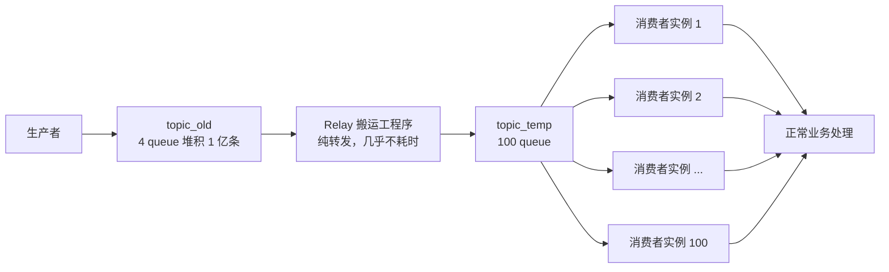
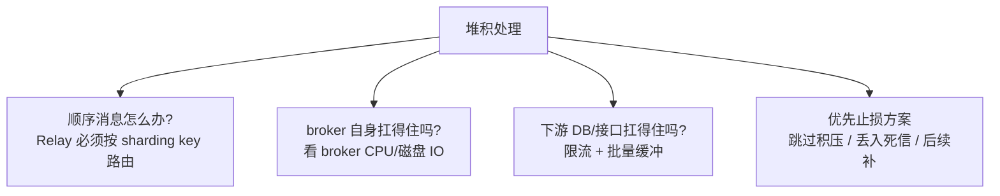

---
---

# MQ 消息堆积 1 亿条怎么办

> 场景：线上消费速度突然跟不上，broker 上堆了 1 亿条消息。怎么 30 分钟内清掉？

---

## 错误答案：直接加机器

很多人第一反应"扩容消费者"，但 **MQ 的 queue ↔ consumer 是 1:1 绑定**，单纯加消费者机器没用：

```
原始：4 queue，2 台消费者机器
   queue_0  queue_1  queue_2  queue_3
      │        │        │        │
      └────────┼────────┴────────┘
            机器A     机器B
            (每台 2 个 queue)

❌ 扩容到 10 台机器：
   queue_0  queue_1  queue_2  queue_3
      │        │        │        │
   机器A    机器B   机器C    机器D     ← 一人分一个
   机器E    机器F   机器G    机器H     ← 干瞪眼
   机器I    机器J                       ← 干瞪眼
```

**queue 数 = 并行度上限**。扩消费者不扩 queue 等于白干。

---

## 正确解法：消息转发 + 临时扩容

核心思路：**新建一个临时 topic，queue 数拉满，再起对应数量的消费者**。



```
步骤：
1. 建临时 topic：topic_temp（queue 数 ×25，比如 100 个）
2. 上线 Relay：把 topic_old 的消息搬到 topic_temp
   - Relay 只做转发，不处理业务，几乎不耗时
3. 部署 100 台消费者，挂在 topic_temp 上
4. 1 亿条快速清完
5. 清完后下掉临时 topic 和 Relay，回到正常拓扑
```

---

## 关键细节：批量 + 顺序

### 批量消费（防打死下游 DB）

```java
// ❌ 一条一条处理，DB 被打爆
@RocketMQMessageListener(topic = "topic_temp", consumeMode = ConsumeMode.CONCURRENTLY)
public void onMessage(Order msg) { dao.insert(msg); }

// ✅ 批量消费，攒批写入
@RocketMQMessageListener(topic = "topic_temp",
    consumeMode = ConsumeMode.CONCURRENTLY,
    consumeMessageBatchMaxSize = 200)
public void onMessage(List<Order> msgs) {
    dao.batchInsert(msgs);  // 一次 200 条
}
```

### 顺序消息（Hash 转发到同一 queue）

```
场景：订单状态变化必须有序
  创建 → 支付 → 发货 → 完成

  ❌ 随机分配 queue：
    创建消息 → queue_5
    支付消息 → queue_18   ← 支付可能先被消费！
    
  ✅ Hash(orderId) % N：
    全部 → queue_5（同 orderId 永远落同 queue）
```

```java
// Relay 转发时按 orderId 路由
producer.send(message, new MessageQueueSelector() {
    @Override
    public MessageQueue select(List<MessageQueue> mqs, Message msg, Object key) {
        int idx = (int)(Math.abs(key.hashCode()) % mqs.size());
        return mqs.get(idx);
    }
}, orderId);  // shard key 是订单 ID
```

---

## 潜在风险



---

## 实战记录


**前置准备**
- 旧 topic：`topic_old`，6 个 queue
- 模拟堆积数据：2700 条


**临时 topic**：`topic_temp`，20 个 queue

**启动 20 个消费者实例**（同一 consumer group：`cg_temp_demo`）
- 容器名：`rmq-temp-consumer-01` ~ `rmq-temp-consumer-20`


**启动 Relay**（旧 topic 转发到 temp）
- 容器：`rmq-relay-demo`
- 项目 Jar：`mq-relay-skeleton/target/mq-relay-skeleton-1.0.0-jar-with-dependencies.jar`
- 配置：`mq-relay-skeleton/src/main/resources/relay.properties`

**验证流程**
1. 先停掉 20 个 temp 消费者
2. 往 `topic_old` 打入 600 条
3. Relay 转发到 `topic_temp` 后出现积压（Diff=600）
4. 再拉起 20 个消费者，Diff 回到 0（消费完成）

---

## 事后复盘

堆积往往不是 MQ 本身的问题，而是消费端慢。常见根因：

| 根因 | 排查 | 处理 |
| :--- | :--- | :--- |
| 第三方接口卡顿 | 看接口 RT 监控 | 加超时、降级、异步化 |
| DB 死锁 / 慢 SQL | 看 DB Slow Log | 优化索引、降并发 |
| 消费者代码 bug | 看异常日志 | 修复后重启 |
| 流量突增（活动/促销） | 看 QPS 曲线 | 提前扩容 / 限流 |
| 单条消息太大 | 看消息平均 size | 拆分、压缩 |

> 长期方案：**给业务 topic 预留足够的 queue 数**（比预期峰值 × 5），让 consumer 能弹性扩容到天花板。
