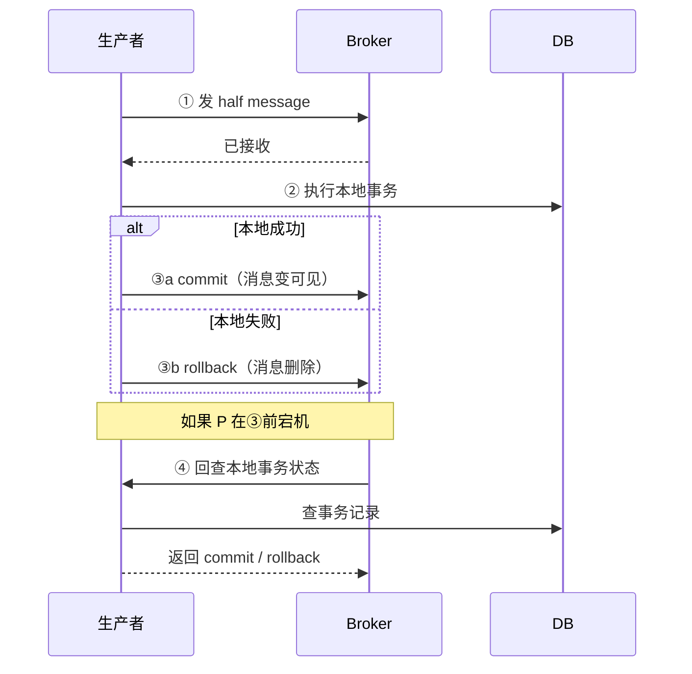
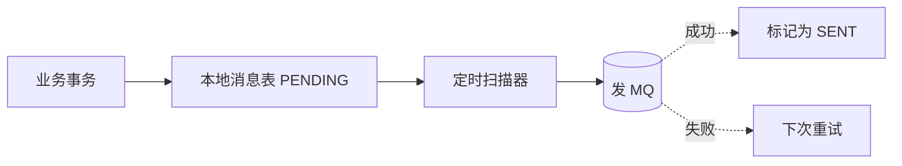
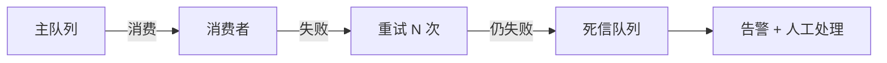
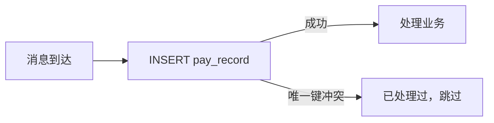
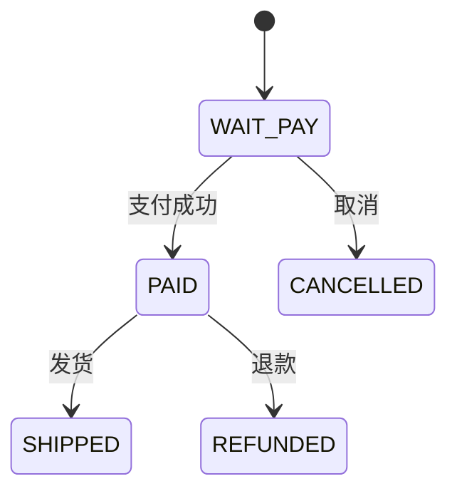
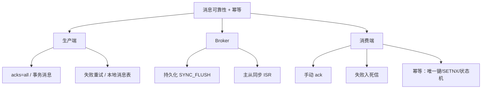

---
---

# 消息可靠性投递与幂等消费

> 用 MQ 的两个核心问题：
> ① 消息**不丢**（可靠性）—— 三个环节都要保
> ② 消息**不重复处理**（幂等）—— 因为重试不可避免

---

## 一、消息可能在哪里丢

```
   生产者         Broker(MQ)        消费者
    │              │                  │
    ●──────发送────▶                  │   ① 生产端：发送失败
                   ●──持久化──▶              ② Broker：刷盘前宕机
                   │             ▼   │   ③ Broker：主从同步前宕机
                   │             ●───▶
                   │                  │   ④ 消费端：拿到消息没处理就 ack
```

每一段都要单独防御。

---

## 二、生产端可靠性

### RocketMQ / RabbitMQ 同步发送

```java
SendResult result = producer.send(msg);
if (result.getSendStatus() != SendStatus.SEND_OK) {
    // 重试或落库补偿
}
```

### Kafka acks 配置

```
acks=0    → 不等任何确认，最快，最容易丢
acks=1    → Leader 写完就 ack（Leader 挂了同步前丢）
acks=all  → Leader + 所有 ISR 都写完才 ack ⭐ 生产配置
```

### 事务消息（保证业务+MQ 一致）

```
经典痛点：
  执行业务 DB → 发 MQ → 任一步失败 → 不一致
  
RocketMQ 事务消息：
  ① 发送 half message（对消费者不可见）
  ② 执行本地事务
  ③ commit / rollback half message
  ④ 如果第三步失败，broker 回查本地事务状态
```



### 本地消息表（更通用，不依赖 MQ 特性）

```sql
-- 业务表 + 本地消息表，同一事务里写
START TRANSACTION;
  UPDATE order SET status=PAID WHERE id=1;
  INSERT INTO local_msg(biz_id, payload, status) VALUES (1, '...', 'PENDING');
COMMIT;
```



详见秒杀文档里的 Outbox 模式。

---

## 三、Broker 可靠性

### 持久化

```
RocketMQ:
  - 同步刷盘 (SYNC_FLUSH)：每条消息 fsync 到磁盘 ✅ 不丢
  - 异步刷盘 (ASYNC_FLUSH)：批量刷，更快，宕机丢一点

Kafka:
  - acks=all + min.insync.replicas=2
  - 至少两个 ISR 都收到才 ack

RabbitMQ:
  - durable=true 队列持久化
  - persistent=true 消息持久化
```

### 主从

```
RocketMQ:  Master + Slave，同步双写 SYNC_MASTER
Kafka:     Leader + ISR，acks=all
RabbitMQ:  镜像队列 / Quorum Queue
```

**关键配置**：写入需**至少同步到一个备份**才回 ack。

---

## 四、消费端可靠性

### 至少一次（At-Least-Once）

```
消费者拿到消息：
  ① 先处理业务
  ② 处理成功才 ack
  ③ 失败不 ack → broker 重投

  → 保证不丢，但可能重复 → 必须幂等
```

### 错误示范

```java
// ❌ 自动 ack：拿到就 ack
@RabbitListener(queues = "queue", ackMode = AUTO)
public void onMsg(Msg msg) {
    process(msg);  // 处理失败也算 ack 了
}

// ✅ 手动 ack
@RabbitListener(queues = "queue", ackMode = MANUAL)
public void onMsg(Msg msg, Channel ch, @Header(...) long tag) {
    try {
        process(msg);
        ch.basicAck(tag, false);
    } catch (Exception e) {
        ch.basicNack(tag, false, true);  // 重新入队
    }
}
```

### 死信队列（DLQ）



消息处理失败超过 N 次（如 RocketMQ 默认 16 次），转入死信队列，避免无限重试堵塞正常消息。

---

## 五、幂等设计

> 既然消息可能重复，业务层必须**处理多次和处理一次结果一致**。

### 方案 1：唯一约束兜底

```sql
CREATE TABLE pay_record (
  id BIGINT PRIMARY KEY,
  biz_id VARCHAR(64) NOT NULL,
  ...
  UNIQUE KEY uk_biz (biz_id)   -- 同一 biz_id 重复 INSERT 报错
);
```



### 方案 2：Redis SETNX

```java
String key = "msg:" + msg.getBizId();
Boolean isFirst = redis.setnx(key, "1");
redis.expire(key, 86400);
if (Boolean.FALSE.equals(isFirst)) {
    log.info("重复消息，跳过 {}", msg.getBizId());
    return;
}
process(msg);
```

### 方案 3：状态机

```sql
-- 只允许从特定旧状态迁移
UPDATE order SET status='PAID' WHERE id=? AND status='WAIT_PAY';
-- 影响 0 行 → 已经支付过，幂等返回
```



> 状态机是**最优雅的幂等方案**，业务自带防重能力。

### 方案 4：消息表 + ACK 表

```sql
CREATE TABLE consumed_msg (
  msg_id VARCHAR(64) PRIMARY KEY,
  consume_time DATETIME
);
```

消费前先查 `consumed_msg`，处理后插入记录。简单可靠。

---

## 六、顺序消息

### 全局有序（吞吐极低）

```
只用 1 个 queue → 单点消费 → 严格顺序
  适合：日志、订单状态变化等"全量按时间"
```

### 分区有序（推荐）

```
按 key 路由到固定 queue：
  Hash(orderId) % N → 同一订单永远到同 queue → 该订单的消息有序
  
  → 不同订单可以并行 → 高吞吐
```

```java
producer.send(message, (mqs, msg, arg) -> {
    return mqs.get(Math.abs(arg.hashCode()) % mqs.size());
}, orderId);
```

详见 [MQ消息堆积1亿条数据.md](MQ消息堆积1亿条数据.md)。

---

## 七、消息可靠性等级（业界共识）

| 语义 | 保证 | 实现难度 |
| :--- | :--- | :--- |
| At-Most-Once | 最多一次（可能丢） | 简单 |
| **At-Least-Once** ⭐ | 至少一次（可能重） | 业界默认 |
| Exactly-Once | 恰好一次 | 极难，仅 Kafka 事务在小范围支持 |

**结论**：
- MQ 给你 **At-Least-Once**
- 你给业务层 **幂等**
- 两者叠加 = 业务上的 **Exactly-Once**

---

## 整体清单



---

## 一句话总结

- 不丢：**生产 acks=all + Broker 持久化 + 消费手动 ack**
- 不重：**业务幂等**（状态机 / 唯一约束 / Redis SETNX）
- 顺序：**按 key 路由到固定 queue**
- MQ 不给你 Exactly-Once，**幂等 + At-Least-Once = Exactly-Once 等价**
