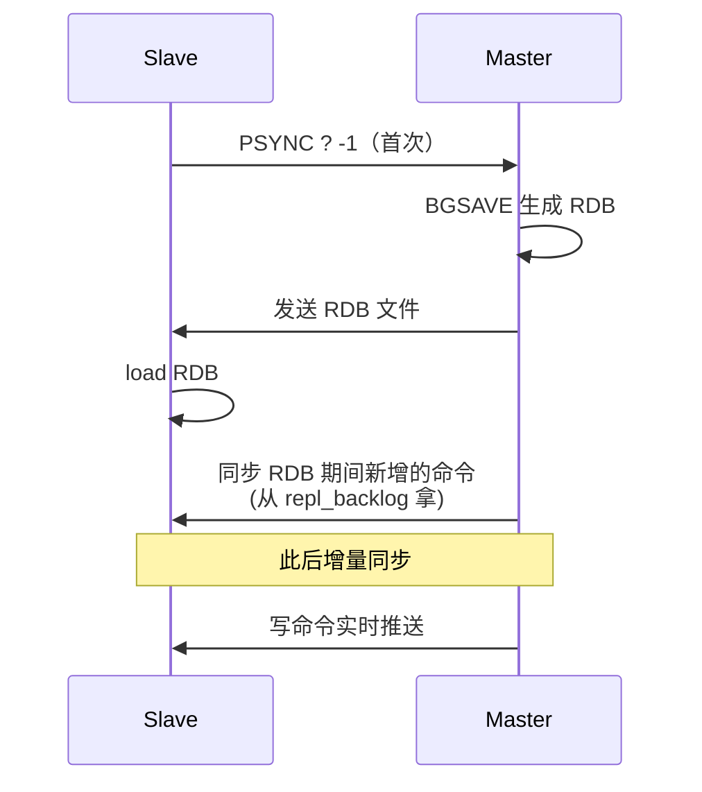
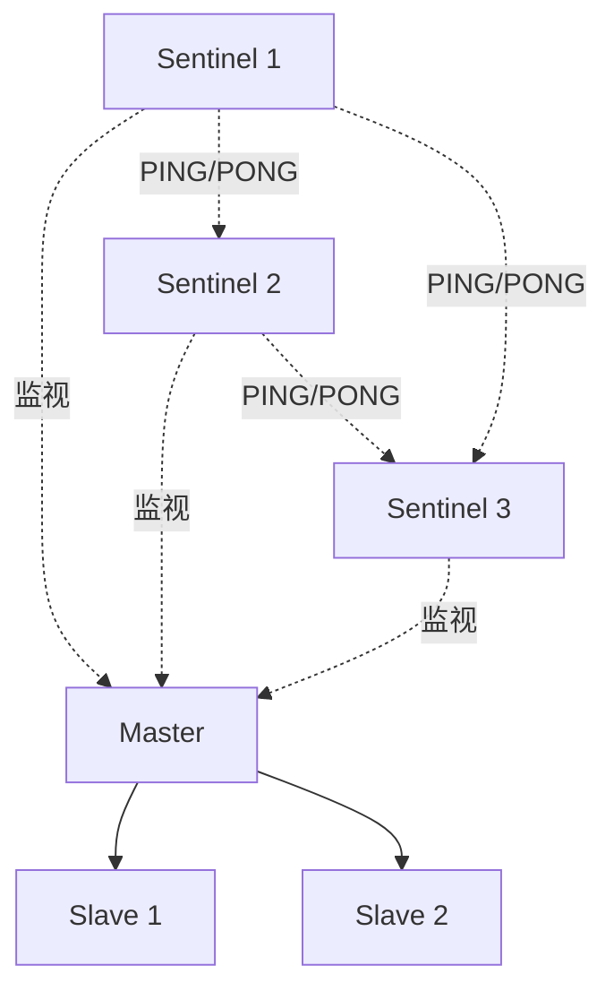
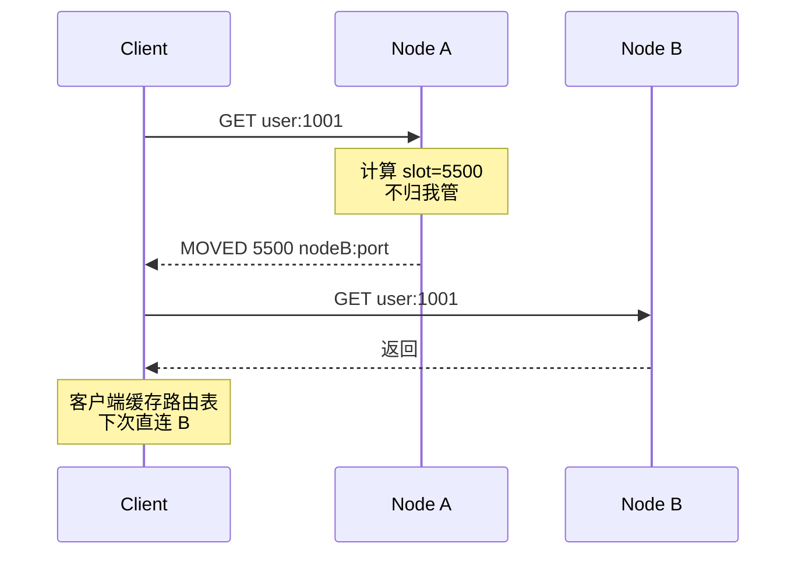
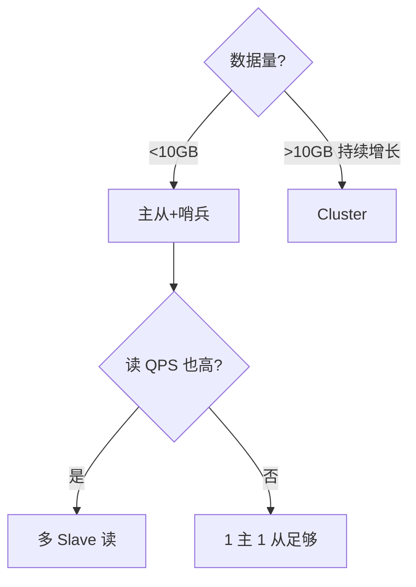

---
---

# Redis 主从 / 哨兵 / 集群

> Redis 高可用演进三阶段：
> **主从复制**（数据冗余） → **哨兵 Sentinel**（自动故障转移） → **Cluster**（数据分片）

---

## 演进路线


| 架构 | 解决 | 痛点 |
| :--- | :--- | :--- |
| 单机 | - | 单点 / 容量受限 |
| 主从 | 读扩展 + 数据冗余 | 主挂了要手动切 |
| 哨兵 | 自动故障转移 | 容量仍受单机限制 |
| Cluster | 水平分片 | 复杂度上升、不支持跨槽位事务 |

---

## 一、主从复制

```
     Master                Slave 1       Slave 2
     ──────                ───────       ───────
     全部读写              ←── 复制 ──→ 只读
       │
       ├─ binlog/replication backlog
       │
       └─ 通过 PSYNC 同步给 Slave
```

### 全量同步 vs 增量同步



```
首次连接 → 全量同步（RDB + 增量缓冲）
断线重连 → 部分同步：
  Slave 报告自己的 offset
  Master 看 repl_backlog 里有没有缺的命令
    有 → 增量补发（PSYNC 部分同步）
    没 → 退回全量同步
```

### 主从延迟问题

```
延迟来源：
  1. 网络 RTT
  2. Slave 写盘/写内存的速度
  3. Slave 上的慢命令（如 KEYS *）

排查：
  Slave 上 INFO replication
    master_link_status
    master_last_io_seconds_ago
    slave_repl_offset    与 master 的差
```

**应用层**：写后立刻读，应**强制走主**（很多 ORM 框架支持注解）。

---

## 二、哨兵 Sentinel

主从不能自愈：Master 挂了，要人工把 Slave 升主。哨兵就是来自动化这件事的。



### 哨兵做什么

1. **监控**：定时 PING Master/Slave，检查存活
2. **通知**：发现异常发邮件/钉钉
3. **自动故障转移**：Master 挂了，把某个 Slave 升主
4. **配置中心**：告诉客户端"现在新主是谁"

### 故障判定

```
主观下线（SDOWN）：
  单个哨兵超时 PING 不通 Master
  
客观下线（ODOWN）：
  多数哨兵都判断 Master 主观下线（quorum 配置）
  → 触发选举
```

### 选 Master

```mermaid
flowchart TD
  Q[多数哨兵同意 ODOWN] --> E[哨兵选举 Leader]
  E --> P[Leader 哨兵挑新 Master]
  P --> P1{slave-priority?}
  P1 -->|有最高优先| W1[选它]
  P1 -->|相同| P2{复制 offset?}
  P2 -->|最新| W2[选它]
  P2 -->|相同| P3{runid 最小]
  P3 --> W3[选它]
  W1 --> R[发布新主，通知客户端]
  W2 --> R
  W3 --> R
```

### 部署要点

- **奇数个哨兵**（3 或 5），避免脑裂时无法过半
- **哨兵和 Redis 分机器**，否则一台机器故障同时挂掉
- **客户端连哨兵**（不是直连 Redis），由哨兵告知主地址

---

## 三、Cluster

哨兵解决了"高可用"，但单机容量仍是瓶颈。Cluster 把数据**分片到多个节点**。

```
Cluster 拓扑（3 主 3 从）：

     Node A (M)   Node B (M)   Node C (M)
        │            │            │
     ┌──┴──┐      ┌──┴──┐      ┌──┴──┐
     │     │      │     │      │     │
   主从复制       主从复制      主从复制
     │              │             │
   Slave A1      Slave B1      Slave C1

  数据分 16384 个槽位 slot：
    Node A：slot 0     ~ 5461
    Node B：slot 5462  ~ 10922
    Node C：slot 10923 ~ 16383
```

### Key 到 Slot 的映射

```
slot = CRC16(key) % 16384

key="user:1001"  → CRC16 → mod 16384 → slot 5500 → Node B
```

### 客户端路由



> 现代客户端（Jedis Cluster、Lettuce）会**缓存 slot → node 映射**，避免每次 MOVED 跳转。

---

## Cluster 的限制

### ① 不支持跨槽位事务/Lua

```redis
# 两个 key 落在不同 slot
MSET user:1 a user:9999 b   # ❌ CROSSSLOT
EVAL "redis.call('SET', KEYS[1], 1) ..." 2 user:1 user:9999  # ❌
```

**解法**：hash tag `{...}`
```redis
SET {user:1001}:profile ...
SET {user:1001}:cart ...
# 两个 key 都按 {user:1001} 算 slot → 必定同槽位
```

详见 [红包雨.md](../业务场景/红包雨.md) 中的 hash tag 部分。

### ② 不支持多 DB
Cluster 模式下只能用 db 0。

### ③ 扩容/缩容要 reshard
通过 `redis-cli --cluster reshard` 迁移 slot。期间访问被迁移的 key 会收到 `ASK` 重定向。

---

## 三种模式对比

| 维度 | 主从 | 哨兵 | Cluster |
| :--- | :--- | :--- | :--- |
| 容量 | 单机 | 单机 | 多机分片 |
| 读扩展 | ✅ Slave 读 | ✅ Slave 读 | ✅ |
| 高可用 | ❌ 手动切 | ✅ 自动切 | ✅ 自动切 |
| 客户端复杂度 | 简单 | 中（连哨兵） | 高（识别 MOVED） |
| 事务/Lua | 全支持 | 全支持 | **同槽位才行** |
| 部署复杂度 | 低 | 中 | 高 |

---

## 选型决策



| 业务规模 | 推荐 |
| :--- | :--- |
| 单业务 5GB 内、QPS < 5万 | 主从 + 哨兵 |
| 数据量 10GB+、需要水平扩展 | Cluster (3 主 3 从起) |
| 多机房容灾 | Cluster + 跨机房 + Redis Enterprise |

---

## 脑裂问题

```
网络分区时：
  Slave 们以为 Master 挂了 → 选了新 Master
  老 Master 网络恢复后还在 → 同时有两个 Master ❌
  
  期间老 Master 接收的写请求 → 网络恢复后被丢弃 → 数据丢失
```

**预防配置**：
```
min-slaves-to-write 1     # 至少有 1 个 Slave 跟得上才接受写
min-slaves-max-lag 10     # Slave 延迟不超 10 秒
  
  → 老 Master 在分区时发现没 Slave 同步上来
  → 主动拒绝写入
  → 客户端报错而不是丢数据
```

---

## 一句话总结

- **主从**：数据冗余 + 读扩展，无自愈
- **哨兵**：3+ 哨兵投票，自动故障转移
- **Cluster**：16384 槽位分片，水平扩展但有限制
- **脑裂防御**：`min-slaves-to-write` 让老主主动拒写
- **客户端**：现代客户端缓存路由表，识别 MOVED/ASK
