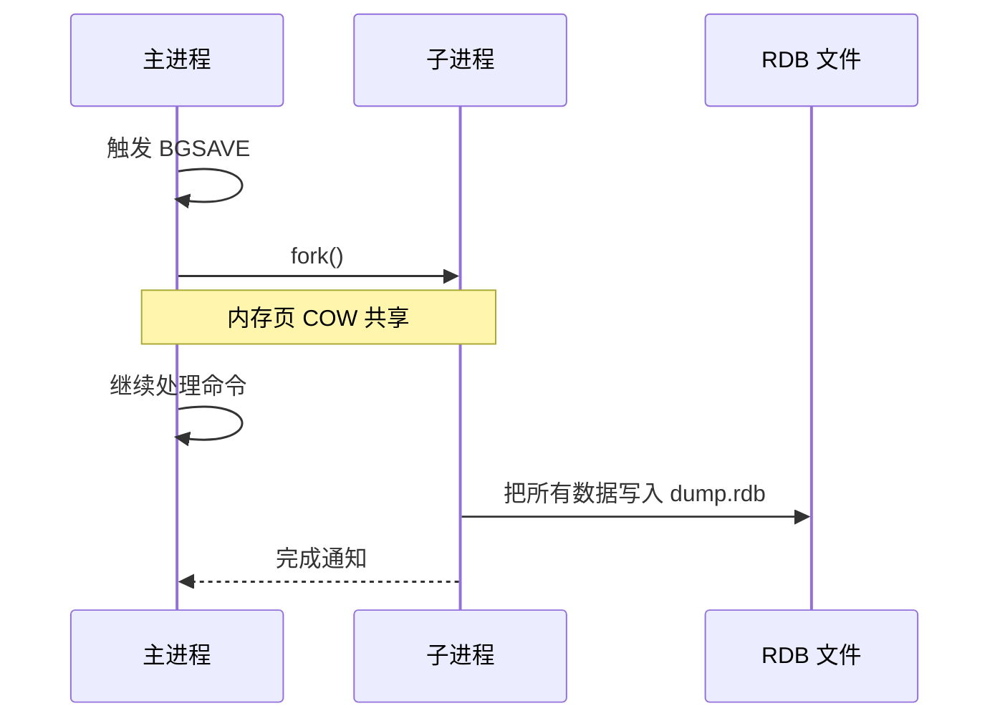
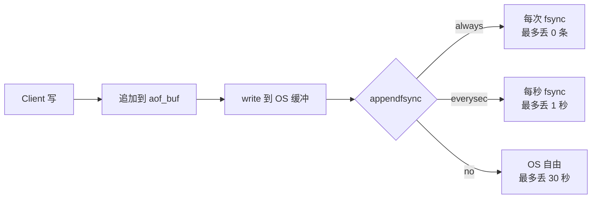
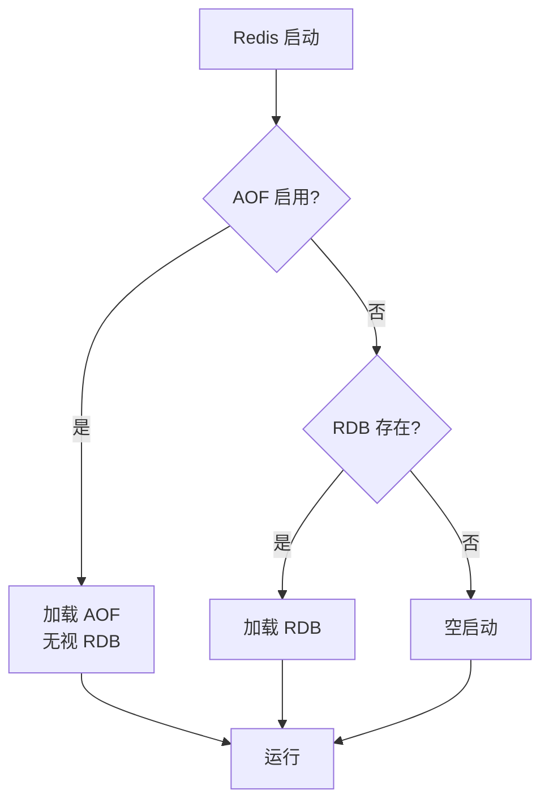
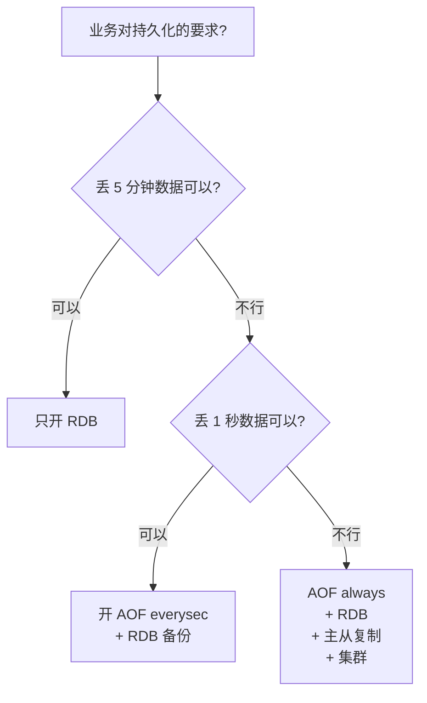

---
---

# Redis 持久化（RDB / AOF）

> Redis 是内存数据库，**重启就丢**。持久化就是为了重启后还能恢复。
> 两种方式各有取舍：**RDB 快但丢数据，AOF 完整但占空间**。

---

## 对比一览

| 维度 | RDB | AOF |
| :--- | :--- | :--- |
| 形式 | 二进制快照 | 命令日志 |
| 大小 | 紧凑（小） | 大 |
| 写入开销 | 偶尔大（全量 dump） | 持续小 |
| 恢复速度 | **极快**（直接 load） | 慢（要回放所有命令） |
| 数据完整性 | 丢最近一次 dump 之后的数据 | 最多丢 1 秒 |
| 适合 | 备份、灾难恢复 | 高可靠 |

> 生产**两个都开**：AOF 主负责数据完整性，RDB 做备份。

---

## RDB（Redis Database）

### 工作原理：fork + copy-on-write



```
fork 后：
  主进程和子进程"共享"同一份物理内存（虚拟内存指向同一物理页）
  
  主进程修改 key：
    → OS 复制那一页（copy-on-write）
    → 子进程仍看到旧版本
    → 子进程持续写完整快照
```

**注意**：
- fork 本身**会短暂阻塞**（亿级 key 可能 1 秒+）
- COW 期间内存可能翻倍（最坏情况）
- 子进程退出，主进程恢复正常

### 触发方式

```
1. SAVE 命令      → 主进程同步 dump，阻塞所有客户端 ❌生产禁用
2. BGSAVE 命令    → fork 后台 dump
3. 配置自动触发：
   save 900 1     → 900 秒内至少 1 次写
   save 300 10    → 300 秒内至少 10 次写
   save 60 10000  → 60 秒内至少 10000 次写
4. 主从复制 / shutdown 时自动 BGSAVE
```

---

## AOF（Append Only File）

### 思路

```
不存数据，存"执行过的写命令"：

   appendonly.aof：
   *3
   $3
   SET
   $3
   foo
   $3
   bar
   *2
   $4
   INCR
   $3
   cnt
   ...
   
   恢复时：从头执行一遍所有命令
```

### 三种刷盘策略（appendfsync）

```
always   ─→ 每条命令 fsync   → 最安全，最慢
everysec ─→ 每秒 fsync       → 折中（默认）
no       ─→ OS 决定          → 最快，可能丢几十秒
```



**生产建议**：`appendfsync everysec`，最多丢 1 秒。

### AOF 重写（瘦身）

```
原 AOF：
  INCR counter
  INCR counter
  INCR counter
  ... 1000 次

重写后：
  SET counter 1000

  → 文件大小骤减
  → 恢复速度更快
```

触发：
- 手动：`BGREWRITEAOF`
- 自动：`auto-aof-rewrite-min-size 64mb`、`auto-aof-rewrite-percentage 100`（比上次重写后增大 100%）

重写流程同 RDB，**fork 子进程做**，主进程同时把新命令记到 aof_rewrite_buf，最后合并。

---

## RDB-AOF 混合持久化（Redis 4+ 推荐）

```
开启：aof-use-rdb-preamble yes

AOF 重写时生成的文件结构：
  ┌────────────────────┬──────────────────────┐
  │   RDB 二进制头部   │   增量 AOF 命令       │
  │   (重写时的快照)   │   (重写期间新命令)    │
  └────────────────────┴──────────────────────┘
  
  恢复时：
    先 load RDB 部分（极快）
    再回放后面少量 AOF 命令
    
  兼具两者优点
```

---

## 恢复流程



> AOF 优先级 > RDB。如果配置了 AOF 就只看 AOF（因为它更完整）。

---

## 持久化对线上性能的影响

```
痛点：
  ① fork 时主进程阻塞
     - 几十毫秒到几秒（取决于内存大小）
     - 期间所有命令排队
  
  ② AOF fsync = always 时严重影响 QPS
     - 每条命令都要等磁盘
     - 单机 QPS 可能从 10w 跌到 1w
  
  ③ 内存 COW 翻倍
     - 业务高峰 + 大量写 → 可能 OOM

避免方法：
  - 凌晨业务低峰做 RDB
  - 主节点关 RDB，由从节点做（OPS 兜底）
  - 选 everysec 而非 always
  - 监控 latest_fork_usec
```

---

## 常用命令

```redis
# 配置
CONFIG GET save                    # 查看 RDB 触发规则
CONFIG GET appendfsync             # AOF 刷盘策略
CONFIG SET save ""                 # 关闭 RDB

# 手动触发
SAVE                               # 同步 dump（禁用）
BGSAVE                             # 异步 dump
BGREWRITEAOF                       # AOF 重写

# 检查状态
INFO persistence
  # rdb_last_save_time
  # rdb_last_bgsave_time_sec
  # aof_enabled
  # aof_last_rewrite_time_sec
```

---

## 选型决策



| 场景 | 建议 |
| :--- | :--- |
| 缓存（数据可丢） | 都不开，重启从 DB 回填 |
| 一般业务 | AOF everysec + RDB 备份 |
| 金融级 | AOF always + 主从 + 哨兵 |

---

## 经典坑

| 坑 | 后果 | 解决 |
| :--- | :--- | :--- |
| 内存写满了 fork OOM | 业务全挂 | 留 30%+ 内存空闲；overcommit_memory=1 |
| AOF 损坏 | 启动失败 | `redis-check-aof --fix appendonly.aof` |
| 主从同时做 RDB | 资源耗尽 | 错开时间或只让从节点做 |
| 内存大 fork 慢 | 几秒不响应 | 单实例不超 8GB |

---

## 一句话总结

- **RDB**：二进制快照，**恢复快**，但**丢数据**
- **AOF**：命令日志，**完整**，但**文件大、恢复慢**
- 生产默认：**AOF everysec + RDB 备份 + 混合持久化**
- 单实例**不超 8GB**，fork 太慢
