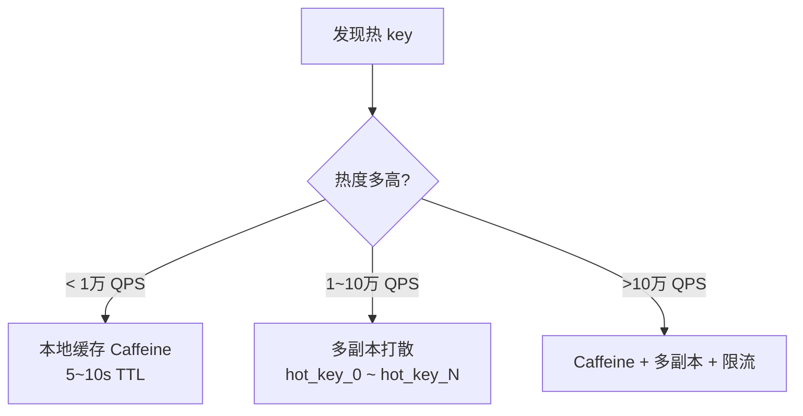

---
---

# 热 Key 与大 Key

> Redis 是单线程，**任何一个 key 出问题都会拖累全集群**。
> 热 Key 拖 CPU，大 Key 拖网络 + 阻塞。

---

## 概念对比

| 维度 | 热 Key | 大 Key |
| :--- | :--- | :--- |
| 定义 | 单个 key 的 QPS 极高 | 单个 key 的 value 体积巨大 |
| 阈值经验 | >5000 QPS | String>10KB / Hash 元素>1万 / List>1万 |
| 直接后果 | CPU 单核打满，分片不均 | 网络抖动、阻塞主线程 |
| 典型案例 | 秒杀商品、首页广告位 | 微博大 V 粉丝列表、用户全量历史订单 |

---

## 危害可视化

### 热 Key —— 分片不均

```
Cluster 集群（3 主）：
   Master1        Master2        Master3
   ┌──────┐       ┌──────┐       ┌──────┐
   │ 30%  │       │ 30%  │       │ 40%  │
   │ QPS  │       │ QPS  │       │ QPS  │
   └──────┘       └──────┘       └──────┘
                                 ↑↑↑↑↑↑
                              hot_key 都落这里
                              CPU 100%，其他节点闲着
```

### 大 Key —— 单次操作阻塞

```
主线程时间轴（Redis 单线程）：
  ──cmd──cmd──HGETALL big:key (耗时 200ms) ──cmd──cmd──
                  ↑↑↑↑↑↑↑↑↑↑↑↑↑↑↑↑↑↑↑↑↑↑↑↑
              这 200ms 所有客户端阻塞
              QPS 跌零、连接超时、雪崩
```

---

## 一、大 Key 排查与处理

### 1. 测试环境造数据

```bash
redis-cli -h 127.0.0.1 -p 6379

# 大 String（约 5MB）
EVAL "local s=string.rep('A',5*1024*1024); return redis.call('SET','big:string',s)" 0

# 大 Hash（10万 field）
EVAL "for i=1,100000 do redis.call('HSET','big:hash','f'..i,string.rep('v',50)) end return redis.call('HLEN','big:hash')" 0

# 大 List（20万元素）
EVAL "for i=1,200000 do redis.call('RPUSH','big:list','item:'..i) end return redis.call('LLEN','big:list')" 0
```

### 2. 扫描

```bash
# 方式 A：扫描整库找最大的（推荐，离线分析）
redis-cli --bigkeys

# 方式 B：精确看某个 key 占用
MEMORY USAGE big:string
MEMORY USAGE big:hash
MEMORY USAGE big:list
```

### 3. 拆分策略

```
原结构：               拆分后：
  big:hash             big:hash:0   big:hash:1   ...   big:hash:99
  10 万 field          每个 1000 field  按 field hash 路由
```

```java
// 写：根据 field 路由到子 hash
String subKey = "big:hash:" + (Math.abs(field.hashCode()) % 100);
redis.hset(subKey, field, value);

// 读：同样路由
String subKey = "big:hash:" + (Math.abs(field.hashCode()) % 100);
redis.hget(subKey, field);

// 全量遍历：循环 100 个子 key
```

### 4. 删除大 Key 也得小心

```bash
# ❌ 直接 DEL 会阻塞主线程
DEL big:hash

# ✅ 用 UNLINK 异步释放
UNLINK big:hash

# ✅ 或者用 SCAN 分批删
HSCAN big:hash 0 COUNT 100  # 分批拿出 field 再 HDEL
```

---

## 二、热 Key 排查与处理

### 1. 测试环境造热点

```bash
# 先配置 Redis（必须用 LFU 策略，--hotkeys 才有数据）
redis-cli
> CONFIG SET maxmemory 256mb
> CONFIG SET maxmemory-policy allkeys-lfu
> SET hot:product:1001 "{\"id\":1001,\"name\":\"iphone\"}"

# 在系统终端压测（不是 redis-cli 内）
redis-benchmark -n 200000 -c 50 GET hot:product:1001
```

### 2. 排查

```bash
# 方式 A：扫描热点（推荐）
redis-cli --hotkeys
```

```bash
# 方式 B：看指定 key 热度计数
OBJECT FREQ hot:product:1001
```

```bash
# 方式 C：实时观察（仅排查用，会显著降低 Redis 性能）
MONITOR

# 方式 D：慢日志（定位"热 key 导致的慢查询"）
SLOWLOG GET 20
```

### 3. 解决方案



**多副本打散**：
```java
// 写：每个副本都写
for (int i = 0; i < N; i++) {
    redis.setex("hot_key_" + i, ttl, value);
}

// 读：随机选一个副本
int idx = ThreadLocalRandom.current().nextInt(N);
String value = redis.get("hot_key_" + idx);
```

**本地缓存（Caffeine）**：
```java
Cache<String, Product> local = Caffeine.newBuilder()
    .maximumSize(1000)
    .expireAfterWrite(Duration.ofSeconds(5))
    .build();

Product p = local.get(id, k -> redis.get("product:" + k));
```

> 5 秒短 TTL 是关键：能挡住绝大部分流量，又不会让数据陈旧到出问题。

---

## 三、生产监控建议

| 指标 | 阈值告警 |
| :--- | :--- |
| 单节点 CPU | >80% 持续 1 分钟 |
| 单节点 QPS | 超出平均节点 30% |
| Slowlog 条数 | >0 条 / 分钟 |
| 单 key 体积 | 通过 `--bigkeys` 每日巡检 |

---

## 一句话口诀

- 大 key：**拆开 + 用 UNLINK 删**
- 热 key：**本地缓存 + 多副本打散**
- 监控：**提前发现 > 事后救火**
