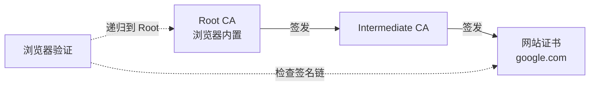
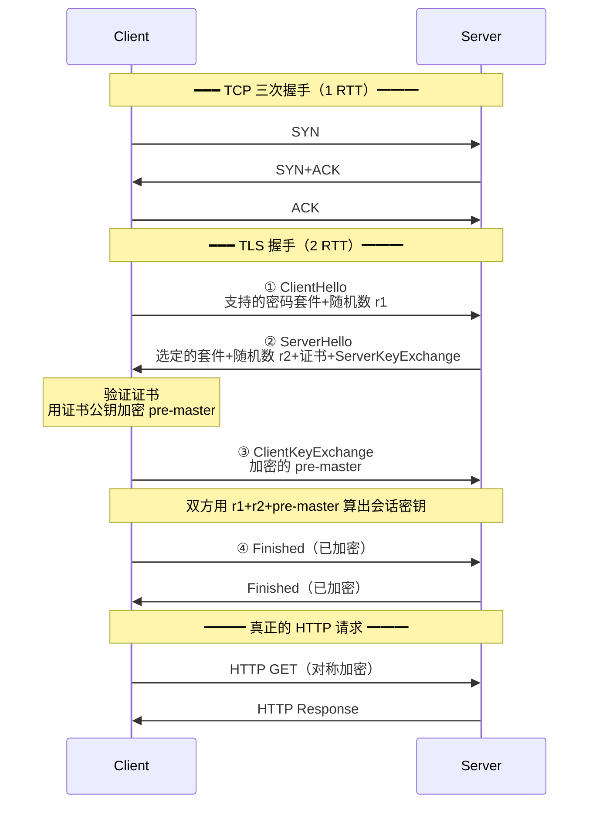
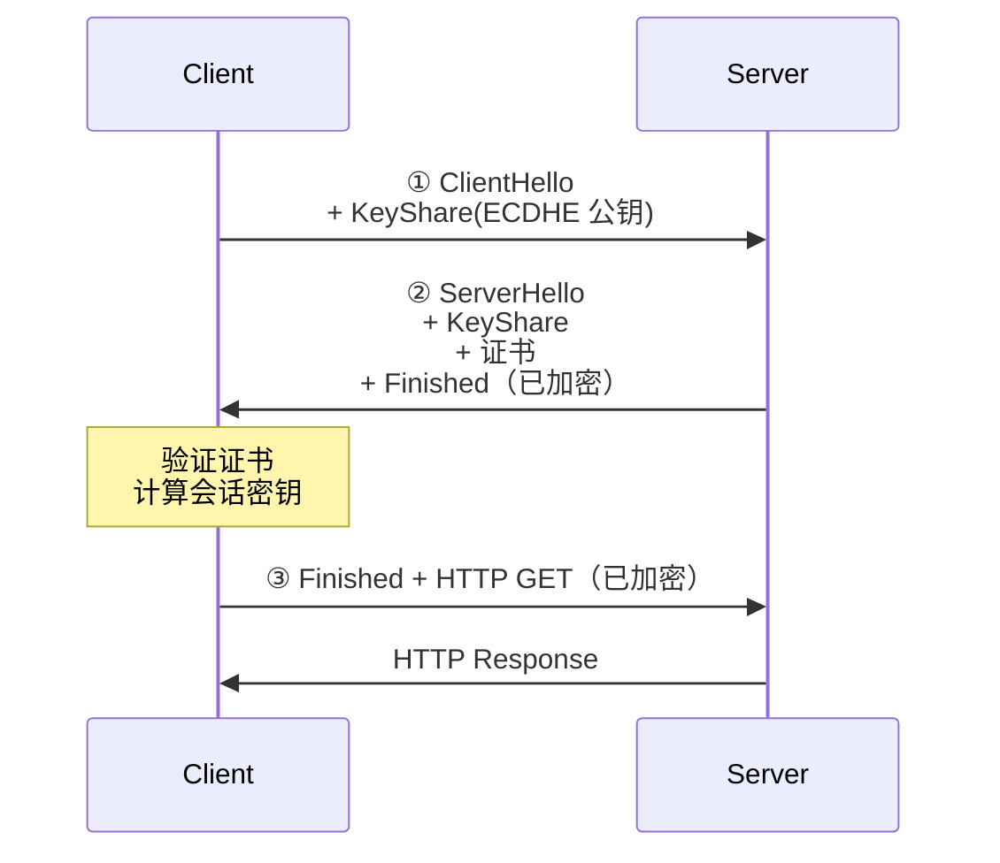
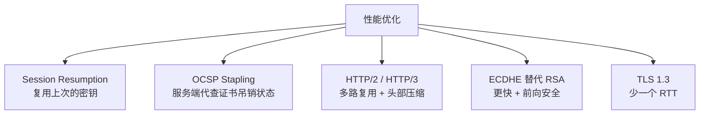
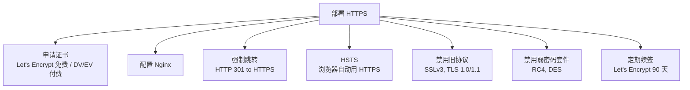

---
---

# HTTPS 与 TLS 握手

> HTTPS = **HTTP + TLS**，在 TCP 之上加一层加密。
> 解决三件事：**机密性**（防偷看）+ **完整性**（防篡改）+ **身份认证**（防冒充）。

---

## HTTPS 解决的三个问题

```
明文 HTTP：
   Client ──"账号密码"──→ Server
              ↑
   中间人（运营商/黑客/Wi-Fi）能：
     - 看到明文 → 偷密码
     - 修改内容 → 注入广告
     - 伪装成 Server → 钓鱼

HTTPS：
   Client ──加密+签名──→ Server
              ↑
   中间人：
     - 看到密文 → 解不开
     - 改了 → 校验失败
     - 伪装 → 证书对不上
```

---

## 加密：对称 + 非对称组合

```
对称加密 (AES)：
  同一把钥匙加密和解密
  优点：极快
  缺点：钥匙怎么安全送给对方？

非对称加密 (RSA / ECDHE)：
  公钥加密，私钥解密
  优点：私钥不传输
  缺点：慢 100~1000 倍

TLS 的天才组合：
  ① 用非对称加密 → 协商一个"对称密钥"
  ② 用对称加密 → 真正传输数据
  
  鱼和熊掌兼得
```

---

## 数字证书与 CA

```
   "你怎么证明你是 google.com？"
   
   解决：证书链
   
   Google 拿到 CA 颁发的证书：
   ┌─────────────────────────────────────┐
   │ Subject: google.com                 │
   │ Public Key: <Google 的公钥>         │
   │ Issuer: GTS CA 1C3                  │
   │ Signature: <GTS CA 用私钥签的名>    │
   └─────────────────────────────────────┘
   
   浏览器内置了所有受信任的 Root CA 的公钥
   → 验证证书的签名 → 证书可信 → 公钥可信
```



---

## TLS 1.2 握手（4 个 RTT）



### 关键步骤

```
① ClientHello
   - TLS 版本
   - 支持的密码套件列表（如 TLS_ECDHE_RSA_WITH_AES_256_GCM_SHA384）
   - Client Random（r1）

② ServerHello + Certificate
   - 选定的密码套件
   - Server Random（r2）
   - 服务器证书（含公钥）
   - 可能附 ServerKeyExchange（ECDHE 参数）

③ ClientKeyExchange
   - Client 生成 pre-master secret
   - 用 Server 公钥加密后发送

④ 双方推导会话密钥
   master_secret = PRF(pre_master, r1, r2)
   后续用 master_secret 派生对称加密密钥
   
   → 即使中间人录下了所有握手包，也解不开 pre-master
   → 双方使用同一密钥做 AES 加密
```

---

## TLS 1.3 握手（仅 1 RTT，新版本）



**0-RTT 优化**：之前连接过的，第一次请求就能带数据（牺牲一点安全性）。

```
TLS 1.2: 2 个 RTT
TLS 1.3: 1 个 RTT（或 0-RTT 复用）
+ 取消不安全的密码套件（RSA 密钥交换、MD5/SHA1）
+ 强制 PFS（前向安全）
```

---

## 前向安全（PFS）

```
传统 RSA 密钥交换：
  Client 用 Server 公钥加密 pre-master
  
  问题：如果 Server 私钥未来泄漏
  → 攻击者把以前录的握手包翻出来
  → 解出 pre-master
  → 解密所有历史会话 ❌

ECDHE 密钥交换：
  每次握手生成新的临时密钥对
  握手结束后丢弃
  
  → Server 私钥泄漏也只能伪造未来连接
  → 历史会话仍然安全 ✅

TLS 1.3 强制要求 PFS。
```

---

## 中间人攻击（MITM）

```
正常：
   Client ──证书 google.com──→ Server
            ↑ 验证 CA 签名通过

MITM：
   Client ──TLS 握手──→ MITM ──TLS 握手──→ Server
            ↑ MITM 想伪装成 Server
            ↑ 它能拿出 google.com 的证书吗?
              - 没法伪造 CA 签名 → 浏览器报警 ❌
              - 除非：
                 - 把自己的根证书装到 Client（Fiddler/Charles 抓包）
                 - 拿到 CA 私钥（HTTPS 拦截器/某些公司内网）
```

---

## HTTPS 性能优化



### Session Resumption

```
① Session ID：服务端存会话，客户端带 ID 复用
② Session Ticket：服务端把会话加密给客户端保管
③ TLS 1.3 PSK：复用上次握手的密钥派生

→ 第二次连接同一服务器：从 2 RTT 减到 1 RTT 或 0 RTT
```

---

## HTTPS 抓包

```bash
# Wireshark：默认看到的是密文
# 想看明文 → 需要服务器配合：
# 1. 设置环境变量 SSLKEYLOGFILE=/tmp/keys.log
# 2. 在 Wireshark Preferences → Protocols → TLS → 加载 keys.log
# 3. 浏览器/curl 启动时会把 master_secret 写入 → Wireshark 用它解密
```

---

## 双向认证 mTLS

```
普通 HTTPS：只验证 Server 身份（防钓鱼）
mTLS：双向都要证书

适合：
  - 金融/银行 API 调用
  - 微服务之间（Service Mesh / Istio）
  - 物联网设备
```

---

## HTTPS 部署清单



### Nginx 最简配置

```nginx
server {
    listen 443 ssl http2;
    server_name example.com;
    
    ssl_certificate     /etc/ssl/cert.pem;
    ssl_certificate_key /etc/ssl/key.pem;
    
    # TLS 1.2 + 1.3
    ssl_protocols TLSv1.2 TLSv1.3;
    ssl_ciphers ECDHE-RSA-AES256-GCM-SHA384:ECDHE-RSA-AES128-GCM-SHA256;
    ssl_prefer_server_ciphers on;
    
    # Session 复用
    ssl_session_cache shared:SSL:10m;
    ssl_session_timeout 1d;
    
    # HSTS
    add_header Strict-Transport-Security "max-age=31536000" always;
}

# 80 → 443 跳转
server {
    listen 80;
    return 301 https://$host$request_uri;
}
```

---

## 一句话总结

- HTTPS = HTTP + TLS：**机密性 + 完整性 + 身份认证**
- 加密：**非对称协商密钥 + 对称传输数据**
- 证书链：**Root CA → Intermediate CA → 网站证书**
- TLS 1.2 需 2 RTT，**TLS 1.3 只需 1 RTT**（或 0-RTT）
- 前向安全（PFS）：**ECDHE 替代 RSA 密钥交换**
- 优化：**Session 复用 + HTTP/2 + TLS 1.3**
